# Section 4:  Quick Introduction to Microservices

 Quick Introduction to Microservices

# What I Learned

# 68. Section Introduction - Microservices with Spring Cloud

 - Git [Microservices](https://github.com/in28minutes/spring-microservices-v3/tree/main/03.microservices)

 # 69. Step 00 - 01 - Introduction to Microservices

 - Microservices definitions.
  
> Small autonomous services that works together.

 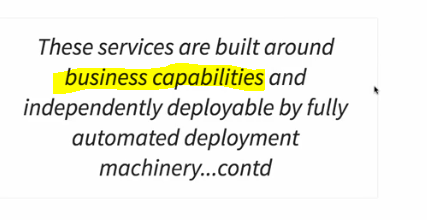

  

 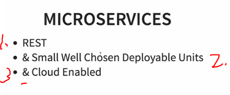

1. These are deployable by **REST**.
2. Theses are small and deployable units.
3. Cloud enabled.

 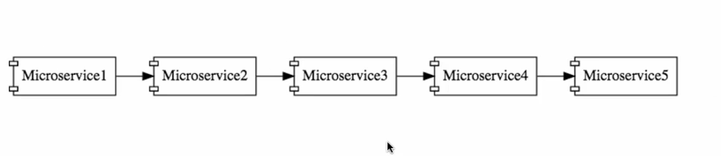

 1. When **microservices** are build such, they are in monolithic architecture.

- When **microservices** are cloud enabled, they are deployed as following.

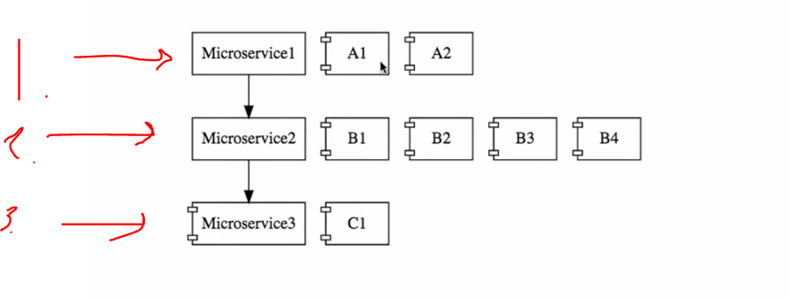

1. Microservice1 has two instances **A1** and **A2** on.
2. Microservice2 has **B1**, **B2**, **B3** and **B4** on. 
3. Microservice3 has **C1**.

- These can be run up when more load comes to server. These should not have much configuration.

# 70. Step 00 - 02 - Challenges with Microservices

### Bounded Context

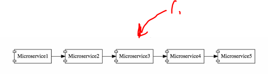

1. When there is lot of **microservices**, how you spot **where to draw line** between microservices.
    - You may not have right **business logic** to understand separation.
    - **ANSWER** This is based on experience.

### Configuration Management

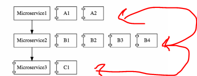

- These have much of configurations to manage. All the servers and deployments.

### Dynamic scale up and scale down

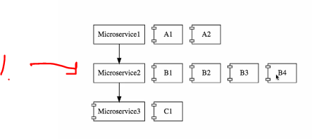

1. When needed, need to bring **Microservice2** up or down based on need and with dynamic load balancing load between these one.

### Visibility

1. If there is bug in this **microservice**, how to identify this one.
    - We need centralized clock.
    - We need monitoring around microservices.

### PACK OF CARDS

- There should be well designed architecture in microservices. They can collapse as **pack of cards**.
    - These need to be **fault tolerant**.

# 71. Step 00 - 03 - Introduction to Spring Cloud

- There is multiple projects under **SPRING CLOUD**.
    - You can see these [on](https://spring.io/projects/spring-cloud#overview).

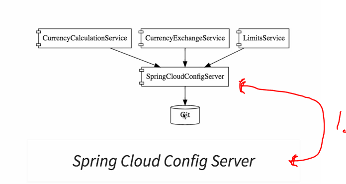

1. **Spring Cloud Config Server** in GIT. Can be used to hold configurations in place.

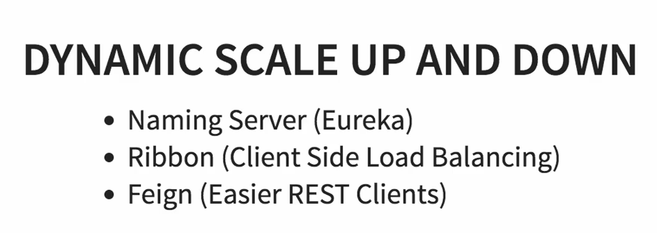

 
 
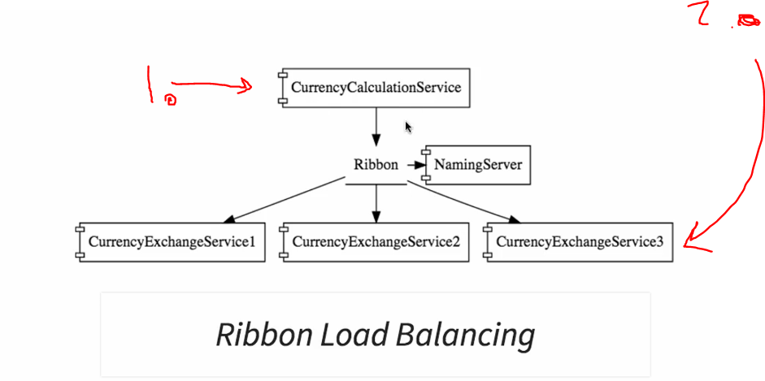

1. Microservice **CurrencyCalculationService** is talking to **CurrencyExchangeService**. 
2. There is multiple **CurrencyExchangeService** services. We want these are dynamically loaded automatically.

- All microservices need to be registered to **Eureka**.

- **Eureka** naming service will return **Services** when asked. These URL are returned.

- We don't want to implement different solutions to every microservice  **Logging, analytics ... etc**. We are using Gateways for this.

- **Hystrix** will provide default response when service is down.

# 72. Step 00 - 04 - Advantages of Microservices Architectures

- Microservices ables you adapt new technologies & process adaptions more easily.

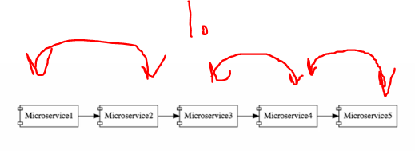

1. These microservices can be easily written in different languages.

### Dynamic scaling

- We can bring up services when needed.
    - Dynamic Scaling.
    - Faster Release Cycles.

# 73. Step 00 - 05 - Microservice Components - Standardizing Ports and URL

- Microservices with multiple **ports** and **URL** its important have standardized documentation.

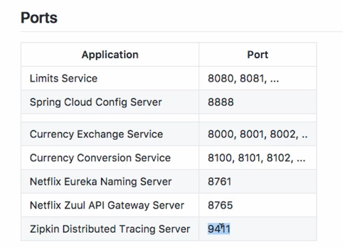

 

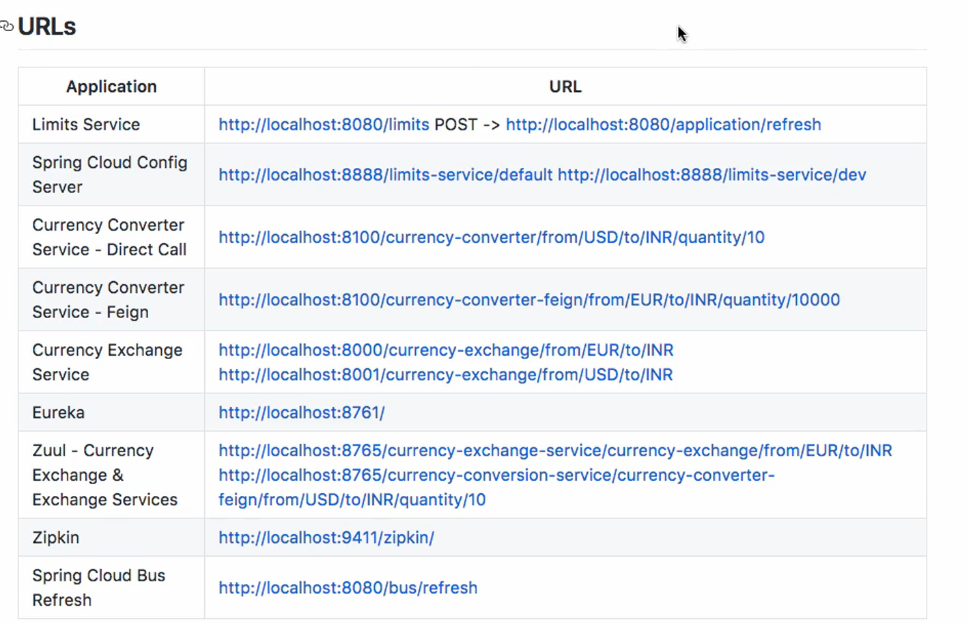

# 74. How to Stay UpTo Date With Technology Changes

- Study hard.