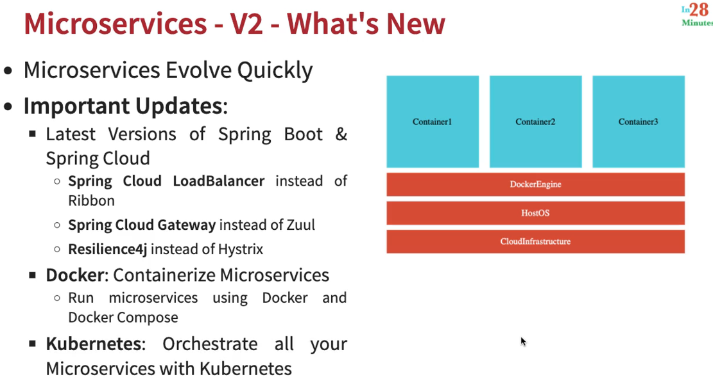
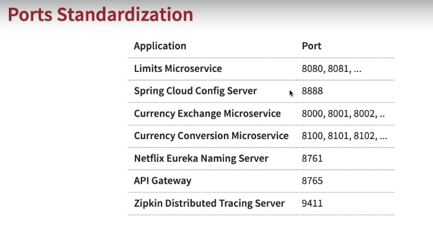
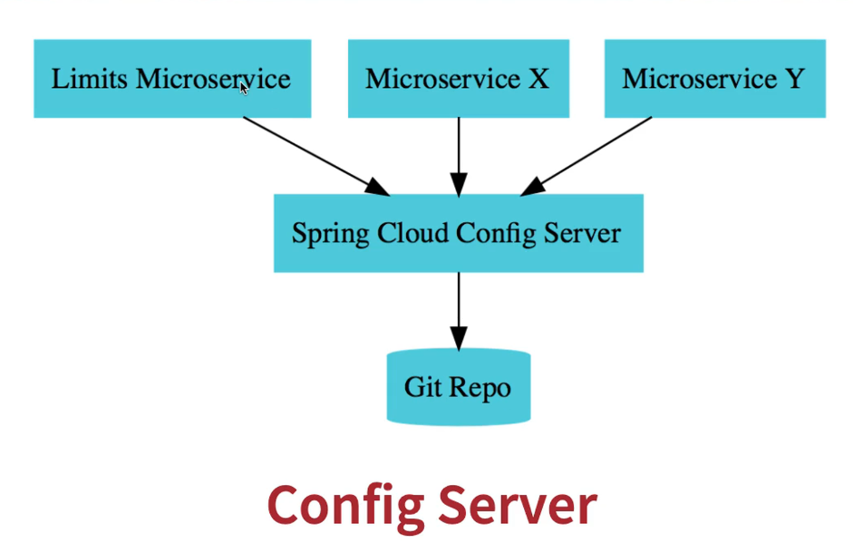
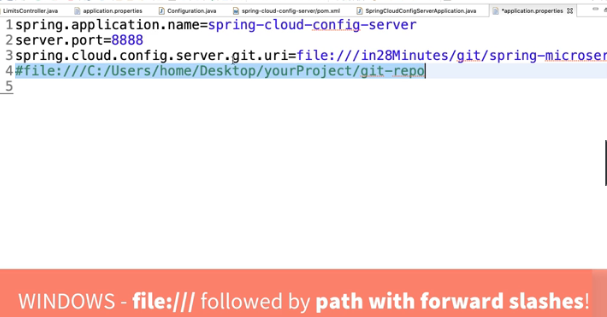
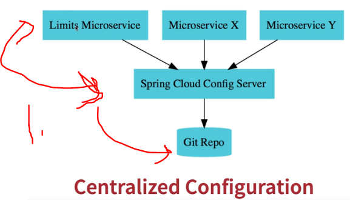
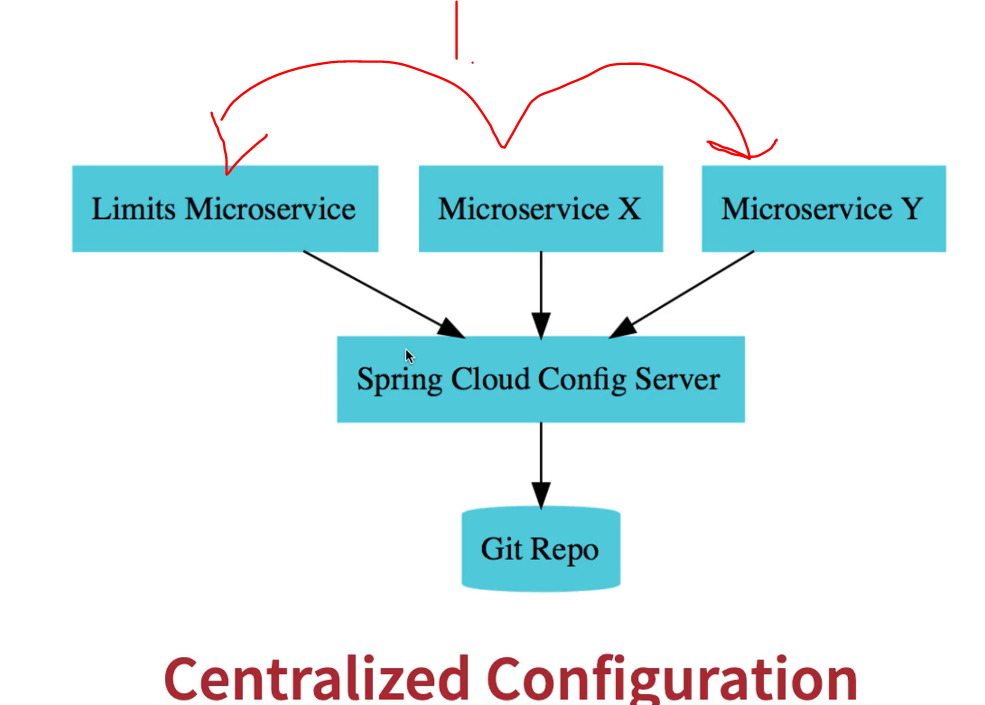
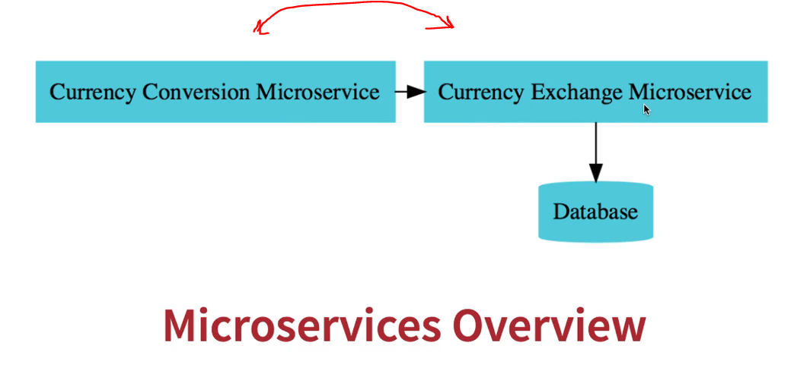
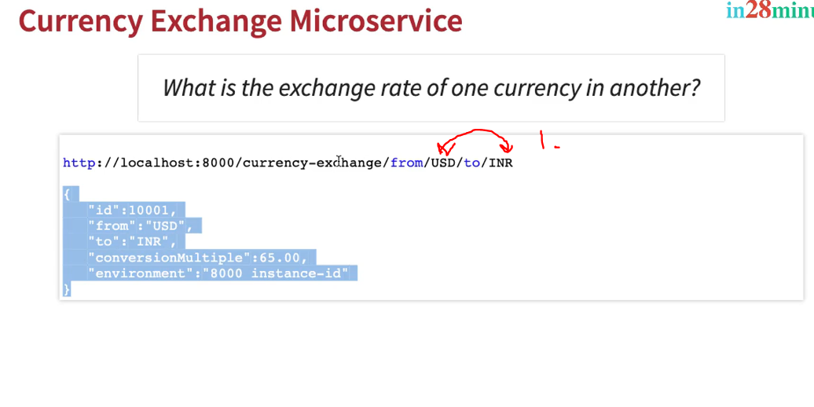
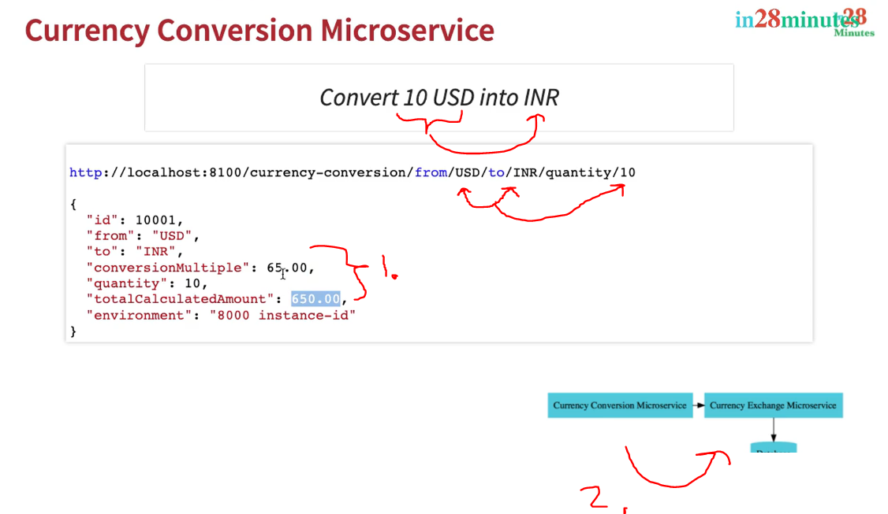
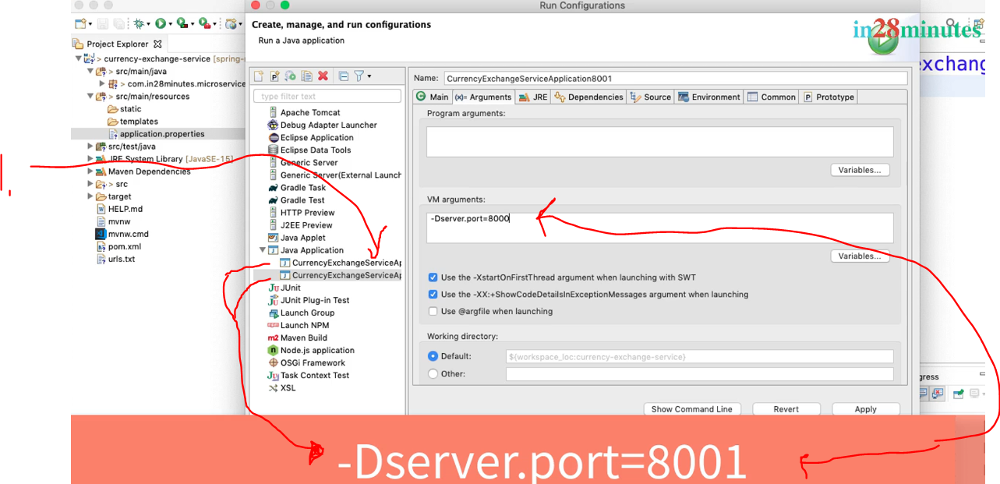

# Section 6: Microservices with Spring Cloud - V2

Microservices with Spring Cloud - V2

# What I Learned

# 132. What's NEW in V2?

 

- We will be using **Spring Cloud LoadBalancer** instead of **Ribbon**.

- We will be using **Spring Cloud Gateway** instead of **Zuul**.

- We will be using **Resilience4j** instead of **Hystrix**.

- Its important to standardize ports for microservice.

 

# 133. RECOMMENDED: Use Latest Spring Boot Version

- ✅

# 134. Have you already completed V1?

- ✅

# 135. Course Downloads

- ✅

# 136. Step 01 - Setting up Limits Microservice - V2

 

 1. We create **Microservice**, which is connected to **Spring Cloud Config Server**.

 - When creating **Microservices** for Spring Cloud.
    - Name the project whiteout any whitespace:s.

- We are using config server for microservice. This needs to be configured in .properties `spring.config.import=optional:configserver:http://localhost:8888`

# 137. CODE BACKUP FILES and STEP BY STEP CHANGES : For Reference

- ✅

# 138. Step 02 - Creating a hard coded limits service - V2

- Here we write simple microservice.

# 139. Step 03 - Enhance limits service - Get configuration from application props - V2

- Rather than passing configuraration values in code, we can create configuration, which handles these process. Example of old way below

```
@GetMapping("/limits")
	public Limits retrieveLimits() {
		return new Limits(1,1000);
	}
```

- We can auto inject/or map the **configuration values** using `@ConfigurationProperties("limits-service")`. Where input is **service name**. Workign example below:


# Java files
```
package com.in28minutes.microservices.limit_service.controller;

import org.springframework.beans.factory.annotation.Autowired;
import org.springframework.web.bind.annotation.GetMapping;
import org.springframework.web.bind.annotation.RestController;

import com.in28minutes.microservices.limit_service.bean.Limits;
import com.in28minutes.microservices.limit_service.configuration.Configuration;

@RestController
public class LimitsController {

	
	@Autowired
	private Configuration configuration;
	
	
	@GetMapping("/limits")
	public Limits retrieveLimits() {
		return new Limits(configuration.getMinimum(), configuration.getMaximum());
		//		return new Limits(1,1000);
	}
	
}
```

```
package com.in28minutes.microservices.limit_service.configuration;

import org.springframework.boot.context.properties.ConfigurationProperties;
import org.springframework.stereotype.Component;


@Component
@ConfigurationProperties("limits-service")
public class Configuration {
	private int minimum;
	private int maximum;
	
	public int getMinimum() {
		return minimum;
	}
	public void setMinimum(int minimum) {
		this.minimum = minimum;
	}
	public int getMaximum() {
		return maximum;
	}
	public void setMaximum(int maximum) {
		this.maximum = maximum;
	}

}
```

## configuration file
```
limits-service-minimum=2
limits-service-maximum=998
```

- This is picked by **Spring**.

 

# 140. Step 04 - Setting up Spring Cloud Config Server - V2

- **Config Server** from **Spring initializer**.

- Other microservice practice is to give good name for services. `spring.application.name=spring-cloud-config-server`.

# 141. Step 05 - Installing Git and Creating Local Git Repository - V2

- Creating local git repo with property file `limits-service.properties`.

# 142. Debugging problems with Spring Cloud Config Server - V2

- ✅

# 143. Step 06 - Connect Spring Cloud Config Server to Local Git Repository - V2

 

<br>

- We need to use `@EnableConfigServer` for config server in spring boot. Below example.

```
@EnableConfigServer
@SpringBootApplication
public class SpringCloudConfigServerApplication {

	public static void main(String[] args) {
		SpringApplication.run(SpringCloudConfigServerApplication.class, args);
	}

}

```


- We need to save configure folder where our Git Repo is in.

 

- Below my example fo mine configuration

## application.properties

```
spring.application.name=spring-cloud-config-server
server.port=8888
spring.cloud.config.server.git.uri=file://C:/Users/heikki/Desktop/Git projektit/spring-springboot-angular-microservices-mysql-java-persistence-hibernate/MasterMicroservicesWithSpringBootandSpringCloud/Section 6/git-localconfig-repo

```

- `spring.cloud.config.server.git.uri` where points where local configs server in locating in.

- Now to look if **Spring Cloud** have picked up the configuration from **git local config file**. We can navigate to config file for microservice.


1. URL name have name of microservice config property first part.

- **URL** for this **microservice** config is `http://localhost:8888/limits-service/default`.

- Below example config picked by **Spring Config Server**.

 

1. As you can see, **minimum** and **maximum** is picked up.
2. You can see what **profile** is being loaded.

# 144. Step 07 - Connect Limits Service to Spring Cloud Config Server - V2

- Property values should match for configured one, in **limit-service**  `spring.application.name=limits-service` and name of service inside **Git repo**.



1. We connected all of these.

- As you can see **git config repo** is being prioritized over **local configuration**.  

# 145. What should I do when I face a challenge

- Try harder.
- Use chatGBT, just for asking lead.
- Ask questions.

# 146. Step 08 - Configuring Profiles for Limits Service - V2



1. How to save different configurations for **microservice** for different environment.

- We just write different `limits-service-dev.properties` and `limits-service-qa.properties`. Then we go for URL `http://localhost:8888/limits-service/qa`. For example **qa** environment.

# 147.


# 148. Step 09 - Introduction to Currency Conversion & Exchange Microservices - V2

- We are going to make two microservice and they talk each other.



<br>



1. What is the conversion rate between these two?

- In here one **USD** is 65 **INR**.



1. 65 is multiplied by 10 is total 650. **USD** to **INR** **ten** units.
2. **Currency conversion microservice** is asking **Currency exchange microservice** about the **rate**.

# 149. Step 09 - Introduction to Currency Conversion & Exchange Microservices - V2

### Configurations for currency-exchange

```
spring.application.name=currency-exchange
server.port=8080
spring.config.import=optional:configserver:http://localhost:8888
```

# 150. URL and Response Structure for Currency Exchange Service

- We will make following.

### URL

`http://localhost:8000/currency-exchange/from/USD/to/INR`

### Response Structure

```
{
   "id":10001,
   "from":"USD",
   "to":"INR",
   "conversionMultiple":65.00,
   "environment":"8000 instance-id"
}
```

# 151. Step 11 - Create a simple hard coded currency exchange service - V2

- We made basic microservice.

```
@RestController
public class CurrencyExchangeController {

	@GetMapping("/currency-conversion/from/{from}/to/{to}")
	public CurrencyExchange retrieveExhangeValue(
			@PathVariable String from,
			@PathVariable String to) {
		
		return new CurrencyExchange(1000L, from, to, BigDecimal.valueOf(50));
		
	}
}

```

# 152. Step 12 - Setting up Dynamic Port in the the Response - V2

```
@Autowired
private Environment environment;

String port = environment.getProperty("local.server.port");
```

- Making two instances of this running.



1. To make **duplicate** configurations, right click and click **duplicate**.

- To make running config for other port in **Eclipse**. We write following into **VM args** `-Dserver.port=8001`. These will override configures provided by `.properties` file. 

# 153. Step 13 - Configure JPA and Initialized Data - V2


1. In **databases** underscores are use to!
2. In Java we tend to use **Camel case**.

- `data.sql` should inside **resources** folder. `/currency-exchange-service/src/main/resources/data.sql` for initialization.
	- OR use schema.sql instead of data.sql
### data.sql

```
insert into currency_exchange
(id,currency_from,currency_to,conversion_multiple,environment)
values(10001,'USD','INR',65,'');
insert into currency_exchange
(id,currency_from,currency_to,conversion_multiple,environment)
values(10002,'EUR','INR',75,'');
insert into currency_exchange
(id,currency_from,currency_to,conversion_multiple,environment)
values(10003,'AUD','INR',25,'');
```

- Data ins inserted **before** tables are created. This was updated **Spring Boot 2.4+**. This can be configured with `spring.jpa.defer-datasource-initialization=true` for inserting after table creation.

### application.properties

```
spring.application.name=currency-exchange
server.port=8000
spring.config.import=optional:configserver:http://localhost:8888


spring.jpa.show-sql=true
spring.datasource.url=jdbc:h2:mem:testdb
spring.h2.console.enabled=true
 
# For >2.5.0
spring.jpa.defer-datasource-initialization=true
```

# 154. CODE BACKUP FILES and STEP BY STEP CHANGES : For Reference

 - ✅

 # 155. Step 14 - Create a JPA Repository - V2

- Spring DATA will convect these into SQL notation behind scenes. 

```
public interface CurrencyExchangeRepository extends JpaRepository<CurrencyExchange, Long> {
	CurrencyExchange findByFromAndTo(String from, String to);
}
```