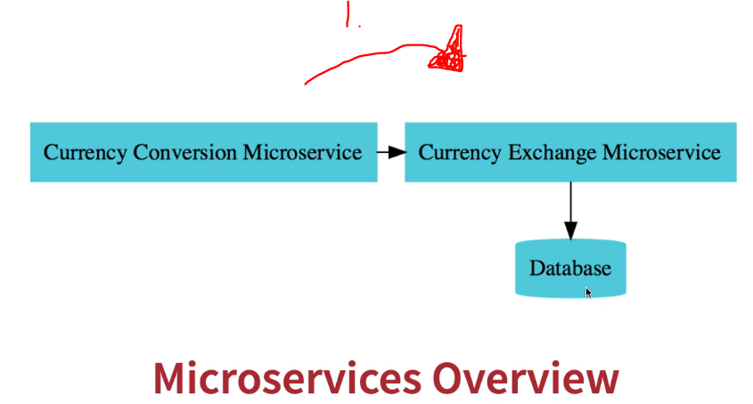
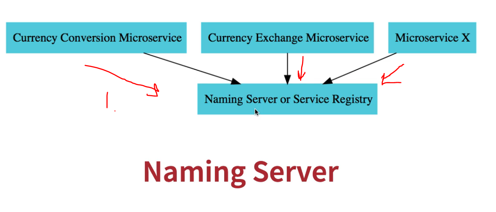
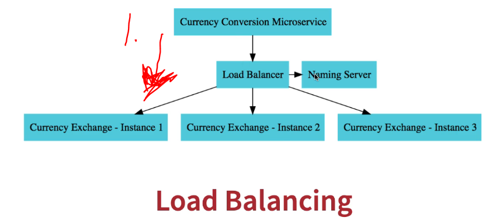
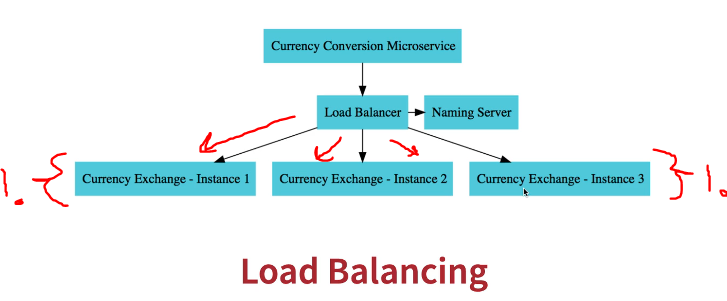
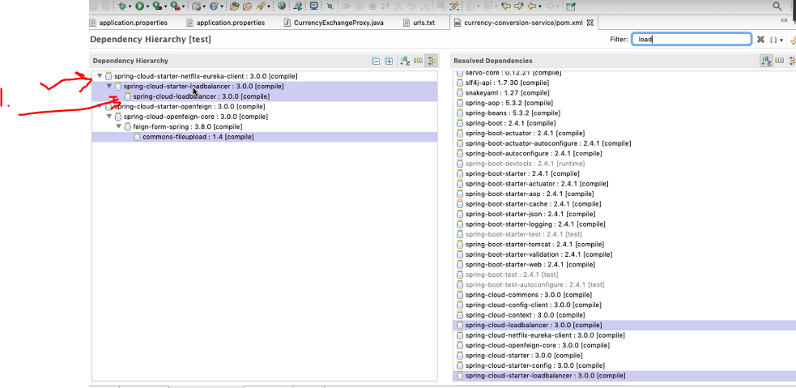
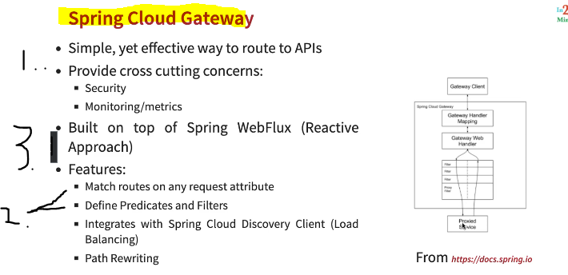
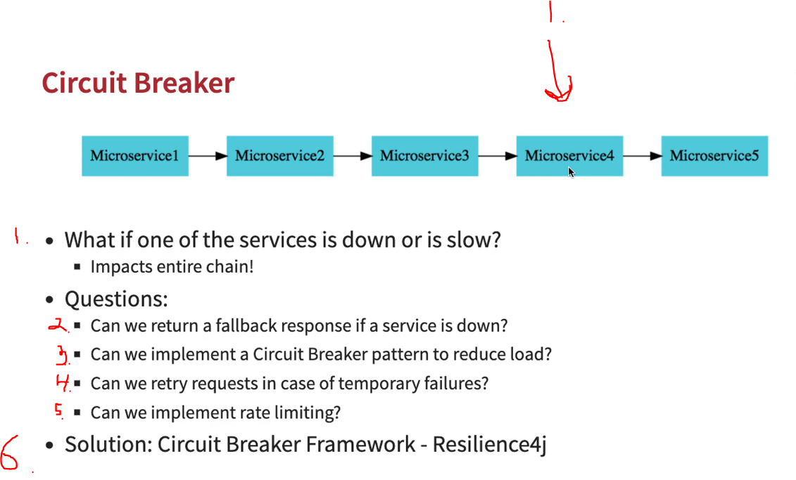
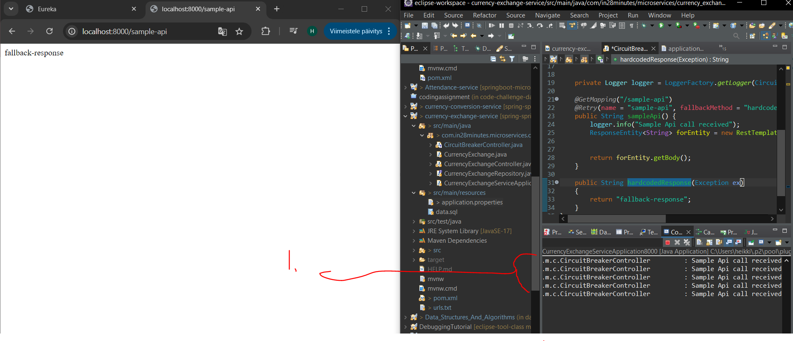

# Section 6: Microservices with Spring Cloud - V2

Microservices with Spring Cloud - V2

# What I Learned

# 132. What's NEW in V2?

 

- We will be using **Spring Cloud LoadBalancer** instead of **Ribbon**.

- We will be using **Spring Cloud Gateway** instead of **Zuul**.

- We will be using **Resilience4j** instead of **Hystrix**.

- Its important to standardize ports for microservice.

 

# 133. RECOMMENDED: Use Latest Spring Boot Version

- ✅

# 134. Have you already completed V1?

- ✅

# 135. Course Downloads

- ✅

# 136. Step 01 - Setting up Limits Microservice - V2

 

 1. We create **Microservice**, which is connected to **Spring Cloud Config Server**.

 - When creating **Microservices** for Spring Cloud.
    - Name the project whiteout any whitespace:s.

- We are using config server for microservice. This needs to be configured in .properties `spring.config.import=optional:configserver:http://localhost:8888`

# 137. CODE BACKUP FILES and STEP BY STEP CHANGES : For Reference

- ✅

# 138. Step 02 - Creating a hard coded limits service - V2

- Here we write simple microservice.

# 139. Step 03 - Enhance limits service - Get configuration from application props - V2

- Rather than passing configuration values in code, we can create configuration, which handles these process. Example of old way below

```
@GetMapping("/limits")
	public Limits retrieveLimits() {
		return new Limits(1,1000);
	}
```

- We can auto inject/or map the **configuration values** using `@ConfigurationProperties("limits-service")`. Where input is **service name**. Working example below:

# Java files

```
package com.in28minutes.microservices.limit_service.controller;

import org.springframework.beans.factory.annotation.Autowired;
import org.springframework.web.bind.annotation.GetMapping;
import org.springframework.web.bind.annotation.RestController;

import com.in28minutes.microservices.limit_service.bean.Limits;
import com.in28minutes.microservices.limit_service.configuration.Configuration;

@RestController
public class LimitsController {

	
	@Autowired
	private Configuration configuration;
	
	
	@GetMapping("/limits")
	public Limits retrieveLimits() {
		return new Limits(configuration.getMinimum(), configuration.getMaximum());
		//		return new Limits(1,1000);
	}
	
}
```

```
package com.in28minutes.microservices.limit_service.configuration;

import org.springframework.boot.context.properties.ConfigurationProperties;
import org.springframework.stereotype.Component;


@Component
@ConfigurationProperties("limits-service")
public class Configuration {
	private int minimum;
	private int maximum;
	
	public int getMinimum() {
		return minimum;
	}
	public void setMinimum(int minimum) {
		this.minimum = minimum;
	}
	public int getMaximum() {
		return maximum;
	}
	public void setMaximum(int maximum) {
		this.maximum = maximum;
	}

}
```

## configuration file
```
limits-service-minimum=2
limits-service-maximum=998
```

- This is picked by **Spring**.

 

1. As you can see this is picked up form git config 
# 140. Step 04 - Setting up Spring Cloud Config Server - V2

- **Config Server** from **Spring initializer**.

- Other microservice practice is to give good name for services. `spring.application.name=spring-cloud-config-server`.

# 141. Step 05 - Installing Git and Creating Local Git Repository - V2

- Creating local git repo with property file `limits-service.properties`.

# 142. Debugging problems with Spring Cloud Config Server - V2

- ✅

# 143. Step 06 - Connect Spring Cloud Config Server to Local Git Repository - V2

 

<br>

- We need to use `@EnableConfigServer` for config server in spring boot. Below example.

```
@EnableConfigServer
@SpringBootApplication
public class SpringCloudConfigServerApplication {

	public static void main(String[] args) {
		SpringApplication.run(SpringCloudConfigServerApplication.class, args);
	}

}

```


- We need to save configure folder where our Git Repo is in.

 

- Below my example fo mine configuration

## application.properties

```
spring.application.name=spring-cloud-config-server
server.port=8888
spring.cloud.config.server.git.uri=file://C:/Users/heikki/Desktop/Git projektit/spring-springboot-angular-microservices-mysql-java-persistence-hibernate/MasterMicroservicesWithSpringBootandSpringCloud/Section 6/git-localconfig-repo

```

- `spring.cloud.config.server.git.uri` where points where local configs server in locating in.

- Now to look if **Spring Cloud** have picked up the configuration from **git local config file**. We can navigate to config file for microservice.


1. URL name have name of microservice config property first part.

- **URL** for this **microservice** config is `http://localhost:8888/limits-service/default`.

- Below example config picked by **Spring Config Server**.

 

1. As you can see, **minimum** and **maximum** is picked up.
2. You can see what **profile** is being loaded.

# 144. Step 07 - Connect Limits Service to Spring Cloud Config Server - V2

- Property values should match for configured one, in **limit-service**  `spring.application.name=limits-service` and name of service inside **Git repo**.


1. We connected all of these.

- As you can see **git config repo** is being prioritized over **local configuration**.  

# 145. What should I do when I face a challenge

- Try harder.
- Use chatGBT, just for asking lead.
- Ask questions.

# 146. Step 08 - Configuring Profiles for Limits Service - V2


1. How to save different configurations for **microservice** for different environment.

- We just write different `limits-service-dev.properties` and `limits-service-qa.properties`. Then we go for URL `http://localhost:8888/limits-service/qa`. For example **qa** environment.

# 147.


# 148. Step 09 - Introduction to Currency Conversion & Exchange Microservices - V2

- We are going to make two microservice and they talk each other.


<br>


1. What is the conversion rate between these two?

- In here one **USD** is 65 **INR**.


1. 65 is multiplied by 10 is total 650. **USD** to **INR** **ten** units.
2. **Currency conversion microservice** is asking **Currency exchange microservice** about the **rate**.

# 149. Step 09 - Introduction to Currency Conversion & Exchange Microservices - V2

### Configurations for currency-exchange

```
spring.application.name=currency-exchange
server.port=8080
spring.config.import=optional:configserver:http://localhost:8888
```

# 150. URL and Response Structure for Currency Exchange Service

- We will make following.

### URL

`http://localhost:8000/currency-exchange/from/USD/to/INR`

### Response Structure

```
{
   "id":10001,
   "from":"USD",
   "to":"INR",
   "conversionMultiple":65.00,
   "environment":"8000 instance-id"
}
```

# 151. Step 11 - Create a simple hard coded currency exchange service - V2

- We made basic microservice.

```
@RestController
public class CurrencyExchangeController {

	@GetMapping("/currency-conversion/from/{from}/to/{to}")
	public CurrencyExchange retrieveExhangeValue(
			@PathVariable String from,
			@PathVariable String to) {
		
		return new CurrencyExchange(1000L, from, to, BigDecimal.valueOf(50));
		
	}
}

```

# 152. Step 12 - Setting up Dynamic Port in the the Response - V2

```
@Autowired
private Environment environment;

String port = environment.getProperty("local.server.port");
```

- Making two instances of this running.


1. To make **duplicate** configurations, right click and click **duplicate**.

- To make running config for other port in **Eclipse**. We write following into **VM args** `-Dserver.port=8001`. These will override configures provided by `.properties` file. 

# 153. Step 13 - Configure JPA and Initialized Data - V2


1. In **databases** underscores are use to!
2. In Java we tend to use **Camel case**.

- `data.sql` should inside **resources** folder. `/currency-exchange-service/src/main/resources/data.sql` for initialization.
	- OR use schema.sql instead of data.sql
### data.sql

```
insert into currency_exchange
(id,currency_from,currency_to,conversion_multiple,environment)
values(10001,'USD','INR',65,'');
insert into currency_exchange
(id,currency_from,currency_to,conversion_multiple,environment)
values(10002,'EUR','INR',75,'');
insert into currency_exchange
(id,currency_from,currency_to,conversion_multiple,environment)
values(10003,'AUD','INR',25,'');
```

- Data ins inserted **before** tables are created. This was updated **Spring Boot 2.4+**. This can be configured with `spring.jpa.defer-datasource-initialization=true` for inserting after table creation.

### application.properties

```
spring.application.name=currency-exchange
server.port=8000
spring.config.import=optional:configserver:http://localhost:8888


spring.jpa.show-sql=true
spring.datasource.url=jdbc:h2:mem:testdb
spring.h2.console.enabled=true
 
# For >2.5.0
spring.jpa.defer-datasource-initialization=true
```

# 154. CODE BACKUP FILES and STEP BY STEP CHANGES : For Reference

 - ✅

 # 155. Step 14 - Create a JPA Repository - V2

- Spring DATA will convect these into SQL notation behind scenes. 

```

public interface CurrencyExchangeRepository extends JpaRepository<CurrencyExchange, Long> {
	CurrencyExchange findByFromAndTo(String from, String to);
}

```

- And our Rest Controller. `String port = environment.getProperty("local.server.port");` pics **port** from our configurations. 

```

@RestController
public class CurrencyExchangeController {
	
	@Autowired
	private CurrencyExchangeRepository repository;

	@Autowired
	private Environment environment;
	
	@GetMapping("/currency-conversion/from/{from}/to/{to}")
	public CurrencyExchange retrieveExhangeValue(
			@PathVariable String from,
			@PathVariable String to) {
		
		String port = environment.getProperty("local.server.port");
		CurrencyExchange currencyExchange = repository.findByFromAndTo(from, to);
		currencyExchange.setEnvironment(port);
		
		if (currencyExchange == null) {
			throw new RuntimeException("Unable to Find data for " + from + " to " + to );
		}
		
		return currencyExchange;
		
	}
}
```

# 156. How to take care of yourselves

- Sleep & eat & walk.

# 157. Step 15 - Setting up Currency Conversion Microservice - V2

- We setting up ``currency-conversion` service.

# 158. URL and Response Structure for Currency Conversion Service


### URL 

```
http://localhost:8100/currency-conversion/from/USD/to/INR/quantity/10
```
### Response Structure

```
{
  "id": 10001,
  "from": "USD",
  "to": "INR",
  "conversionMultiple": 65.00,
  "quantity": 10,
  "totalCalculatedAmount": 650.00,
  "environment": "8000 instance-id"
}
```

# 159. Step 16 - Creating a service for currency conversion - V2

- We create controller.

```
	@GetMapping("/currency-conversion/from/{from}/to/{to}/quantity/{quantity}")
	public CurrencyConversion calculateCurrencyConversion(
			@PathVariable String from,
			@PathVariable String to,
			@PathVariable BigDecimal quantity
			) {
		
		return new CurrencyConversion(10001L, from, to, quantity, BigDecimal.ONE, BigDecimal.ONE, "");
		}
```

# 160. Step 17 - Invoking Currency Exchange from Currency Conversion Microservice - V2



1. Calling other **microservice** from other **microservice**.

- To make **simple** REST api call, we need configure much attributes. This is using **RestTemplate** to make REST calls.

- More tedious example below.
	- 
```
@GetMapping("/currency-conversion/from/{from}/to/{to}/quantity/{quantity}")
	public CurrencyConversion calculateCurrencyConversion(
			@PathVariable String from,
			@PathVariable String to,
			@PathVariable BigDecimal quantity
			) {
		
		HashMap<String, String> uriVariables = new HashMap<>();
		uriVariables.put("from", from);
		uriVariables.put("to", to);
		
		System.out.println("currency-conversion");
		
		// .getForEntity() we want get entity back
		// CurrencyConversion.class to what class we want to our class to convert
		// for mapping both JSON and Mapped class needs to be in same order.
		ResponseEntity<CurrencyConversion> responseEntity = new RestTemplate().getForEntity
		("http://localhost:8000/currency-exchange/from/{from}/to/{to}", CurrencyConversion.class, uriVariables);
		
		CurrencyConversion currencyConversion = responseEntity.getBody();
		
		
```

# 161. Step 18 - Using Feign REST Client for Service Invocation - V2

- To make **less code when** calling, we can use **Feign** from **Spring Cloud**.

- To talk other class we need create **Proxy interface**.
	- This interface `@FeignClient(name = "currency-exchange", url = "localhost:8000")`
		- **name** is name of service inside the property file.
		- **url** is the base URL.

- To use such, we need annotate main **SpringApp** with `@EnableFeignClients` and import following from cloud.
```
<dependency>
			<groupId>org.springframework.cloud</groupId>
			<artifactId>spring-cloud-starter-openfeign</artifactId>
</dependency>
```


```
// name is usually service name
// url should be local url

@FeignClient(name = "currency-exchange", url = "localhost:8000")
public interface CurrencyExchangeProxy {

	@GetMapping("/currency-exchange/from/{from}/to/{to}")
	public CurrencyConversion retrieveExchangeValue(
			@PathVariable String from,
			@PathVariable String to);
}
```

- And following implementation will be used:
	- Now, we just call `CurrencyConversion currencyConversion = proxy.retrieveExchangeValue(from, to);` proxy services.

```
	@GetMapping("/currency-conversion-feign/from/{from}/to/{to}/quantity/{quantity}")
	public CurrencyConversion calculateCurrencyConversionFeign(
			@PathVariable String from,
			@PathVariable String to,
			@PathVariable BigDecimal quantity
			) {
				
		CurrencyConversion currencyConversion = proxy.retrieveExchangeValue(from, to);
		
		return new CurrencyConversion(currencyConversion.getId(), 
				from, to, quantity, 
				currencyConversion.getConversionMultiple(), 
				quantity.multiply(currencyConversion.getConversionMultiple()), 
				currencyConversion.getEnvironment() + " " + "feign"); // coming from feign
		
	}
```

# 162. Step 19 - Understand Naming Server and Setting up Eureka Naming Server - V2



1. All the **Microservices** needs to register to **Naming Server** or **Service Registry**. When **Currency Conversion Microservice** wants to talk to**Currency Exchange Microservice**. It would ask for its address, it will ask from **Naming Server** or **Service Registry** this one.



1. **Currency Conversion Microservice** asks **Naming Server**, which are **active instances** of the **Currency Exchange Instances** and gets these instances with load balances between them.

- We will be using **Eureka Server**. Add `@EnableEurekaServer` annotation to Spring class.

```
@EnableEurekaServer
@SpringBootApplication
public class NamingServerApplication {

	public static void main(String[] args) {
		SpringApplication.run(NamingServerApplication.class, args);
	}

}
```

# properties file for this one

```
spring.application.name=naming-server
server.port=8761

# Recommended by eureka server

# we don't want this specific server to register with itself
eureka.client.register-with-eureka=false
# we don't want this specific server to register with itself
eureka.client.fetch-registry=false


spring.config.import=optional:configserve
```

# 163. Debugging Problems with Eureka - V2

 - ✅

# 164. Step 20 - Connect Currency Conversion & Currency Exchange Microservices - V2

- Registering 

- To register microservices with **Eureka** is to add following into the microservices.

```
			<groupId>org.springframework.cloud</groupId>
			<artifactId>spring-cloud-starter-netflix-eureka-client</artifactId>
		</dependency>

``` 

- Adding default `eureka.client.serviceUrl.defaultZone=http://localhost:8761/eureka` for default Eureka zone.


# 165. All Work and No Play Make Adam and Eve Dull Kids

 - ✅

 # 166. Course Update - Github Repositories

 - ✅

# 167. Step 21 - QuickStart by Importing Microservices

 - ✅

# 168. Step 22 - Load Balancing with Eureka, Feign & Spring Cloud LoadBalancer - V2



1. We will make load balance between **Currency Exchange** instances.

- Making `FeignClient` using Eureka and load balancing. Is to comment out port and registering service in POM.

```

// name is usually service name
// url should be local url

//@FeignClient(name = "currency-exchange", url = "localhost:8000")
@FeignClient(name = "currency-exchange") // This talks to Eureka, if no port is defined and client is registered in POM
public interface CurrencyExchangeProxy {

	@GetMapping("/currency-exchange/from/{from}/to/{to}")
	public CurrencyConversion retrieveExchangeValue(
			@PathVariable String from,
			@PathVariable String to);
}

```

-  **Client-side load balancing** is done thought `FeignClient`.



1. You can have **Load balancing** inside **Spring cloud Eureka package**.
	- Newer version uses **Spring Cloud Load Balancer**, older version used **Ribbon** for load balancing.


# 169. Course Update: New Dependency for Spring Cloud API Gateway

 - ✅

# 170. Step 22 - Setting up Spring Cloud API Gateway

-  Normally there would be 100 of different microservices.

- **Zuul** was before, this was transitioned since it dirent provide reactive programming support.

- We will be using following **POM**.

```
<artifactId>spring-cloud-starter-gateway</artifactId>
```

- Configurations for gateway.

```
spring.application.name=api-gateway
server.port=8765

eureka.client.serviceUrl.defaultZone=http://localhost:8761/eureka
```
- In this solution we registered **API gateway** with **eureka** naming server.

# 171. URLs for next Lecture

 - ✅

# 172. Step 23 - Enabling Discovery Locator with Eureka for Spring Cloud Gateway

- We want **Gateway** to talk with **Eureka** naming server.

- When **Gateway** is up, we can just call the naming server whiteout port.

- Now we can query microservices trough gateway.

```

URL thought gateway
http://localhost:8765/CURRENCY-EXCHANGE/currency-exchange/from/USD/to/INR
http://localhost:8765/CURRENCY-CONVERSION/currency-conversion-feign/from/USD/to/INR/quantity/10

```

- Gateway configuration `spring.cloud.gateway.discovery.locator.enabled=true`.

# 173. Debugging Problems with Spring Cloud Gateway - V2

 - ✅

# 174. Step 24 - Exploring Routes with Spring Cloud Gateway

- Custom routes needs configuration file. We need to disable some old discovery service configurations ones.

```
# We want our own custom routes, so we comments these out

#spring.cloud.gateway.discovery.locator.enabled=true
#spring.cloud.gateway.discovery.locator.lowerCaseServiceId=true
```

- To get route, we need to use **route builder**.

- We want to reduce long routes, we can use such
	- From `http://localhost:8765/CURRENCY-EXCHANGE/currency-exchange/from/USD/to/INR`.
	- To `http://localhost:8765/currency-exchange/from/USD/to/INR`.

- This is typically how **routes** are defined in **Spring**.

```
@Configuration
public class ApiGatewayConfiguration {

	// to get route, we need to use route builder
	@Bean
	public RouteLocator gateRouter(RouteLocatorBuilder builder) {
		return builder.routes()
				.route(p -> p
						.path("/get")
						.filters(f -> f
								.addRequestHeader("MyHeader", "MyURI")
								.addRequestParameter("Param", "MyValue"))
						.uri("http://httpbin.org:80"))
				.route(p -> p.path("/currency-exchange/**")
						.uri("lb://currency-exchange"))
				.route(p -> p.path("/currency-conversion/**")
						.uri("lb://currency-conversion"))
				.route(p -> p.path("/currency-conversion-feign/**")
						.uri("lb://currency-conversion"))
				.route(p -> p.path("/currency-conversion-new/**") // We can write new URL and redirect them
						.filters(f -> f.rewritePath(
								"/currency-conversion-new/(?<segment>.*)",  
								"/currency-conversion-feign/${segment}"))
						.uri("lb://currency-conversion"))
				.build();
	}
}
```

- We can add **Headers** and **Parameter** additional to our redirect.

```
.filters(f -> f
	.addRequestHeader("MyHeader", "MyURI")
	.addRequestParameter("Param", "MyValue")
.uri("http://httpbin.org:80"))
```

- `/currency-exchange/**`.
	- Anything followed regular expression`**`.

# 175. Step 25 - Implementing Spring Cloud Gateway Logging Filter

- Api gateway can add global filters. Example we greater here logger.

```

@Component
public class LoggingFilter  implements GlobalFilter{
	
	private Logger logger = LoggerFactory.getLogger(LoggingFilter.class);
	
	@Override
	public Mono<Void> filter(ServerWebExchange exchange, GatewayFilterChain chain) {
		logger.info("Path of the request received -> {}",
				exchange.getRequest().getPath());
		return chain.filter(exchange);
	}
}

```



1. **Spring Cloud Gateway** is good.
2. You can **match** based on different criteria, not just based on **routes**.
3. This is based on **Spring WebFlux**, **reactive approach**.

# 176. Step 26 - Getting started with Circuit Breaker - Resilience4j



1. If there is one **Microservices** down, how it will be affecting other microservices.
2. **Q1**. What is default behavior if service is down.
3. **Q2**. **Circuit Breaker** for default behavior if, there is problem.  
4. **Q3**. If there is **temporary failure**, can we retry the request.
	- If tried multiple times, we can return default answer back.
5. **Q4**. Do we want implement **rate limiting**.
6. In **Spring boot** solution is **Resilience4j**.
	- Old recommended was **Netflix Hystrix**.
		- After **Java 8** and **Reactive programming** coming more popular, [resilience4j](https://resilience4j.readme.io/docs/getting-started).

- **NOTE:** Resilience4j 2 requires Java 17.

- Using everything from **Resilience4j 2**.
	- These are **must** and recommended.

- And with Spring Boot 3

```
<dependency>
    <groupId>io.github.resilience4j</groupId>
    <artifactId>resilience4j-spring-boot3</artifactId>
    <version>{resilience4j-spring-boot3-version}</version>
</dependency>
```

```
<dependency>
	<groupId>org.springframework.boot</groupId>
	<artifactId>spring-boot-starter-actuator</artifactId>
</dependency>
<dependency>
	<groupId>org.springframework.boot</groupId>
	<artifactId>spring-boot-starter-aop</artifactId>
</dependency>
```

# 177. DO NOT SKIP: Update to Step 28 and Step 29 - Change in Configuration

- We need configure the microservice.

```
#NEW
resilience4j.retry.instances.sample-api.maxAttempts=5 
#OLD
#resilience4j.retry.instances.sample-api.maxRetryAttempts=5
```

# 178. Step 27 - Playing with Resilience4j - Retry and Fallback Methods

We are implementing failing endpoint with `Resilience4j`.

```

@RestController
public class CircuitBreakerController {
	
	
	private Logger logger = LoggerFactory.getLogger(CircuitBreakerController.class);
	
	@GetMapping("/sample-api")
	@Retry(name = "sample-api", fallbackMethod = "hardcodedResponse")
	public String sampleApi() {
		logger.info("Sample Api call received");
		ResponseEntity<String> forEntity = new RestTemplate().getForEntity("http://8080/some-ummy-url", String.class);
		
		
		return forEntity.getBody();
	}
	
	public String hardcodedResponse(Exception ex)
	{
		return "fallback-response";
	}
}

```

- This is done wit retry and fallback method as following
	- `@Retry(name = "sample-api", fallbackMethod = "hardcodedResponse")`.

- We can also configure **fallback method** `fallbackMethod = "hardcodedResponse"`

- We can return different answers for different type of exceptions.
	- This one is most generic or default.



1. You can see there is 5 tries and then there is fallback method.

- We can configure `1 second` before after every re try and have also **Exponential Back Off**.
	- Many cloud and API:s are using **ExponentialBackOff**.


# 179. Step 28 - Playing with Circuit Breaker Features of Resilience4j

- To see power of **Circuit Breaker** we need send many request for API.

- One options is  to use `watch` in **Windows**.

