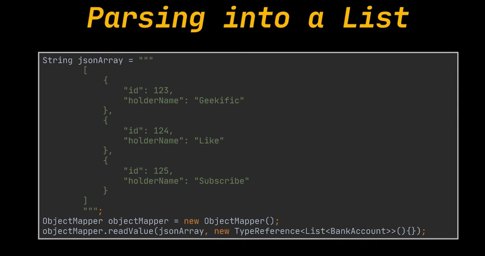
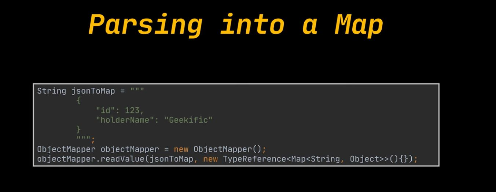

# Additional chapter: Intro to JSON and Jackson's ObjectMapper | Parse JSON in Java | Convert Object to JSON | Geekific.

Intro to JSON and Jackson's ObjectMapper | Parse JSON in Java | Convert Object to JSON | Geekific.

# What I Learned.

- The output of a Java class in relation to **JSON**!

- **Java** `List<T>` → **JSON** `List`:

````Json
[
  { "id": 1 },
  { "id": 2 }
]
````

- **Java** `Map<K,V>` → **JSON** Map:

````Json
{
  "USD": 1.0,
  "EUR": 0.92
}
````

- We can parse **JSON** Array into to the **Java List**!

<div align="center">
    
</div>

````Java
String jsonArray = """
        [
          {
            "id": 123,
            "holderName": "Geekific"
          },
          {
            "id": 124,
            "holderName": "Like"
          },
          {
            "id": 125,
            "holderName": "Subscribe"
          }
        ]
        """;
ObjectMapper objectMapper = new ObjectMapper();
objectMapper.readValue(jsonArray, new TypeReference<List<BankAccount>>(){});
````

<div align="center">
    
</div>

````Java
String jsonToMap = """
    {
        "id": 123,
        "holderName": "Geekific"
    }
    """;

ObjectMapper objectMapper = new ObjectMapper();
objectMapper.readValue(jsonToMap, new TypeReference<Map<String, Object>>(){});
````