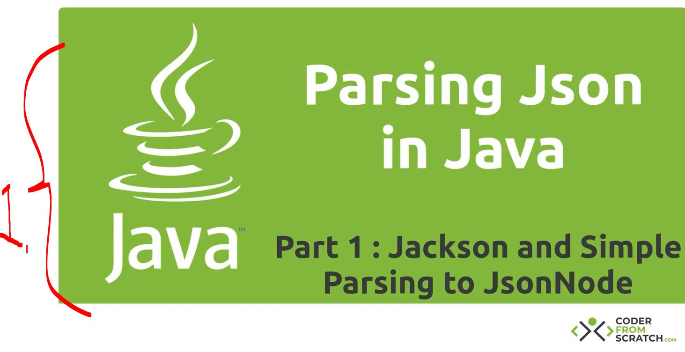
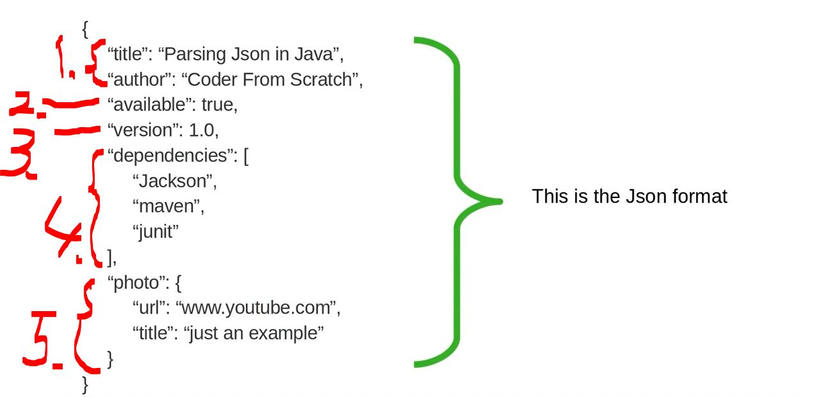
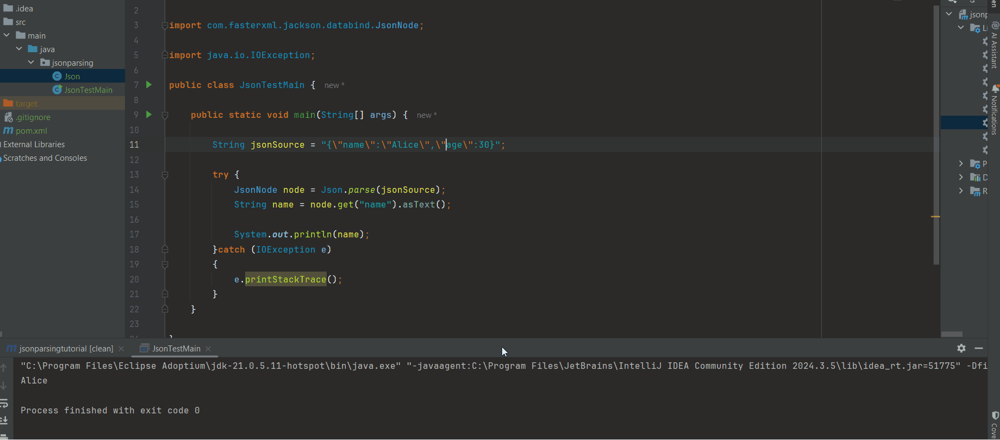
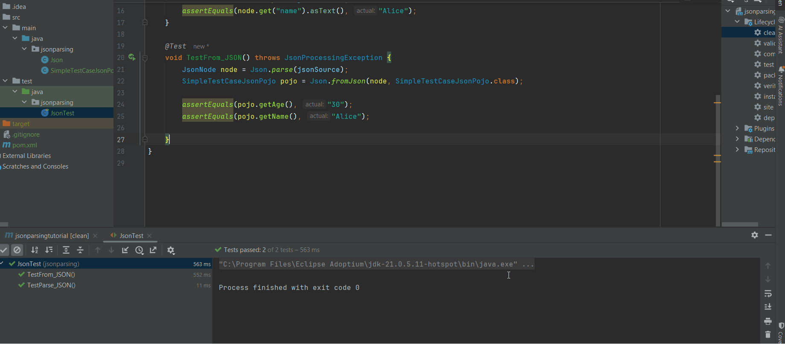

# Section 01: Parsing Json in Java Tutorial - Part 1: Jackson and Simple Objects.

Parsing Json in Java Tutorial - Part 1: Jackson and Simple Objects.

# What I Learned.

<div align="center">
    
</div>

1. We will be looking how to parse `JSON` to **Java Object** and **Java Object** to `JSON`! 

- There is other JSON library than **Jackson**.
    - **Gson** (Google).
    - **JSON-B** (Jakarta standard).

<div align="center">
    
</div>

1. There is **String**!
2. There is **Boolean**!
3. There is **Integers**!
4. There is **Array**, it can be any of **basic types**!
5. There is **Object attribute**!

- We will be using the **Jackson** processing:

````Xml
        <!-- Source: https://mvnrepository.com/artifact/com.fasterxml.jackson.core/jackson-databind -->
    <dependency>
      <groupId>com.fasterxml.jackson.core</groupId>
      <artifactId>jackson-databind</artifactId>
      <version>2.21.2</version>
      <scope>compile</scope>
    </dependency>
````

> [!NOTE]
> The Jackson is presented in `JsonNode` called in **Tree Model** as **JSON**:
>````Xml
>{
>   "name": "Alice",
>   "age": 30,
>   "address": {
>       "city": "Helsinki"
>   }
>}
>````

<br>

- There is different `JsonNode`:'s types, which can have value:
    - **ObjectNode**, it will be in JSON as **JSON object**:
        ````Xml
        {
        "name": "Alice",
        "age": 30
        }
        ````
    - **ArrayNode**, it will be in JSON as **JSON array**:
        ````Xml
        ["apple", "banana", "cherry"]
        ````
    - **TextNode**, it will be in JSON as **String**:
        ````Xml
        "hello world"
        ````
    - **NumericNode**, it will be in JSON as **Number**:
        ````Xml
        42
        ````
    - **NullNode**, it will be in JSON, **Null**:
        ````Xml
        null
        ````
    - **MissingNode**, there will be no JSON example:
        ````Xml
        {
            "name": "Alice"
        }
        ````
    - And when we are trying to access, There will be `MissingNode`!
        ```Xml
        node.path("age")   // → MissingNode.
        ```

- We will be initializing the `ObjectMapper` for reading the `JsonNode`!

````
static private ObjectMapper objectMapper = getDefaultObjectMapper();

    /**
     *  Construction happens here, coz we need configure the mapper!
     */
    private static ObjectMapper getDefaultObjectMapper() {
       ObjectMapper defaultObjectMapper = new ObjectMapper();
        // configure the mapper here!
        return defaultObjectMapper;
    }
````

- We will be reading **Tree Model**, with Jackson!

````Java
public static JsonNode parse(String source) throws JsonProcessingException {
        // We are reading tree mapping!
        return objectMapper.readTree(source);
    }
````

- `readTree()` converts a **JSON** `string` into a **tree** of `JsonNode` objects and returns the root of that tree.


- We will be testing, if we can read the `TreeNode` from **JSON**:

````Java
package jsonparsing;

import com.fasterxml.jackson.databind.JsonNode;

import java.io.IOException;

public class JsonTestMain {

    public static void main(String[] args) {

        String jsonSource = "{\"name\":\"Alice\",\"age\":30}";

        try {
            JsonNode node = Json.parse(jsonSource);
            String name = node.get("name").asText();

            System.out.println(name);
        }catch (IOException e)
        {
            e.printStackTrace();
        }
    }
}
````

- This illustrated as below:

<div align="center">
    
</div>

- One can see the `name` filed is being read from the **JSON**, with usage of the `.readTree(...)`;

- We will be making this as **JUnit** case:

````Java
class JsonTest {

    String jsonSource = "{\"name\":\"Alice\",\"age\":30}";

    @Test
    void TestParse_JSON() throws JsonProcessingException {
        JsonNode node = Json.parse(jsonSource);
        assertEquals(node.get("name").asText(), "Alice");
    }
}
````

- `fromJson` convert a `JsonNode` tree into a **Java POJO** of type `clazz`.

````Java
    // From JsonNode to POJO Object!
    public static<A> A fromJson(JsonNode node, Class<A> clazz) throws JsonProcessingException {
        return objectMapper.treeToValue(node, clazz);
    }
````

- We need the **Java POJO** class the` SimpleTestCaseJsonPojo.java`:

````Java
package jsonparsing;

import lombok.Getter;
import lombok.Setter;

@Getter
@Setter
class SimpleTestCaseJsonPojo {
    private String name;
    private String age;
}
````

- We will be having this as **JUnit** case:

````Java
class JsonTest {

    String jsonSource = "{\"name\":\"Alice\",\"age\":30}";

    @Test
    void TestFrom_JSON() throws JsonProcessingException {
        JsonNode node = Json.parse(jsonSource);
        SimpleTestCaseJsonPojo pojo = Json.fromJson(node, SimpleTestCaseJsonPojo.class);

        assertEquals(pojo.getAge(), "30");
        assertEquals(pojo.getName(), "Alice");
    }
}
````

- This illustrated as below:

<div align="center">
    
</div>

- As you can see the fields, `name` and the `age` is being read to **Java POJO** object!

<details>
<summary id="chapter1" open="true"> <b>Code after chapter 1</b>! </summary>

#### POM.xml

```Xml
<project xmlns="http://maven.apache.org/POM/4.0.0" xmlns:xsi="http://www.w3.org/2001/XMLSchema-instance"
  xsi:schemaLocation="http://maven.apache.org/POM/4.0.0 http://maven.apache.org/xsd/maven-4.0.0.xsd">
  <modelVersion>4.0.0</modelVersion>

  <groupId>collection</groupId>
  <artifactId>jsonparsingtutorial</artifactId>
  <version>1.0-SNAPSHOT</version>
  <packaging>jar</packaging>

  <name>jsonparsingtutorial</name>
  <url>http://maven.apache.org</url>

  <properties>
    <project.build.sourceEncoding>UTF-8</project.build.sourceEncoding>
  </properties>

  <dependencies>
    <!-- Source: https://mvnrepository.com/artifact/com.fasterxml.jackson.core/jackson-databind -->
    <dependency>
      <groupId>com.fasterxml.jackson.core</groupId>
      <artifactId>jackson-databind</artifactId>
      <version>2.21.2</version>
      <scope>compile</scope>
    </dependency>

    <!-- Source: https://mvnrepository.com/artifact/org.projectlombok/lombok -->
    <dependency>
      <groupId>org.projectlombok</groupId>
      <artifactId>lombok</artifactId>
      <version>1.18.46</version>
      <scope>compile</scope>
    </dependency>

    <dependency>
      <groupId>org.junit.jupiter</groupId>
      <artifactId>junit-jupiter</artifactId>
      <version>RELEASE</version>
      <scope>test</scope>
    </dependency>
    <dependency>
      <groupId>org.junit.jupiter</groupId>
      <artifactId>junit-jupiter</artifactId>
      <version>RELEASE</version>
      <scope>test</scope>
    </dependency>
  </dependencies>
</project>

```

#### SimpleTestCaseJsonPojo.java

```Java
package jsonparsing.pojo;

import lombok.Getter;
import lombok.Setter;

@Getter
@Setter
public class SimpleTestCaseJsonPojo {
    private String name;
    private String age;
}

```

#### Json.java

```Java
package jsonparsing;


import com.fasterxml.jackson.core.JsonProcessingException;
import com.fasterxml.jackson.databind.DeserializationFeature;
import com.fasterxml.jackson.databind.JsonNode;
import com.fasterxml.jackson.databind.ObjectMapper;
import com.fasterxml.jackson.databind.ObjectWriter;
import com.fasterxml.jackson.databind.SerializationFeature;
import com.fasterxml.jackson.datatype.jsr310.JavaTimeModule;

// This will be util class!
public class Json {

    static private ObjectMapper objectMapper = getDefaultObjectMapper();

    /**
     *  Construction happens here, coz we need configure the mapper!
     */
    private static ObjectMapper getDefaultObjectMapper() {
       ObjectMapper defaultObjectMapper = new ObjectMapper();
        // Configure the mapper here!

        // We don't want to throw exception when there unknown fields.
        defaultObjectMapper.configure(DeserializationFeature.FAIL_ON_UNKNOWN_PROPERTIES, false);
        // We want to use Java 8 Dates.
        defaultObjectMapper.registerModule(new JavaTimeModule());

        return defaultObjectMapper;
    }

    // Parse from String JSON -> JsonNode.
    public static JsonNode parse(String source) throws JsonProcessingException {
        // We are reading tree mapping!
        return objectMapper.readTree(source);
    }
    
    // From JsonNode to POJO Object!
    public static<A> A fromJson(JsonNode node, Class<A> clazz) throws JsonProcessingException {
        return objectMapper.treeToValue(node, clazz);
    }
}
```

#### JsonTest.java

```Java
package jsonparsing;

import com.fasterxml.jackson.core.JsonProcessingException;
import com.fasterxml.jackson.databind.JsonNode;
import jsonparsing.pojo.AuthorPOJO;
import jsonparsing.pojo.BookPOJO;
import jsonparsing.pojo.DayPOJO;
import jsonparsing.pojo.SimpleTestCaseJsonPojo;
import org.junit.jupiter.api.Test;

import static org.junit.jupiter.api.Assertions.assertEquals;

class JsonTest {

    private String jsonSource = "{\n" +
            "  \"name\":\"Alice\",\n" +
            "  \"age\":30,\n" +
            "  \"surename\":\"Richard\"\n" +
            "}";

    @Test
    void TestParse_JSON() throws JsonProcessingException {
        JsonNode node = Json.parse(jsonSource);
        assertEquals(node.get("name").asText(), "Alice");
    }

    @Test
    void TestFrom_JSON() throws JsonProcessingException {
        JsonNode node = Json.parse(jsonSource);
        SimpleTestCaseJsonPojo pojo = Json.fromJson(node, SimpleTestCaseJsonPojo.class);

        assertEquals(pojo.getAge(), "30");
        assertEquals(pojo.getName(), "Alice");

    }
}
```
</details>
