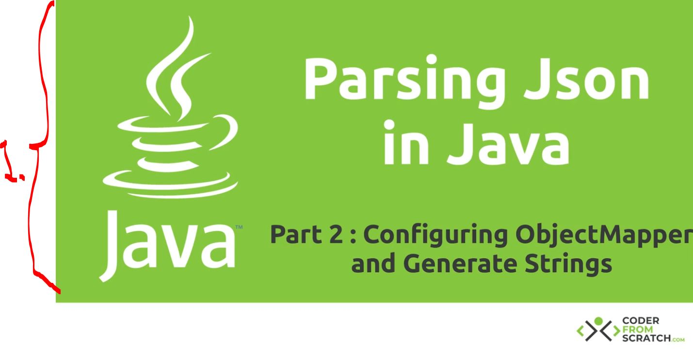
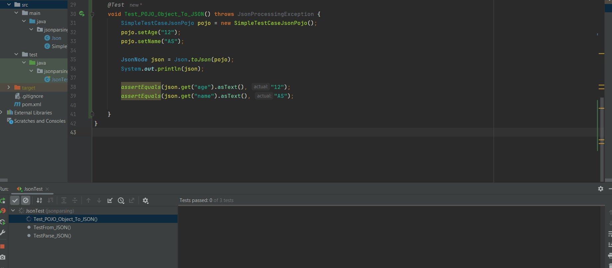
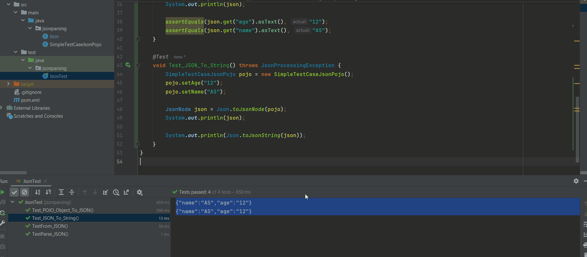

# Section 02: Parsing Json in Java Tutorial - Part 2: ObjectMapper and Generate Json Strings.

Parsing Json in Java Tutorial - Part 2: ObjectMapper and Generate Json Strings.

# What I Learned.

<div align="center">
    
</div>

1. We will be checking configuring the **ObjectMapper** and **Generating Strings**!

- We will **configure** the **mapper**, with `.configure(...)`.
    - It tells Jackson **not** to **throw** an exception when the JSON contains fields that don’t exist in your **POJO** class.
    ````Java
    defaultObjectMapper.configure(DeserializationFeature.FAIL_ON_UNKNOWN_PROPERTIES, false);
    ````

- We will be making **Java POJO** to **JSON**!
    - `.valueToTree(...);` Converts a **Java object** into a **JSON tree structure**.

````Java
    // POJO to JsonNode!
    public static JsonNode toJson(Object object)
    {
        return objectMapper.valueToTree(object);
    }
````

- We will be having this as **JUnit** case:

````Java
@Test
    void Test_POJO_Object_To_JSON() throws JsonProcessingException {
        SimpleTestCaseJsonPojo pojo = new SimpleTestCaseJsonPojo();
        pojo.setAge("12");
        pojo.setName("AS");

        JsonNode json = Json.toJson(pojo);
        System.out.println(json);

        assertEquals(json.get("age").asText(), "12");
        assertEquals(json.get("name").asText(), "AS");

    }
````

- This illustrated as below:

<div align="center">
    
</div>

1. As you can see the fields, `name` and the `age` in JSON format.

- We will be writing the **Object** to **String**, with the `ObjectWriter`.
    - `ObjectWriter` is a helper object from Jackson used only for writing (serializing) **JSON**.

````Java
    // JSON to String!
    public static String toJsonString(JsonNode node) throws JsonProcessingException {
        ObjectWriter objectWriter = objectMapper.writer();
        return objectWriter.writeValueAsString(node);
    }
````

- We will be having this as **JUnit** case:

````Java
    @Test
    void Test_JSON_To_String() throws JsonProcessingException {
        SimpleTestCaseJsonPojo pojo = new SimpleTestCaseJsonPojo();
        pojo.setAge("12");
        pojo.setName("AS");

        JsonNode json = Json.toJsonNode(pojo);
        System.out.println(json);

        System.out.println(Json.toJsonString(json));
    }
````

- This illustrated as below:

<div align="center">
    
</div>

1. As you can see there are **two outputs**! They both look the same, but they are different internally `JsonNode` and `String`!

````Xml
{"name":"AS","age":"12"}
{"name":"AS","age":"12"}
````

- Codes after chapter:

<details>
<summary id="chapter2" open="true"> <b>Code after chapter 2</b>! </summary>

```Java

```
</details>
