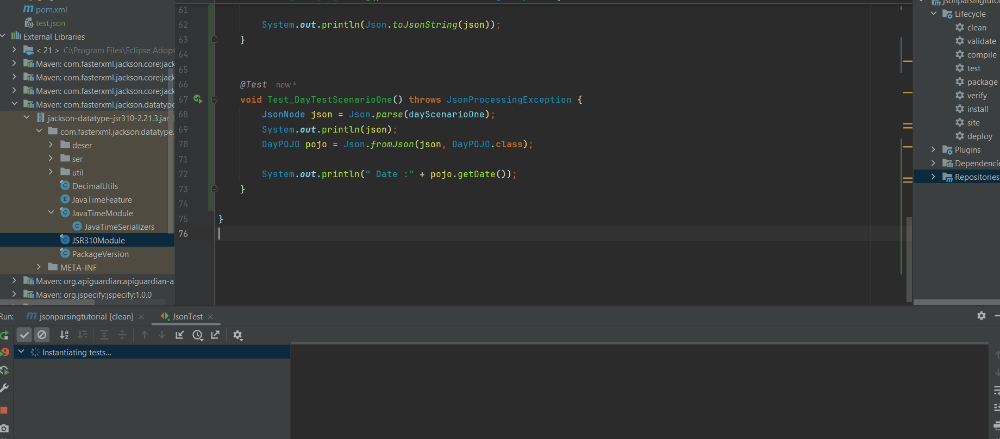
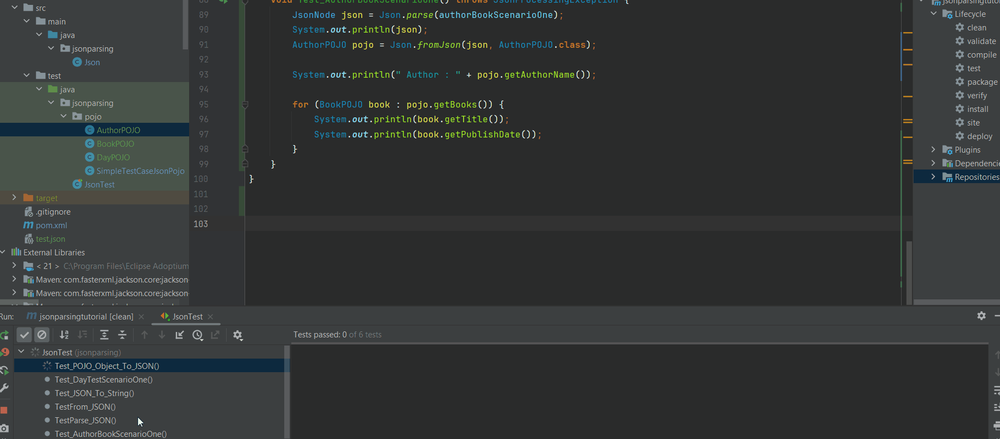

# Section 03: Parsing Json in Java Tutorial - Part 3: More complex Mappings.

Parsing JSON in Java Tutorial - Part 3: More complex Mappings.

# What I Learned.

<div align="center">
    
</div>

1. We will be doing **complex** mappings!

- We will be having following `DayPOJO.java`.

````
package jsonparsing.pojo;

import lombok.Getter;
import lombok.Setter;

import java.time.LocalDate;

@Setter
@Getter
public class DayPOJO {
    LocalDate date;
    String name;
}
````

- That matches **JSON**:

````Json
{
  "date": "2019-12-25",
  "name": "Xmas day!"
}
````

- We will be importing in `POM` **jackson-datatype-jsr310**:

````Xml
    <!-- Source: https://mvnrepository.com/artifact/com.fasterxml.jackson.datatype/jackson-datatype-jsr310 -->
    <dependency>
      <groupId>com.fasterxml.jackson.datatype</groupId>
      <artifactId>jackson-datatype-jsr310</artifactId>
      <version>2.21.3</version>
      <scope>compile</scope>
    </dependency>
````

- We need configure **Jackson** with Java 8 Dates!

````Java
    // We want to use Java 8 Dates.
    defaultObjectMapper.registerModule(new JavaTimeModule());
````

- We will be having this as **JUnit** case:

````Java
    @Test
    void Test_DayTestScenarioOne() throws JsonProcessingException {
        JsonNode json = Json.parse(dayScenarioOne);
        System.out.println(json);
        DayPOJO pojo = Json.fromJson(json, DayPOJO.class);

        System.out.println(" Date :" + pojo.getDate());
    }
````

- This illustrated as below:

<div align="center">
    
</div>

1. `LocalDate` working!

- The output below:

````Xml
{"date":"2019-12-25","name":"Xmas day!"}
 Date :2019-12-25
````

- Next, we will be looking **Object**'s inside **Object**!

- We will be having following `AuthorPOJO.java`.

````
package jsonparsing.pojo;

import lombok.Getter;
import lombok.Setter;

import java.time.LocalDate;
import java.util.List;

@Setter
@Getter
public class AuthorPOJO {
    private String authorName;
    private List<BookPOJO> books;
}
````

- And will be having following `BookPOJO.java`.

````
package jsonparsing.pojo;

import lombok.Getter;
import lombok.Setter;

import java.time.LocalDate;

@Setter
@Getter
public class BookPOJO {
    String title;
    boolean inPrint;
    LocalDate publishDate;
}
````

- That matches **JSON**:

````Json
{
  "authorName": "Rui",
  "books" : [
    {
      "title": "Title1",
      "inPrint": true,
      "publishDate": "2019-12-25"
    },
    {
      "title": "Title2",
      "inPrint": true,
      "publishDate": "2019-01-02"
    }
  ]
}
````

- We will be having this as **JUnit** case:

````Java
    @Test
    void Test_AuthorBookScenarioOne() throws JsonProcessingException {
        JsonNode json = Json.parse(authorBookScenarioOne);
        System.out.println(json);
        AuthorPOJO pojo = Json.fromJson(json, AuthorPOJO.class);

        System.out.println(" Author : " + pojo.getAuthorName());

        for (BookPOJO book : pojo.getBooks()) {
            System.out.println(book.getTitle());
            System.out.println(book.getPublishDate());
        }
    }
````

- This illustrated as below:

<div align="center">
    
</div>

1. Multiple objects inside array working!

- The output below:

````Json
{"authorName":"Rui","books":[{"title":"Title1","inPrint":true,"publishDate":"2019-12-25"},{"title":"Title2","inPrint":true,"publishDate":"2019-01-02"}]}
 Author : Rui
Title1
2019-12-25
Title2
2019-01-02
````

- Codes after chapter:

<details>
<summary id="chapter3" open="true"> <b>Code after chapter 3</b>! </summary>

#### Json.java

```Java
package jsonparsing;


import com.fasterxml.jackson.core.JsonProcessingException;
import com.fasterxml.jackson.databind.DeserializationFeature;
import com.fasterxml.jackson.databind.JsonNode;
import com.fasterxml.jackson.databind.ObjectMapper;
import com.fasterxml.jackson.databind.ObjectWriter;
import com.fasterxml.jackson.databind.SerializationFeature;
import com.fasterxml.jackson.datatype.jsr310.JavaTimeModule;

// This will be util class!
public class Json {

    static private ObjectMapper objectMapper = getDefaultObjectMapper();

    /**
     *  Construction happens here, coz we need configure the mapper!
     */
    private static ObjectMapper getDefaultObjectMapper() {
       ObjectMapper defaultObjectMapper = new ObjectMapper();
        // Configure the mapper here!

        // We don't want to throw exception when there unknown fields.
        defaultObjectMapper.configure(DeserializationFeature.FAIL_ON_UNKNOWN_PROPERTIES, false);
        // We want to use Java 8 Dates.
        defaultObjectMapper.registerModule(new JavaTimeModule());

        return defaultObjectMapper;
    }

    // Parse from String JSON -> JsonNode.
    public static JsonNode parse(String source) throws JsonProcessingException {
        // We are reading tree mapping!
        return objectMapper.readTree(source);
    }

    // From JsonNode to POJO Object!
    public static<A> A fromJson(JsonNode node, Class<A> clazz) throws JsonProcessingException {
        return objectMapper.treeToValue(node, clazz);
    }

    // POJO to JsonNode!
    public static JsonNode toJsonNode(Object object)
    {
        return objectMapper.valueToTree(object);
    }

    // JsonNode to String!
    public static String toJsonString(JsonNode node) throws JsonProcessingException {
        ObjectWriter objectWriter = objectMapper.writer();
        // For the pretty print.
        objectWriter.with(SerializationFeature.INDENT_OUTPUT);
        return objectWriter.writeValueAsString(node);
    }
}
```

- POJO classes:

#### AuthorPOJO.java

```Java
package jsonparsing.pojo;

import lombok.Getter;
import lombok.Setter;

import java.time.LocalDate;
import java.util.List;

@Setter
@Getter
public class AuthorPOJO {
    private String authorName;
    private List<BookPOJO> books;
}
```

#### BookPOJO.java

```Java
package jsonparsing.pojo;

import lombok.Getter;
import lombok.Setter;

import java.time.LocalDate;

@Setter
@Getter
public class BookPOJO {
    String title;
    boolean inPrint;
    LocalDate publishDate;
}
```

#### DayPOJO.java

```Java
package jsonparsing.pojo;

import lombok.Getter;
import lombok.Setter;

import java.time.LocalDate;

@Setter
@Getter
public class DayPOJO {
    LocalDate date;
    String name;
}
```
#### SimpleTestCaseJsonPojo.java

```Java
package jsonparsing.pojo;

import lombok.Getter;
import lombok.Setter;

@Getter
@Setter
public class SimpleTestCaseJsonPojo {
    private String name;
    private String age;
}
```

#### JsonTest.java

```Java
package jsonparsing;

import com.fasterxml.jackson.core.JsonProcessingException;
import com.fasterxml.jackson.databind.JsonNode;
import jsonparsing.pojo.AuthorPOJO;
import jsonparsing.pojo.BookPOJO;
import jsonparsing.pojo.DayPOJO;
import jsonparsing.pojo.SimpleTestCaseJsonPojo;
import org.junit.jupiter.api.Test;

import static org.junit.jupiter.api.Assertions.assertEquals;

class JsonTest {

    private String jsonSource = "{\n" +
            "  \"name\":\"Alice\",\n" +
            "  \"age\":30,\n" +
            "  \"surename\":\"Richard\"\n" +
            "}";

    private String dayScenarioOne = "{\n" +
            "  \"date\": \"2019-12-25\",\n" +
            "  \"name\": \"Xmas day!\"\n" +
            "}";

    private String authorBookScenarioOne = "{\n" +
            "  \"authorName\": \"Rui\",\n" +
            "  \"books\": [\n" +
            "    { \"title\": \"Title1\", \"inPrint\": true, \"publishDate\": \"2019-12-25\" },\n" +
            "    { \"title\": \"Title2\", \"inPrint\": true, \"publishDate\": \"2019-01-02\" }\n" +
            "  ]\n" +
            "}";

    @Test
    void TestParse_JSON() throws JsonProcessingException {
        JsonNode node = Json.parse(jsonSource);
        assertEquals(node.get("name").asText(), "Alice");
    }

    @Test
    void TestFrom_JSON() throws JsonProcessingException {
        JsonNode node = Json.parse(jsonSource);
        SimpleTestCaseJsonPojo pojo = Json.fromJson(node, SimpleTestCaseJsonPojo.class);

        assertEquals(pojo.getAge(), "30");
        assertEquals(pojo.getName(), "Alice");

    }

    @Test
    void Test_POJO_Object_To_JSON() throws JsonProcessingException {
        SimpleTestCaseJsonPojo pojo = new SimpleTestCaseJsonPojo();
        pojo.setAge("12");
        pojo.setName("AS");

        JsonNode json = Json.toJsonNode(pojo);
        System.out.println(json);

        assertEquals(json.get("age").asText(), "12");
        assertEquals(json.get("name").asText(), "AS");
    }

    @Test
    void Test_JSON_To_String() throws JsonProcessingException {
        SimpleTestCaseJsonPojo pojo = new SimpleTestCaseJsonPojo();
        pojo.setAge("12");
        pojo.setName("AS");

        JsonNode json = Json.toJsonNode(pojo);
        System.out.println(json);

        System.out.println(Json.toJsonString(json));
    }


    @Test
    void Test_DayTestScenarioOne() throws JsonProcessingException {
        JsonNode json = Json.parse(dayScenarioOne);
        System.out.println(json);
        DayPOJO pojo = Json.fromJson(json, DayPOJO.class);

        System.out.println(" Date :" + pojo.getDate());

        assertEquals("2019-12-25", pojo.getDate().toString());
    }

    @Test
    void Test_AuthorBookScenarioOne() throws JsonProcessingException {
        JsonNode json = Json.parse(authorBookScenarioOne);
        System.out.println(json);
        AuthorPOJO pojo = Json.fromJson(json, AuthorPOJO.class);

        System.out.println(" Author : " + pojo.getAuthorName());

        for (BookPOJO book : pojo.getBooks()) {
            System.out.println(book.getTitle());
            System.out.println(book.getPublishDate());
        }
    }
}
```

#### POM.xml

```Xml
<project xmlns="http://maven.apache.org/POM/4.0.0" xmlns:xsi="http://www.w3.org/2001/XMLSchema-instance"
  xsi:schemaLocation="http://maven.apache.org/POM/4.0.0 http://maven.apache.org/xsd/maven-4.0.0.xsd">
  <modelVersion>4.0.0</modelVersion>

  <groupId>collection</groupId>
  <artifactId>jsonparsingtutorial</artifactId>
  <version>1.0-SNAPSHOT</version>
  <packaging>jar</packaging>

  <name>jsonparsingtutorial</name>
  <url>http://maven.apache.org</url>

  <properties>
    <project.build.sourceEncoding>UTF-8</project.build.sourceEncoding>
  </properties>

  <dependencies>
    <!-- Source: https://mvnrepository.com/artifact/com.fasterxml.jackson.core/jackson-databind -->
    <dependency>
      <groupId>com.fasterxml.jackson.core</groupId>
      <artifactId>jackson-databind</artifactId>
      <version>2.21.2</version>
      <scope>compile</scope>
    </dependency>

    <!-- Source: https://mvnrepository.com/artifact/com.fasterxml.jackson.datatype/jackson-datatype-jsr310 -->
    <dependency>
      <groupId>com.fasterxml.jackson.datatype</groupId>
      <artifactId>jackson-datatype-jsr310</artifactId>
      <version>2.21.3</version>
      <scope>compile</scope>
    </dependency>

    <!-- Source: https://mvnrepository.com/artifact/org.projectlombok/lombok -->
    <dependency>
      <groupId>org.projectlombok</groupId>
      <artifactId>lombok</artifactId>
      <version>1.18.46</version>
      <scope>compile</scope>
    </dependency>

    <dependency>
      <groupId>org.junit.jupiter</groupId>
      <artifactId>junit-jupiter</artifactId>
      <version>RELEASE</version>
      <scope>test</scope>
    </dependency>
    <dependency>
      <groupId>org.junit.jupiter</groupId>
      <artifactId>junit-jupiter</artifactId>
      <version>RELEASE</version>
      <scope>test</scope>
    </dependency>

  </dependencies>
</project>
```

</details>