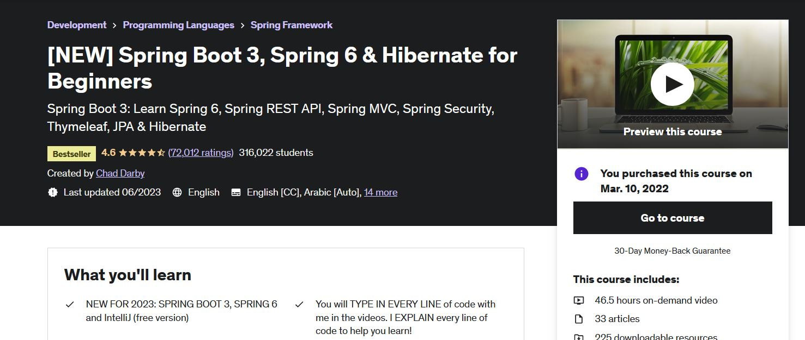
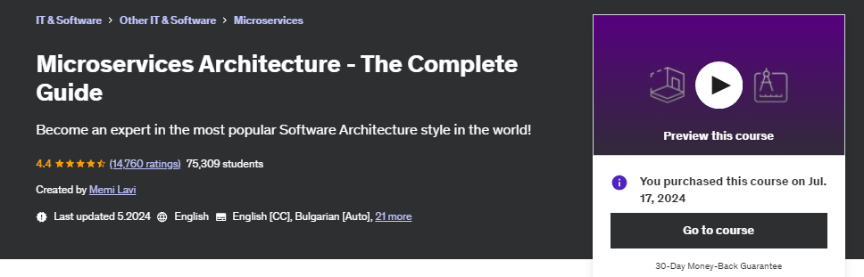
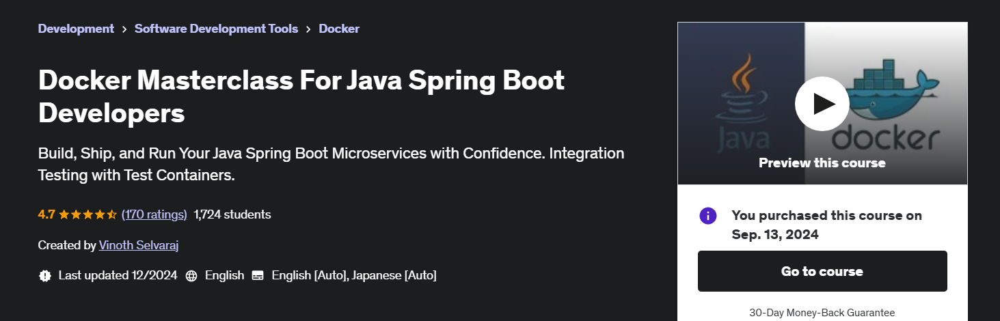
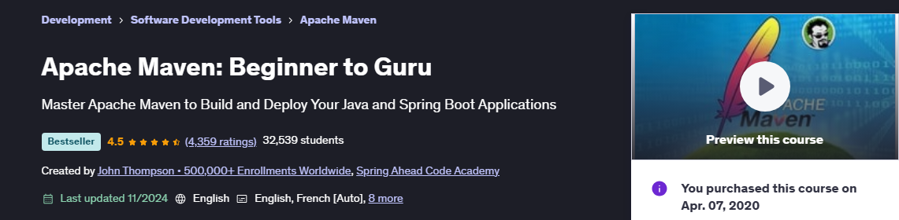
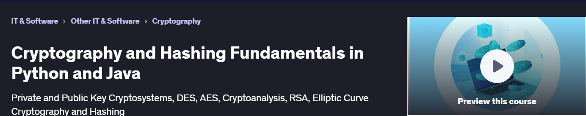

    

> For these courses one should configure **GIT** for handle projects.
> `git config --global http.postBuffer 524288000`
> `git config --global core.longpaths true`

    

All course material from Spring Boot 3, Spring 6 & Hibernate for Beginners by **Chad Darby** ©. 

Contains my own notes with some course material to enforce learning experience.

[The course at Udemy](https://www.udemy.com/course/spring-hibernate-tutorial/). 

[Content maker](https://luv2code.com/).

[Git repo](https://github.com/darbyluv2code/spring-boot-3-spring-6-hibernate-for-beginners/blob/main/11-appendix/course-links.md).

If the content sparked :fire: your interest, please consider buying the course and start learning :book:.

<!-- 
Linkedin puts this shit front, when clicking from private mode x(. Need to put this to make jump working every case
?trk=public_profile_see-credential 
-->

    Insert certificate here when completed

**Note: The material provided in this repository is only for helping those who may get stuck at any point of time in the course. It is very advised that no one should just copy the solutions(violation of Honor Code) presented here.**

#### Progress/Curriculum.

- [x] [Section 01](https://github.com/developersCradle/spring-springboot-angular-microservices-mysql-java-persistence-hibernate/tree/main/SpringBootHibernateForBeginners/Section%201#section-1-new---spring-boot-3-quick-start) - Section 1: NEW - Spring Boot 3 Quick Start.
- [x] [Section 02](https://github.com/developersCradle/spring-springboot-angular-microservices-mysql-java-persistence-hibernate/tree/main/SpringBootHibernateForBeginners/Section%202#section-2-new---spring-boot-3---inversion-of-control-and-dependency-injection) - Section 2: NEW - Spring Core.
- [x] [Section 03](https://github.com/developersCradle/spring-springboot-angular-microservices-mysql-java-persistence-hibernate/tree/main/SpringBootHibernateForBeginners/Section%203#section-3-new---hibernatejpa-crud) - Section 3: NEW - Hibernate/JPA CRUD.
- [x] [Section 04](https://github.com/developersCradle/spring-springboot-angular-microservices-mysql-java-persistence-hibernate/tree/main/SpringBootHibernateForBeginners/Section%204#section-4-new---rest-crud-apis) - Section 4: NEW - REST CRUD APIs.
- [x] [Section 05](https://github.com/developersCradle/spring-springboot-angular-microservices-mysql-java-persistence-hibernate/tree/main/SpringBootHibernateForBeginners/Section%205#section-5-new---rest-api-security) - Section 5: NEW - REST API Security.
- [ ] [Section 06](https://github.com/developersCradle/spring-springboot-angular-microservices-mysql-java-persistence-hibernate/tree/main/SpringBootHibernateForBeginners/Section%206#section-6-new---spring-mvc) - Section 6: NEW - Spring MVC.
- [ ] [Section 07](#) - Section 7: NEW - Spring MVC CRUD.
- [ ] [Section 08](#) - Section 8: NEW - Spring MVC Security.
- [ ] [Section 09](#) - Section 9: NEW - JPA / Hibernate Advanced Mappings.
- [ ] [Section 10](#) - Section 10: NEW - AOP: Aspect-Oriented Programming.
- [ ] [Section 11](#) - Section 11: Summary.
- [ ] [Section 12](#) - Section 12: Appendix.
- [ ] [Section 13](#) - Section 13: Bonus.

#### Additional stuff.

- [ ] Read/skim thought Spring documentation when finished this course.
- [ ] Make Unix clock in Thymeleaf or in Angular.
- [ ] Make crypt program in Angular.
- [ ] Refactor paths and projects inside eclipse.
- [ ] Check typos.
- [ ] Make folder 00 based.
- [ ] Section 05 - Spring Boot REST Security with JPA/Hibernate Tutorial.
- [ ] Make Chapters/headings when reviewing.

## Old(legacy) course Curriculum, old course still accessible, if useful do. 

#### Progress/Curriculum.

- [x] [Section 01](#) - Course Introduction
- [X] [Section 02](#) - Spring Overview
- [ ] [Section 03](#) - Setting Up Your Development Environment
- [ ] [Section 04](#) - Spring Inversion of Control - XML Configuration
- [ ] [Section 05](#) - Spring Dependency Injection - XML Configuration

    

All course material from Master Microservices with Spring Boot and Spring Cloud by **in28Minutes** ©.

Contains my own notes with some course material to enforce learning experience.

[The course at Udemy](https://www.udemy.com/course/microservices-with-spring-boot-and-spring-cloud/).

[Content maker](https://www.in28minutes.com/).

[Latest GIT](https://github.com/in28minutes/spring-microservices-v3).

If the content sparked :fire: your interest, please consider buying the course and start learning :book:.

<!-- 
Linkedin puts this shit front, when clicking from private mode x(. Need to put this to make jump working every case
?trk=public_profile_see-credential 
-->

    Insert certificate here when completed

**Note: The material provided in this repository is only for helping those who may get stuck at any point of time in the course. It is very advised that no one should just copy the solutions(violation of Honor Code) presented here.**

#### Progress/Curriculum new.

- [x] [Section 01](https://github.com/developersCradle/spring-springboot-angular-microservices-mysql-java-persistence-hibernate/tree/main/MasterMicroservicesWithSpringBootandSpringCloud/Section%201#section-1-introduction) - Introduction ✅.
- [x] [Section 02](https://github.com/developersCradle/spring-springboot-angular-microservices-mysql-java-persistence-hibernate/tree/main/MasterMicroservicesWithSpringBootandSpringCloud/Section%202#section-2-introduction-to-web-services) - Introduction To Web Services ✅.
- [ ] [Section 03](#) - Restful Web Services with Spring Boot - V2.
- [x] [Section 04](https://github.com/developersCradle/spring-springboot-angular-microservices-mysql-java-persistence-hibernate/tree/main/MasterMicroservicesWithSpringBootandSpringCloud/Section%204#section-4--quick-introduction-to-microservices) - Quick Introduction to Microservices ✅.
- [ ] [Section 05](https://github.com/developersCradle/spring-springboot-angular-microservices-mysql-java-persistence-hibernate/tree/main/MasterMicroservicesWithSpringBootandSpringCloud/Section%205#section-5-microservices-with-spring-cloud---v1) - Microservices with Spring Cloud - V1. **Master Microservices - V1 is now deprecated!**.
- [x] [Section 06](https://github.com/developersCradle/spring-springboot-angular-microservices-mysql-java-persistence-hibernate/tree/main/MasterMicroservicesWithSpringBootandSpringCloud/Section%206#section-6-microservices-with-spring-cloud---v2) - Microservices with Spring Cloud - V2 ✅.
- [ ] [Section 07](https://github.com/developersCradle/spring-springboot-angular-microservices-mysql-java-persistence-hibernate/tree/main/MasterMicroservicesWithSpringBootandSpringCloud/Section%2007#section-07-docker-with-microservices-using-spring-boot-and-spring-cloud---v2) - Docker with Microservices using Spring Boot and Spring Cloud - V2.
- [ ] [Section 08](#) - Kubernetes with Microservices using Docker, Spring Boot and Spring Cloud - V2.
- [ ] [Section 09](#) - Thanks.
- [ ] [Section 10](#) - Appendix - Introduction to Spring Boot in 12 Steps.  
- [ ] [Section 11](#) - Appendix - Introduction to JUnit.
- [ ] [Section 12](#) - Appendix - Introduction To Mockito.
- [ ] [Section 13](#) - Appendix - Introduction to Functional Programming in 30 Minutes. 
- [ ] [Section 14](https://github.com/developersCradle/spring-springboot-angular-microservices-mysql-java-persistence-hibernate/tree/main/MasterMicroservicesWithSpringBootandSpringCloud/Section%2014#section-14-appendix---introduction-to-gradle) - Appendix - Introduction To Gradle.
- [x] [Section 15](https://github.com/developersCradle/spring-springboot-angular-microservices-mysql-java-persistence-hibernate/tree/main/MasterMicroservicesWithSpringBootandSpringCloud/Section%2015#section-15-appendix---introduction-to-jpa-in-10-steps---v2) - Appendix - Introduction to JPA in 10 Steps - V2 ✅.
- [ ] [Section 16](https://github.com/developersCradle/spring-springboot-angular-microservices-mysql-java-persistence-hibernate/tree/main/MasterMicroservicesWithSpringBootandSpringCloud/Section%2016#section-16-appendix---introduction-to-functional-programming-in-30-minutes) - Appendix - Introduction to Functional Programming in 30 Minutes.

#### Additional stuff.

- [ ] Read [Pro GIT book](https://git-scm.com/book/en/v2).
- [ ] Move Spring V1 into appendix folder, since it depreciated.
    - Also numbering got changed.

    

All course material from Microservices Architecture - The Complete Guide by **Memi Lavi** ©.

Contains my own notes with some course material to enforce learning experience.

[The course at Udemy](https://www.udemy.com/course/microservices-architecture-the-complete-guide/).

[Content maker](https://memilavi.com/).

If the content sparked :fire: your interest, please consider buying the course and start learning :book:.

<!-- 
Linkedin puts this shit front, when clicking from private mode x(. Need to put this to make jump working every case
?trk=public_profile_see-credential 
-->

    Insert certificate here when completed

**Note: The material provided in this repository is only for helping those who may get stuck at any point of time in the course. It is very advised that no one should just copy the solutions(violation of Honor Code) presented here.**

#### Progress/Curriculum.

- [ ] [Section 01](#) - Welcome.

<!-- Change the name -->

    

All course material from **Java Persistence: Hibernate and JPA Fundamentals** by **Deshraj Singh Kiran** ©.

[The Course at Udemy](https://www.udemy.com/course/hibernate-and-jpa-fundamentals/).   

If the content sparked :fire: your interest, please consider buying the course and start learning :book:.

<!-- 
Linkedin puts this shit front, when clicking from private mode x(. Need to put this to make jump working every case
?trk=public_profile_see-credential 
-->

    

**Note: The material provided in this repository is only for helping those who may get stuck at any point of time in the course. It is very advised that no one should just copy the solutions(violation of Honor Code) presented here.**

#### Progress/Curriculum.

- [x] [Section 01](https://github.com/developersCradle/spring-springboot-angular-microservices-mysql-java-persistence-hibernate-aws/tree/main/Java%20Persistence%20Hibernate%20and%20JPA%20Fundamentals/Section%2001#section-01-about-this-course) - About this Course. ✅
- [x] [Section 02](https://github.com/developersCradle/spring-springboot-angular-microservices-mysql-java-persistence-hibernate-aws/tree/main/Java%20Persistence%20Hibernate%20and%20JPA%20Fundamentals/Section%2002#section-02-understanding-objectrelational-persistence) - Understanding object/relational persistence. ✅
- [ ] [Section 03](https://github.com/developersCradle/spring-springboot-angular-microservices-mysql-java-persistence-hibernate-aws/tree/main/Java%20Persistence%20Hibernate%20and%20JPA%20Fundamentals/Section%2003#section-3-getting-started-with-hibernate-and-jpa-annotations) - Getting Started with Hibernate and JPA Annotations.
- [ ] [Section 04](https://github.com/developersCradle/spring-springboot-angular-microservices-mysql-java-persistence-hibernate-aws/tree/main/Java%20Persistence%20Hibernate%20and%20JPA%20Fundamentals/Section%2004#section-04-mapping-concepts) - Mapping Concepts.
- [ ] [Section 05](https://github.com/developersCradle/spring-springboot-angular-microservices-mysql-java-persistence-hibernate-aws/blob/main/Java%20Persistence%20Hibernate%20and%20JPA%20Fundamentals/Section%2005/README.md#section-05-getting-started-with-jpa) - Getting Started with JPA.
- [ ] [Section 06](https://github.com/developersCradle/spring-springboot-angular-microservices-mysql-java-persistence-hibernate-aws/tree/main/Java%20Persistence%20Hibernate%20and%20JPA%20Fundamentals/Section%2006#section-06-best-practices) - Best Practices.

#### Additional stuff.

- [ ] Read again the mismatches.

    

All course material from **The Ultimate MySQL Bootcamp: Go from SQL Beginner to Expert** by **Colt Steele** ©.

[The course at Udemy](https://www.udemy.com/course/the-ultimate-mysql-bootcamp-go-from-sql-beginner-to-expert/).   

[Home page of maker](https://www.youtube.com/c/ColtSteeleCode).

If the content sparked :fire: your interest, please consider buying the course and start learning :book:.

<!-- 
Linkedin puts this shit front, when clicking from private mode x(. Need to put this to make jump working every case
?trk=public_profile_see-credential 
-->

    

**Note: The material provided in this repository is only for helping those who may get stuck at any point of time in the course. It is very advised that no one should just copy the solutions(violation of Honor Code) presented here.**

#### Progress/Curriculum.

- [x] [All Done](#) - All Done! ✅.

#### Additional stuff.

- [ ] Course got updated, transfer your answers here with updated content!
- [ ] Do little game as refresher. [Fun game](https://mystery.knightlab.com/).

# Cloud Native course series.

- This course series will have the following courses. 

    

1. About **Docker**. [Course](https://www.udemy.com/course/docker-java/).
2. About **Kubernetes**. [Course](https://www.udemy.com/course/kubernetes-cloud-native/).
3. About **Helm**.
4. About **Service Mesh**. 

 

    

All course material from Docker Masterclass For Java Spring Boot Developers by **Vinoth Selvaraj** ©.

Contains my own notes with some course material to enforce learning experience.

[The course at Udemy](https://www.udemy.com/course/docker-java/).

[Content maker](https://www.vinsguru.com/).

If the content sparked :fire: your interest, please consider buying the course and start learning :book:.

<!-- 
Linkedin puts this shit front, when clicking from private mode x(. Need to put this to make jump working every case
?trk=public_profile_see-credential 
-->

    Insert certificate here when completed

**Note: The material provided in this repository is only for helping those who may get stuck at any point of time in the course. It is very advised that no one should just copy the solutions(violation of Honor Code) presented here.**

#### Progress/Curriculum.

- [x] [Section 01](https://github.com/developersCradle/spring-springboot-angular-microservices-mysql-java-persistence-hibernate-aws/tree/main/Docker%20Masterclass%20For%20Java%20Spring%20Boot%20Developers/Section%2001#section-01-introduction) - Introduction ✅.
- [x] [Section 02](https://github.com/developersCradle/spring-springboot-angular-microservices-mysql-java-persistence-hibernate-aws/tree/main/Docker%20Masterclass%20For%20Java%20Spring%20Boot%20Developers/Section%2002#section-02-need-for-docker) - Need For Docker ✅.
- [x] [Section 03](https://github.com/developersCradle/spring-springboot-angular-microservices-mysql-java-persistence-hibernate-aws/tree/main/Docker%20Masterclass%20For%20Java%20Spring%20Boot%20Developers/Section%2003#section-03-resource) - Resource ✅.
- [x] [Section 04](https://github.com/developersCradle/spring-springboot-angular-microservices-mysql-java-persistence-hibernate-aws/tree/main/Docker%20Masterclass%20For%20Java%20Spring%20Boot%20Developers/Section%2004#section-04-docker-crash-course) - Docker Crash Course. ✅.
- [x] [Section 05](https://github.com/developersCradle/spring-springboot-angular-microservices-mysql-java-persistence-hibernate-aws/tree/main/Docker%20Masterclass%20For%20Java%20Spring%20Boot%20Developers/Section%2005#section-5-docker-compose) - Docker Compose ✅.
- [ ] [Section 06](#) 
- [ ] [Section 07](#) 
- [ ] [Section 08](#)

#### Additional stuff.

- [ ] Do the last chapter exercise from Section 05.

    

All course material from Kubernetes Masterclass For Beginners [Hands-On] by **Vinoth Selvaraj** ©.

Contains my own notes with some course material to enforce learning experience.

[The course at Udemy](https://www.udemy.com/course/kubernetes-cloud-native/).

[Content maker](https://www.vinsguru.com/).

[Latest GIT ](https://github.com/vinsguru/kubernetes-course).

If the content sparked :fire: your interest, please consider buying the course and start learning :book:.

<!-- 
Linkedin puts this shit front, when clicking from private mode x(. Need to put this to make jump working every case
?trk=public_profile_see-credential 
-->

    Insert certificate here when completed

**Note: The material provided in this repository is only for helping those who may get stuck at any point of time in the course. It is very advised that no one should just copy the solutions(violation of Honor Code) presented here.**

#### Progress/Curriculum.

- [x] [Section 01](https://github.com/developersCradle/spring-springboot-angular-microservices-mysql-java-persistence-hibernate-aws/tree/main/Kubernetes%20Masterclass%20For%20Beginners/Section%2001#section-01-introduction) - Introduction ✅.
- [x] [Section 02](https://github.com/developersCradle/spring-springboot-angular-microservices-mysql-java-persistence-hibernate-aws/tree/main/Kubernetes%20Masterclass%20For%20Beginners/Section%2002#section-02-kubernetes-cluster) - Kubernetes Cluster ✅.
- [ ] [Section 03](https://github.com/developersCradle/spring-springboot-angular-microservices-mysql-java-persistence-hibernate-aws/tree/main/Kubernetes%20Masterclass%20For%20Beginners/Section%2003#section-03-pod) - Pod.
- [ ] [Section 04](#) - ReplicaSet.
- [ ] [Section 05](#) - Deployment.
- [ ] [Section 06](#) - Service.
- [ ] [Section 07](#) - Namespace.
- [ ] [Section 08](#) - Probes.
- [ ] [Section 09](#) - ConfigMap & Secret.
- [ ] [Section 10](#) - Persistent Volume & StatefulSet.
- [ ] [Section 11](#) - HPA - Horizontal Pod Autoscaler.
- [ ] [Section 12](#) - Ingress.

#### Additional stuff.

- [ ] Some.

    

All course material from Apache Maven: Beginner to Guru **John Thompson** ©. With my own notes need this to manage our corporate POM :fire: $${\color{red}HELL}$$ :fire:.

Contains my own notes with some course material to enforce learning experience.

[The course at Udemy](https://www.udemy.com/course/apache-maven-beginner-to-guru/).

If the content sparked :fire: your interest, please consider buying the course and start learning :book:.

<!-- add these later.
[Content maker](https://www.vinsguru.com/).

[Latest GIT ](https://github.com/vinsguru/kubernetes-course). -->

<!-- 
Linkedin puts this shit front, when clicking from private mode x(. Need to put this to make jump working every case
?trk=public_profile_see-credential 
-->

    Insert certificate here when completed

**Note: The material provided in this repository is only for helping those who may get stuck at any point of time in the course. It is very advised that no one should just copy the solutions(violation of Honor Code) presented here.**

#### Progress/Curriculum.

- [x] [Section 01](https://github.com/developersCradle/spring-springboot-angular-microservices-mysql-java-persistence-hibernate-aws/tree/main/Apache%20Maven%20Beginner%20to%20Guru/Section%2001#section-1-apache-maven-introduction) - Apache Maven Introduction. ✅
- [x] [Section 02](https://github.com/developersCradle/spring-springboot-angular-microservices-mysql-java-persistence-hibernate-aws/tree/main/Apache%20Maven%20Beginner%20to%20Guru/Section%2002#section-2-getting-started) - Getting Started. ✅
- [ ] [Section 03](https://github.com/developersCradle/spring-springboot-angular-microservices-mysql-java-persistence-hibernate-aws/tree/main/Apache%20Maven%20Beginner%20to%20Guru/Section%2003#section-3-compiling-java) - Compiling Java.
- [ ] [Section 04](https://github.com/developersCradle/spring-springboot-angular-microservices-mysql-java-persistence-hibernate-aws/tree/main/Apache%20Maven%20Beginner%20to%20Guru/Section%2004#section-4-getting-started-with-maven) - Getting Started with Maven.
- [ ] [Section 05](https://github.com/developersCradle/spring-springboot-angular-microservices-mysql-java-persistence-hibernate-aws/tree/main/Apache%20Maven%20Beginner%20to%20Guru/Section%2005#section-5-maven-basics) - Maven Basics.

#### Additional stuff.

- [ ] For now do till basic level.

    

All course material from Cryptography and Hashing Fundamentals in Python and Java **Holczer Balazs** ©.

Contains my own notes with some course material to enforce learning experience.

[The course at Udemy](https://www.udemy.com/course/learn-cryptography-basics-in-python/).

If the content sparked :fire: your interest, please consider buying the course and start learning :book:

<!-- 
Linkedin puts this shit front, when clicking from private mode x(. Need to put this to make jump working every case
?trk=public_profile_see-credential 
-->

    Insert certificate here when completed

**Note: The material provided in this repository is only for helping those who may get stuck at any point of time in the course. It is very advised that no one should just copy the solutions(violation of Honor Code) presented here.**

#### Progress/Curriculum.

- [ ] [Section 01](#) - Introduction.
- [ ] [Section 02](#) - Cryptography Fundamentals.
- [ ] [Section 03](#) - SYMMETRIC (PRIVATE KEY) CRYPTOGRAPHY.

#### Additional stuff.

- [ ] Stuff.
