<!-- 

We are using following structure:

<p align="center">
    
</p> 
<p align="center">
    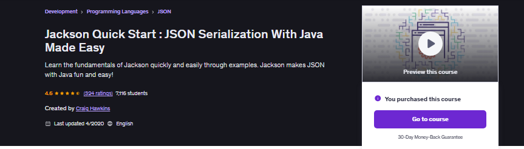
</p>

-->


<!--
Template for the questions:

# Quiz 07: Atomic Operations, Volatile & Metrics Practical Example.

<details>
<summary id="Question_01" open="true"> <b>Question 01.</b> </summary>
````yaml
Question 01:
The question comes here!

- My answer:

<div align="center">
    
</div>

1. Add here the answer!

</details>
-->

<!-- 
Template for the task/exercies:
 
# Lab Exercise - Mapping Collections of Value Types.

<div align="center">
    
</div>

1. **Question 1:** add here the question from the test!
	- **Answer:** **D**. here can be the examplaniton!
 -->

<p align="center">
    
  <text>Attempt to study <b>Java</b> related topics!</text>
</p>

<p align="center">
   
</p>

- For these courses one should configure **GIT** for handle projects.
    - `git config --global http.postBuffer 524288000`.
    - `git config --global core.longpaths true`.


<p align="center">
    
</p>

<p align="center">
    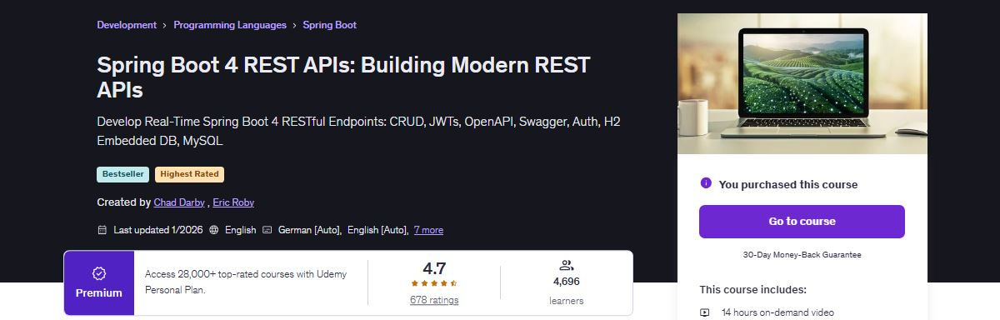
</p>

All course material from *Spring Boot 4 REST APIs: Building Modern REST APIs* by **Chad Darby** and **Eric Roby** ©. 

> Add story here! 🐟 <br><br>
~ *DevelopersCradle*

<!-- Add here link to java 22 description! -->

We are using [](#). Instead, the which are recommended!

Contains my own with my own visual notes ✍️ with some course material to enforce learning experience.

This repository is made with [](#), therefore it will include configuration files which are related to this IDE this approach will be favored for now. ⚙️

[The course at Udemy](https://www.udemy.com/course/spring-boot-rest-apis/). 

[Content maker](https://luv2code.com/).

[Content maker second](https://www.codingwithroby.com/).

If the content sparked :fire: your interest, please consider buying the course and start learning :book:.

<!-- 
Linkedin puts this shit front, when clicking from private mode x(. Need to put this to make jump working every case
?trk=public_profile_see-credential 
-->

<div align="center">
    Insert certificate here when completed
</div>

<br>

**Note: The material provided in this repository is only for helping those who may get stuck at any point of time in the course. It is very advised that no one should just copy the solutions(violation of Honor Code) presented here.**

#### Progress/Curriculum.

- [ ] [Section 01](#) - Introduction.
- [ ] [Section 02](#) - Spring Boot REST - Project 01.
- [ ] [Section 03](#) - Spring Boot REST - Project 02.
- [ ] [Section 04](#) - Spring Boot REST - Project 03 (Part 1).
- [ ] [Section 05](#) - Spring Boot REST - Project 03 (Part 2).
- [ ] [Section 06](#) - Spring Boot REST - Project 04.
- [ ] [Section 07](#) - Summary.
- [ ] [Section 08](#) - Bonus.

#### Additional stuff.

- [Original repository](https://github.com/darbyluv2code/spring-boot-rest-apis)!

<p align="center">
    
</p>

<p align="center">
    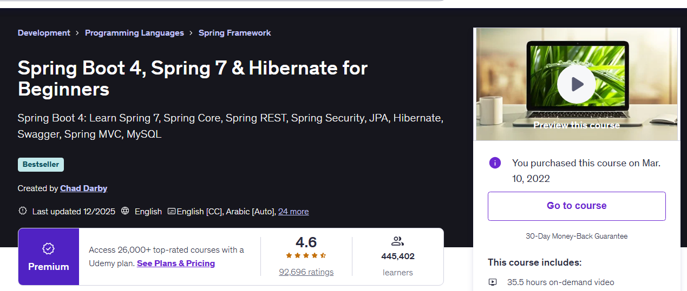
</p>


All course material from *Spring Boot 3, Spring 6 & Hibernate for Beginners* by **Chad Darby** ©. 

> Add story here! 🐟<br><br>
~ *DevelopersCradle*

Contains my own with my own visual notes ✍️ with some course material to enforce learning experience.

This repository is made with [](#), therefore it will include configuration files which are related to this IDE this approach will be favored for now. ⚙️

[The course at Udemy](https://www.udemy.com/course/spring-hibernate-tutorial/). 

[Content maker](https://luv2code.com/).

[Git repo](https://github.com/darbyluv2code/spring-boot-3-spring-6-hibernate-for-beginners/blob/main/11-appendix/course-links.md).

If the content sparked :fire: your interest, please consider buying the course and start learning :book:.

<!-- 
Linkedin puts this shit front, when clicking from private mode x(. Need to put this to make jump working every case
?trk=public_profile_see-credential 
-->

<div align="center">
    Insert certificate here when completed
</div>

<details>

<summary id="Spring boot roadmap" open="true"> <b> Spring boot roadmap! </b> </summary>

<br>

<p align="center">
    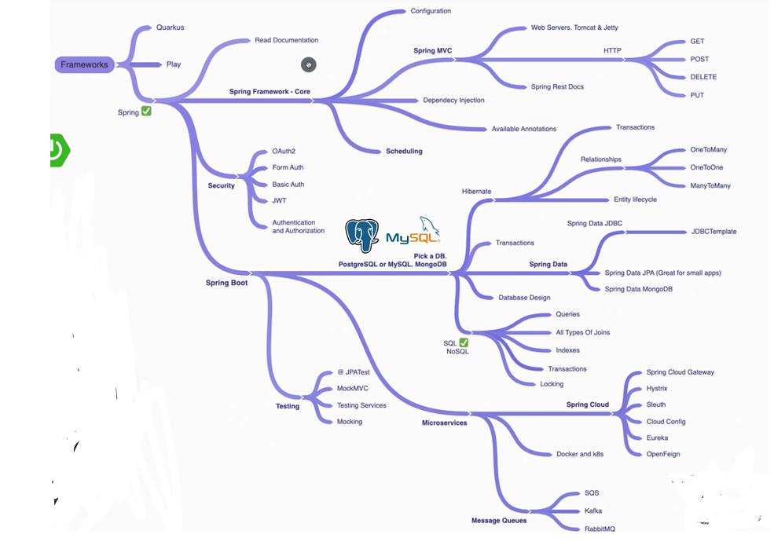
</p>

</details>

<br>

**Note: The material provided in this repository is only for helping those who may get stuck at any point of time in the course. It is very advised that no one should just copy the solutions(violation of Honor Code) presented here.**

#### Progress/Curriculum.

- [x] [Section 01](#) - NEW - Spring Boot 3 Quick Start. ✅
- [x] [Section 02](https://github.com/developersCradle/spring-springboot-angular-microservices-mysql-java-persistence-hibernate-aws/tree/main/Spring%20Boot%203%2C%20Spring%206%20%26%20Hibernate%20for%20Beginners/Section%2002#section-02-new---spring-boot-3---inversion-of-control-and-dependency-injection) - NEW - Spring Core. ✅
- [x] [Section 03](https://github.com/developersCradle/spring-springboot-angular-microservices-mysql-java-persistence-hibernate-aws/tree/main/Spring%20Boot%203%2C%20Spring%206%20%26%20Hibernate%20for%20Beginners/Section%2003#section-03-new---hibernatejpa-crud) - NEW - Hibernate/JPA CRUD. ✅
- [x] [Section 04](https://github.com/developersCradle/spring-springboot-angular-microservices-mysql-java-persistence-hibernate-aws/blob/main/Spring%20Boot%203%2C%20Spring%206%20%26%20Hibernate%20for%20Beginners/Section%2004/README.md#section-04-new---rest-crud-apis) - NEW - REST CRUD APIs. ✅
- [x] [Section 05](https://github.com/developersCradle/spring-springboot-angular-microservices-mysql-java-persistence-hibernate-aws/tree/main/Spring%20Boot%203%2C%20Spring%206%20%26%20Hibernate%20for%20Beginners/Section%2005#section-05-new---rest-api-security) - NEW - REST API Security. ✅
- [ ] [Section 06](https://github.com/developersCradle/spring-springboot-angular-microservices-mysql-java-persistence-hibernate-aws/blob/main/Spring%20Boot%203%2C%20Spring%206%20%26%20Hibernate%20for%20Beginners/Section%2006/README.md#section-06-new---spring-mvc) - Section 6: NEW - Spring MVC. ⚠️ In progress! ⚠️
- [ ] [Section 07](https://github.com/developersCradle/spring-springboot-angular-microservices-mysql-java-persistence-hibernate-aws/blob/main/Spring%20Boot%203%2C%20Spring%206%20%26%20Hibernate%20for%20Beginners/Section%2007/README.md#section-07-new---spring-mvc-crud) - NEW - Spring MVC CRUD. ⚠️ In progress! ⚠️
- [ ] [Section 08](https://github.com/developersCradle/spring-springboot-angular-microservices-mysql-java-persistence-hibernate-aws/blob/main/Spring%20Boot%203%2C%20Spring%206%20%26%20Hibernate%20for%20Beginners/Section%2008/README.md#section-08-new---spring-mvc-security) - NEW - Spring MVC Security. ⚠️ In progress! ⚠️
- [ ] [Section 09](https://github.com/developersCradle/spring-springboot-angular-microservices-mysql-java-persistence-hibernate-aws/blob/main/Spring%20Boot%203%2C%20Spring%206%20%26%20Hibernate%20for%20Beginners/Section%2009/README.md#section-09-new---jpa--hibernate-advanced-mappings) - NEW - JPA / Hibernate Advanced Mappings. ⚠️ In progress! ⚠️
- [ ] [Section 10](https://github.com/developersCradle/spring-springboot-angular-microservices-mysql-java-persistence-hibernate-aws/blob/main/Spring%20Boot%203%2C%20Spring%206%20%26%20Hibernate%20for%20Beginners/Section%2010/README.md#section-10-new---aop-aspect-oriented-programming) - NEW - AOP: Aspect-Oriented Programming. ⚠️ In progress! ⚠️
- [ ] [Section 11](https://github.com/developersCradle/spring-springboot-angular-microservices-mysql-java-persistence-hibernate-aws/blob/main/Spring%20Boot%203%2C%20Spring%206%20%26%20Hibernate%20for%20Beginners/Section%2011/README.md#section-11-summary) - Summary. ⚠️ In progress! ⚠️
- [ ] [Section 12](https://github.com/developersCradle/spring-springboot-angular-microservices-mysql-java-persistence-hibernate-aws/blob/main/Spring%20Boot%203%2C%20Spring%206%20%26%20Hibernate%20for%20Beginners/Section%2012/README.md#section-12-appendix) - Appendix. ⚠️ In progress! ⚠️
- [ ] [Section 13](https://github.com/developersCradle/spring-springboot-angular-microservices-mysql-java-persistence-hibernate-aws/blob/main/Spring%20Boot%203%2C%20Spring%206%20%26%20Hibernate%20for%20Beginners/Section%2013/README.md#section-13-bonus) - Bonus. ⚠️ In progress! ⚠️

#### Additional stuff.

- Use the `.gif` tool for making illustrations! Check the chapters and make GIFs out of it.
- [x] The source repository can be found [here](https://github.com/darbyluv2code/spring-boot-3-spring-6-hibernate-for-beginners). ✅
- [ ] Read/skim thought Spring documentation when finished this course.
- [ ] Make Unix clock in **Thymeleaf** or in **Angular**.
- [ ] Make crypt program in **Angular**.
- [ ] Refactor paths and projects inside Eclipse.
- [ ] Check typos.
- [ ] Section 05 - Spring Boot REST Security with JPA/Hibernate Tutorial.
- [ ] Make Chapters/headings when reviewing.
- [ ] Remove numbers from packages.

<details>

<summary id="refactoring the progress" open="true"> <b> Refactoring the progress! </b> </summary>
<br>

- Refactoring in progress, this will be chapter by chapter:
    - [ ] Chapter 01. 🚧 In progress 🚧
    - [ ] Chapter 02.
    - [ ] Chapter 03.
    - [ ] Chapter 04.
    - [ ] Chapter 05.
    - [ ] Chapter 06.
    - [ ] Chapter 07.
    - [ ] Chapter 08.
    - [ ] Chapter 09.
    - [ ] Chapter 10.
    - [ ] Chapter 11.
    - [ ] Chapter 12.
</details>

<details>

<summary id="old legacy course" open="false"> <b> Old(legacy) course Curriculum. Do this, if this this is still usefull! </b> </summary>
<br>

## Old(legacy) course Curriculum, old course still accessible, if useful do. 

#### Progress/Curriculum.

- [x] [Section 01](#) - Course Introduction.
- [X] [Section 02](#) - Spring Overview.
- [ ] [Section 03](#) - Setting Up Your Development Environment.
- [ ] [Section 04](#) - Spring Inversion of Control - XML Configuration.
- [ ] [Section 05](#) - Spring Dependency Injection - XML Configuration.

</details>

<p align="center">
    
</p>

<p align="center">
    
</p>

All course material from *Master the Basics of Spring Integration and it's Components* by **Rajshree Umarekar** ©. 

> I wasn’t sure if I had just broken everything—yikes!
But now, I finally understand the expected behavior. Fear not the dreaded POM hell 🔥 with its cryptic dependencies—your update is on the way! 🐟 <br> <br>
~ *DevelopersCradle*

Contains my own with my own visual notes ✍️ with some course material to enforce learning experience.

This came helpful when updating our ancient repositories, which had **Spring integration** modules.


This repository is made with [](#) with [](#) hotkeys, therefore it will include configuration files which are related to this IDE this approach will be favored for now. ⚙️

[The course at Udemy](https://www.udemy.com/course/master-the-basics-of-spring-integration-and-its-components/). 

[Content maker](https://www.letsunderstandjava.com/).

If the content sparked :fire: your interest, please consider buying the course and start learning :book:.

<!-- 
Linkedin puts this shit front, when clicking from private mode x(. Need to put this to make jump working every case
?trk=public_profile_see-credential 
-->

<div align="center">
    
</div>

<br>

**Note: The material provided in this repository is only for helping those who may get stuck at any point of time in the course. It is very advised that no one should just copy the solutions(violation of Honor Code) presented here.**

#### Progress/Curriculum.

- [x] [Section 01](https://github.com/developersCradle/spring-springboot-angular-microservices-mysql-java-persistence-hibernate-aws/tree/main/Master%20the%20Basics%20of%20Spring%20Integration%20and%20its%20Components/Section%2001#section-01-introduction) - Introduction. ✅
- [x] [Section 02](https://github.com/developersCradle/spring-springboot-angular-microservices-mysql-java-persistence-hibernate-aws/tree/main/Master%20the%20Basics%20of%20Spring%20Integration%20and%20its%20Components/Section%2002#section-02-create-project) - Create Project. ✅
- [x] [Section 03](https://github.com/developersCradle/spring-springboot-angular-microservices-mysql-java-persistence-hibernate-aws/tree/main/Master%20the%20Basics%20of%20Spring%20Integration%20and%20its%20Components/Section%2003#section-03-spring-integration-components) - Spring Integration Components. ✅

#### Additional stuff.

- [x] [Source code repo](https://github.com/misstechack/spring-integration). ✅
- [x] Additional [content](https://www.baeldung.com/spring-integration) to check. ✅

<p align="center">
    
</p>

<p align="center">
    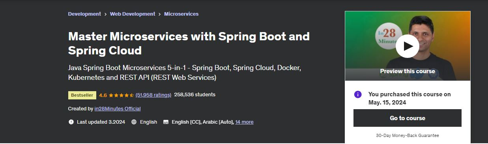
</p>

All course material from *Master Microservices with Spring Boot and Spring Cloud* by **in28Minutes** ©.

> Add story here! 🐟 <br><br>
~ *DevelopersCradle*

Contains my own with my own visual notes ✍️ with some course material to enforce learning experience.

This repository is made with [](#), therefore it will include configuration files which are related to this IDE this approach will be favored for now. ⚙️

[The course at Udemy](https://www.udemy.com/course/microservices-with-spring-boot-and-spring-cloud/).

[Content maker](https://www.in28minutes.com/).

[Latest GIT](https://github.com/in28minutes/spring-microservices-v3).

If the content sparked :fire: your interest, please consider buying the course and start learning :book:.

<!-- 
Linkedin puts this shit front, when clicking from private mode x(. Need to put this to make jump working every case
?trk=public_profile_see-credential 
-->

<div align="center">
    Insert certificate here when completed
</div>

<br>

**Note: The material provided in this repository is only for helping those who may get stuck at any point of time in the course. It is very advised that no one should just copy the solutions(violation of Honor Code) presented here.**

- Currently transferring handwritten notes to **digital form**.

#### Progress/Curriculum new.

- [x] [Section 01](https://github.com/developersCradle/spring-springboot-angular-microservices-mysql-java-persistence-hibernate/tree/main/MasterMicroservicesWithSpringBootandSpringCloud/Section%201#section-1-introduction) - Introduction ✅.
- [x] [Section 02](https://github.com/developersCradle/spring-springboot-angular-microservices-mysql-java-persistence-hibernate/tree/main/MasterMicroservicesWithSpringBootandSpringCloud/Section%202#section-2-introduction-to-web-services) - Introduction To Web Services ✅.
- [ ] [Section 03](#) - Restful Web Services with Spring Boot - V2. ⚠️ In progress! ⚠️
- [x] [Section 04](https://github.com/developersCradle/spring-springboot-angular-microservices-mysql-java-persistence-hibernate/tree/main/MasterMicroservicesWithSpringBootandSpringCloud/Section%204#section-4--quick-introduction-to-microservices) - Quick Introduction to Microservices ✅.
- [ ] [Section 05](https://github.com/developersCradle/spring-springboot-angular-microservices-mysql-java-persistence-hibernate/tree/main/MasterMicroservicesWithSpringBootandSpringCloud/Section%205#section-5-microservices-with-spring-cloud---v1) - Microservices with Spring Cloud - V1. **Master Microservices - V1 is now deprecated!**
- [x] [Section 06](https://github.com/developersCradle/spring-springboot-angular-microservices-mysql-java-persistence-hibernate/tree/main/MasterMicroservicesWithSpringBootandSpringCloud/Section%206#section-6-microservices-with-spring-cloud---v2) - Microservices with Spring Cloud - V2 ✅.
- [ ] [Section 07](https://github.com/developersCradle/spring-springboot-angular-microservices-mysql-java-persistence-hibernate/tree/main/MasterMicroservicesWithSpringBootandSpringCloud/Section%2007#section-07-docker-with-microservices-using-spring-boot-and-spring-cloud---v2) - Docker with Microservices using Spring Boot and Spring Cloud - V2. ⚠️ In progress! ⚠️
- [ ] [Section 08](#) - Kubernetes with Microservices using Docker, Spring Boot and Spring Cloud - V2.
- [ ] [Section 09](#) - Thanks. ⚠️ In progress! ⚠️
- [ ] [Section 10](#) - Appendix - Introduction to Spring Boot in 12 Steps. ⚠️ In progress! ⚠️
- [ ] [Section 11](#) - Appendix - Introduction to JUnit. ⚠️ In progress! ⚠️
- [ ] [Section 12](#) - Appendix - Introduction To Mockito. ⚠️ In progress! ⚠️
- [ ] [Section 13](#) - Appendix - Introduction to Functional Programming in 30 Minutes. 
- [ ] [Section 14](https://github.com/developersCradle/spring-springboot-angular-microservices-mysql-java-persistence-hibernate/tree/main/MasterMicroservicesWithSpringBootandSpringCloud/Section%2014#section-14-appendix---introduction-to-gradle) - Appendix - Introduction To Gradle.
- [x] [Section 15](https://github.com/developersCradle/spring-springboot-angular-microservices-mysql-java-persistence-hibernate/tree/main/MasterMicroservicesWithSpringBootandSpringCloud/Section%2015#section-15-appendix---introduction-to-jpa-in-10-steps---v2) - Appendix - Introduction to JPA in 10 Steps - V2 ✅.
- [ ] [Section 16](https://github.com/developersCradle/spring-springboot-angular-microservices-mysql-java-persistence-hibernate/tree/main/MasterMicroservicesWithSpringBootandSpringCloud/Section%2016#section-16-appendix---introduction-to-functional-programming-in-30-minutes) - Appendix - Introduction to Functional Programming in 30 Minutes. ⚠️ In progress! ⚠️

#### Additional stuff.

- Use the `.gif` tool for making illustrations! Check the chapters and make GIFs out of it.
- [ ] Move Spring V1 into appendix folder, since it depreciated.
    - Also numbering got changed.
- [ ] Remove numbers from packages and from lecture notes `.md` if there is.

<p align="center">
    
</p>

<p align="center">
    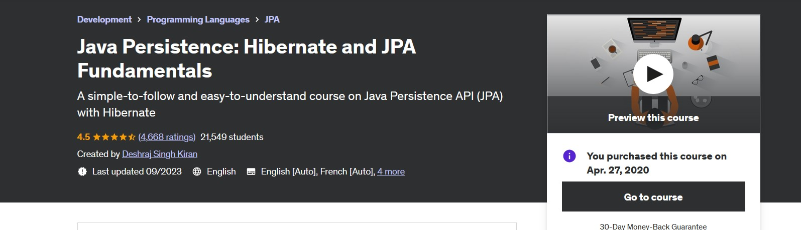
</p>

All course material from *Java Persistence: Hibernate and JPA Fundamentals* by **Deshraj Singh Kiran** ©.


> I thought Hibernate was doing magic behind the scenes... until it broke my app. 😵
>
> But now, I finally understand what's really happening between my Java objects and the database. One less mystery, one more skill unlocked. 🔓☕🐟 <br><br> ~ *DevelopersCradle*

Contains my own with my own visual notes ✍️ with some course material to enforce learning experience.

[The Course at Udemy](https://www.udemy.com/course/hibernate-and-jpa-fundamentals/).   

[Homepage of Course](https://mavenedge.com/).   

If the content sparked :fire: your interest, please consider buying the course and start learning :book:.

<!-- 
Linkedin puts this shit front, when clicking from private mode x(. Need to put this to make jump working every case
?trk=public_profile_see-credential 
-->

<div align="center">
    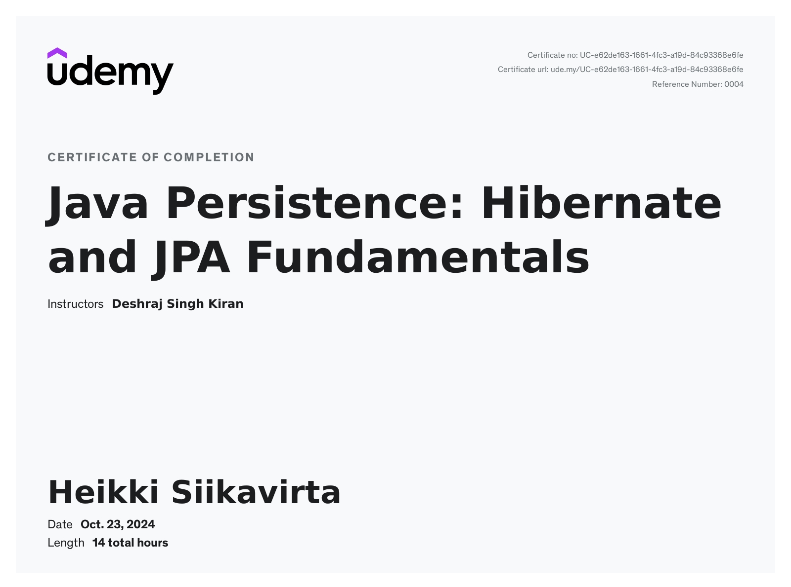
</div>

<br>

**Note: The material provided in this repository is only for helping those who may get stuck at any point of time in the course. It is very advised that no one should just copy the solutions(violation of Honor Code) presented here.**

- Currently transferring handwritten notes to **digital form**.

#### Progress/Curriculum.

- [x] [Section 01](https://github.com/developersCradle/spring-springboot-angular-microservices-mysql-java-persistence-hibernate-aws/tree/main/Java%20Persistence%20Hibernate%20and%20JPA%20Fundamentals/Section%2001#section-01-about-this-course) - About this Course. ✅
- [x] [Section 02](https://github.com/developersCradle/spring-springboot-angular-microservices-mysql-java-persistence-hibernate-aws/tree/main/Java%20Persistence%20Hibernate%20and%20JPA%20Fundamentals/Section%2002#section-02-understanding-objectrelational-persistence) - Understanding object/relational persistence. ✅
- [x] [Section 03](https://github.com/developersCradle/spring-springboot-angular-microservices-mysql-java-persistence-hibernate-aws/tree/main/Java%20Persistence%20Hibernate%20and%20JPA%20Fundamentals/Section%2003#section-3-getting-started-with-hibernate-and-jpa-annotations) - Getting Started with Hibernate and JPA Annotations. ✅
- [x] [Section 04](https://github.com/developersCradle/spring-springboot-angular-microservices-mysql-java-persistence-hibernate-aws/tree/main/Java%20Persistence%20Hibernate%20and%20JPA%20Fundamentals/Section%2004#section-04-mapping-concepts) - Mapping Concepts. ✅
- [ ] [Section 05](https://github.com/developersCradle/spring-springboot-angular-microservices-mysql-java-persistence-hibernate-aws/blob/main/Java%20Persistence%20Hibernate%20and%20JPA%20Fundamentals/Section%2005/README.md#section-05-getting-started-with-jpa) - Getting Started with JPA.
- [ ] [Section 06](https://github.com/developersCradle/spring-springboot-angular-microservices-mysql-java-persistence-hibernate-aws/tree/main/Java%20Persistence%20Hibernate%20and%20JPA%20Fundamentals/Section%2006#section-06-best-practices) - Best Practices.

<hr>

- Todo, update this curriculum to this one. This has been changed:

<hr>

- [ ] [Section 01](#) - About this Course.
- [ ] [Section 02](#) - Understanding Object/Relational Persistence.
- [ ] [Section 03](#) - Getting Started with Hibernate and JPA Annotations.
- [ ] [Section 04](#) - Mapping Concepts.
- [ ] [Section 05](#) - Getting Started with JPA.
- [ ] [Section 06](#) - Fetching Strategies, Bytecode Enhancement and Equality.
- [ ] [Section 07](#) - Querying.
- [ ] [Section 08](#) - Identifier Generation Strategies.
- [ ] [Section 09](#) - Inheritance Mapping and Polymorphic Queries.
- [ ] [Section 10](#) - Entity Lifecycle Callbacks.
- [ ] [Section 11](#) - Logic in Database.
- [ ] [Section 12](#) - Batch Processing and Logging Slow Queries.
- [ ] [Section 13](#) - N+1 SELECTs Problem, Batch Fetching and Entity Graphs.
- [ ] [Section 14](#) - Merging Detached Objects.
- [ ] [Section 15](#) - Optimistic Locking and Transaction Isolation Rules.
- [ ] [Section 16](#) - Second Level Caching and Query Cache.
- [ ] [Section 17](#) - Best Practices.
- [ ] [Section 18](#) - Wrap Up.


#### Additional stuff.

- Use the `.gif` tool for making illustrations! Check the chapters and make GIFs out of it.
- [ ] Make the Book Store project working from chapter 04.
- [ ] Go thought `@mapsID` and then again the `Book Store with Hibernate and JPA Annotations.`.
- [ ] Take Cofee and Sunday. Finish the chapter `Book Store with Hibernate and JPA Annotations`.
- [ ] Take Cofee and Sunday. Finish the chapter `Foreign-Key in Composite Primary-Key using MapsId`. 
- [ ] Redo 18. Lab Exercise - Manipulating Objects.
- [ ] Check again, "Entity cannot reference Entity", but there is connections?.
- [ ] Do including POM file `<classpathentry kind="lib" path="C:/Users/ScoopiDoo/Desktop/git projektit/spring-springboot-angular-microservices-mysql-java-persistence-hibernate-aws/Java Persistence Hibernate and JPA Fundamentals/Files for course/connector/mysql-connector-j-9.2.0/mysql-connector-j-9.2.0.jar"/>`
    - In `.classpath`.
- [ ] Remove numbers from packages `.md` if there is.
- [ ] When course finished, remove the projects from the IDE!
- [ ] Exercises should be in following order:
    - First question as plain text.
    - Then comes the answer under it.
        - Fix these for this repository!

<hr>

<details>

<summary id="Cleaning_Quiz" open="true"> <b>Cleaning process of the code snippets! </b></summary>
<br>

- Cleaning the numbering from the exercise and quizes, they should be `01` rather than `1` chapter by chapter:
    - [x] Chapter 01.
    - [x] Chapter 02.
    - [x] Chapter 03.
    - [x] Chapter 04.
    - [ ] Chapter 05.
    - [ ] Chapter 06.
    - [ ] Chapter 07.
    - [ ] Chapter 08.
    - [ ] Chapter 09.
    - [ ] Chapter 10.
    - [ ] Chapter 11.
    - [ ] Chapter 12.
</details>

<hr>

<p align="center">
    
</p>

<p align="center">
    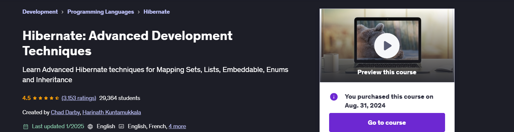
</p>

All course material from *Hibernate: Advanced Development Techniques* by **Harinath Kuntamukkala** and **Chad Darby** ©.

> Add story here! 🐟 <br><br>
~ *DevelopersCradle*

Contains my own with my own visual notes ✍️ with some course material to enforce learning experience.

[The Course at Udemy](https://www.udemy.com/course/hibernate-tutorial-advanced/). 

If the content sparked :fire: your interest, please consider buying the course and start learning :book:.

<!-- 
Linkedin puts this shit front, when clicking from private mode x(. Need to put this to make jump working every case
?trk=public_profile_see-credential 
-->

<div align="center">
    cert here.
</div>

<br>

**Note: The material provided in this repository is only for helping those who may get stuck at any point of time in the course. It is very advised that no one should just copy the solutions(violation of Honor Code) presented here.**

#### Progress/Curriculum.

- [x] [Section 01](https://github.com/developersCradle/spring-springboot-angular-microservices-mysql-java-persistence-hibernate-aws/tree/main/Hibernate%20Advanced%20Development%20Techniques/Section%2001#section-01-introduction) - Introduction. ✅
- [x] [Section 02](https://github.com/developersCradle/spring-springboot-angular-microservices-mysql-java-persistence-hibernate-aws/tree/main/Hibernate%20Advanced%20Development%20Techniques/Section%2002#section-02-mapping-collections---sets-and-lists) - Mapping Collections - Sets and Lists. ✅ 
- [x] [Section 03](https://github.com/developersCradle/spring-springboot-angular-microservices-mysql-java-persistence-hibernate-aws/tree/main/Hibernate%20Advanced%20Development%20Techniques/Section%2003#section-03-mapping-collections---maps-sorted-maps-and-sorted-sets) - Mapping Collections - Maps, Sorted Maps and Sorted Sets. ✅
- [x] [Section 04](https://github.com/developersCradle/spring-springboot-angular-microservices-mysql-java-persistence-hibernate-aws/tree/main/Hibernate%20Advanced%20Development%20Techniques/Section%2004#section-04-mapping-components---embeddable) - Mapping Components - Embeddable. ✅
- [x] [Section 05](https://github.com/developersCradle/spring-springboot-angular-microservices-mysql-java-persistence-hibernate-aws/tree/main/Hibernate%20Advanced%20Development%20Techniques/Section%2005#section-05-mapping-enums) - Mapping Enums. ✅
- [ ] [Section 06](#) - Inheritance Mapping - Single Table Strategy. ⚠️ In progress! ⚠️
- [ ] [Section 07](#) - Inheritance Mapping - Table per Class Strategy. ⚠️ In progress! ⚠️
- [ ] [Section 08](#) - Inheritance Mapping - Joined Table Strategy. ⚠️ In progress! ⚠️
- [ ] [Section 09](#) - Inheritance Mapping - Mapped Superclass. ⚠️ In progress! ⚠️
- [ ] [Section 10](#) - Inheritance Mapping - Recap and Comparison. ⚠️ In progress! ⚠️
- [ ] [Section 11](#) - Course Summary - Thank You. ⚠️ In progress! ⚠️
- [ ] [Section 12](#) - Bonus. ⚠️ In progress! ⚠️

#### Additional stuff.

- Use the `.gif` tool for making illustrations! Check the chapters and make GIFs out of it.
- [x] The repository for the code is [here](https://github.com/darbyluv2code/hibernate-advanced-development-techniques?tab=readme-ov-file#hibernate-advanced-development-techniques).
- [ ] Paste every exercise code after examples.
- [ ] Do the last piece of `OrderBy` from the chapter 
 `Sorted Maps - Write Some Code`. Just another way to OrderBy.

<details>

<summary id="cloud native progress" open="true"> <b>  Cloud native course series by Vinoth Selvaraj! </b> </summary>

<br>

<div align="center">
    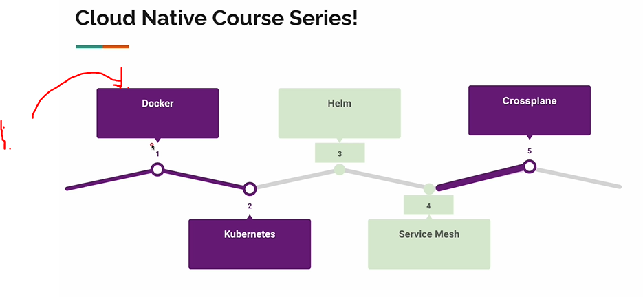
</div>

1. About **Docker**. [Course](https://www.udemy.com/course/docker-java/).
2. About **Kubernetes**. [Course](https://www.udemy.com/course/kubernetes-cloud-native/).
3. About **Helm**.
4. About **Service Mesh**. 

</details>


<p align="center">
    
</p>

<p align="center">
    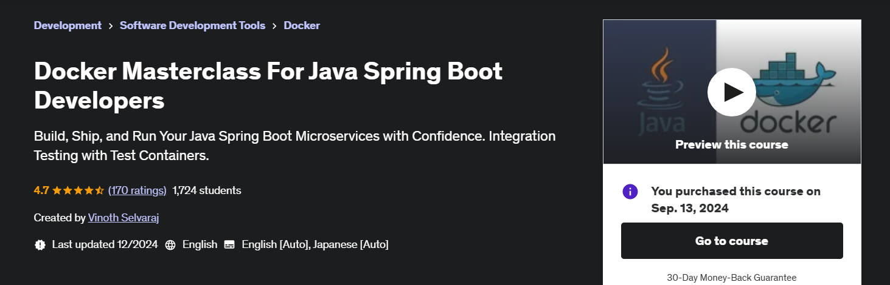
</p>

All course material from *Docker Masterclass For Java Spring Boot Developers* by **Vinoth Selvaraj** ©.

> Add story here! 🐟 <br><br>
~ *DevelopersCradle*

Contains my own with my own visual notes ✍️ with some course material to enforce learning experience.

[The course at Udemy](https://www.udemy.com/course/docker-java/).

[Content maker](https://www.vinsguru.com/).

If the content sparked :fire: your interest, please consider buying the course and start learning :book:.

<!-- 
Linkedin puts this shit front, when clicking from private mode x(. Need to put this to make jump working every case
?trk=public_profile_see-credential 
-->

<div align="center">
    Insert certificate here when completed
</div>

<br>

**Note: The material provided in this repository is only for helping those who may get stuck at any point of time in the course. It is very advised that no one should just copy the solutions(violation of Honor Code) presented here.**

#### Progress/Curriculum.

- [x] [Section 01](https://github.com/developersCradle/spring-springboot-angular-microservices-mysql-java-persistence-hibernate-aws/tree/main/Docker%20Masterclass%20For%20Java%20Spring%20Boot%20Developers/Section%2001#section-01-introduction) - Introduction. ✅
- [x] [Section 02](https://github.com/developersCradle/spring-springboot-angular-microservices-mysql-java-persistence-hibernate-aws/tree/main/Docker%20Masterclass%20For%20Java%20Spring%20Boot%20Developers/Section%2002#section-02-need-for-docker) - Need For Docker. ✅
- [x] [Section 03](https://github.com/developersCradle/spring-springboot-angular-microservices-mysql-java-persistence-hibernate-aws/tree/main/Docker%20Masterclass%20For%20Java%20Spring%20Boot%20Developers/Section%2003#section-03-resource) - Resource. ✅
- [x] [Section 04](https://github.com/developersCradle/spring-springboot-angular-microservices-mysql-java-persistence-hibernate-aws/tree/main/Docker%20Masterclass%20For%20Java%20Spring%20Boot%20Developers/Section%2004#section-04-docker-crash-course) - Docker Crash Course. ✅
- [x] [Section 05](https://github.com/developersCradle/spring-springboot-angular-microservices-mysql-java-persistence-hibernate-aws/tree/main/Docker%20Masterclass%20For%20Java%20Spring%20Boot%20Developers/Section%2005#section-5-docker-compose) - Docker Compose. ✅
- [ ] [Section 06](#) - Dockerizing Spring Application. ⚠️ In progress! ⚠️
- [ ] [Section 07](#) - Integration Testing With TestContainers. ⚠️ In progress! ⚠️
- [ ] [Section 08](#) - Assignment. ⚠️ In progress! ⚠️
- [ ] [Section 09](#) - Mockserver. ⚠️ In progress! ⚠️
- [ ] [Section 10](#) - API Gateway / Service Integration. ⚠️ In progress! ⚠️
- [ ] [Section 11](#) - Spring Native. ⚠️ In progress! ⚠️
- [ ] [Section 12](#) - What's Next? ⚠️ In progress! ⚠️

#### Additional stuff.

- [ ] Do the last chapter exercise from Section 05.
- [ ] Remove numbers from packages and from lecture notes `.md` if there is.

<br>

<!-- todo -->
<!-- <p align="center">
    
</p>

<p align="center">
    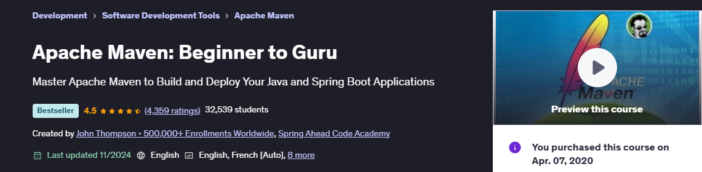
</p> -->


<p align="center">
    
</p>

<p align="center">
    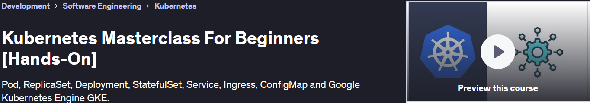
</p>

All course material from *Kubernetes Masterclass For Beginners [Hands-On]* by **Vinoth Selvaraj** ©.

> Add story here! 🐟 <br><br>
~ *DevelopersCradle*

Contains my own with my own visual notes ✍️ with some course material to enforce learning experience.

[The course at Udemy](https://www.udemy.com/course/kubernetes-cloud-native/).

[Content maker](https://www.vinsguru.com/).

[Latest GIT repo from owner](https://github.com/vinsguru/kubernetes-course).

If the content sparked :fire: your interest, please consider buying the course and start learning :book:.

<!-- 
Linkedin puts this shit front, when clicking from private mode x(. Need to put this to make jump working every case
?trk=public_profile_see-credential 
-->

<div align="center">
    Insert certificate here when completed
</div>

<br>

**Note: The material provided in this repository is only for helping those who may get stuck at any point of time in the course. It is very advised that no one should just copy the solutions(violation of Honor Code) presented here.**

#### Progress/Curriculum.

- [x] [Section 01](https://github.com/developersCradle/spring-springboot-angular-microservices-mysql-java-persistence-hibernate-aws/tree/main/Kubernetes%20Masterclass%20For%20Beginners/Section%2001#section-01-introduction) - Introduction. ✅
- [x] [Section 02](https://github.com/developersCradle/spring-springboot-angular-microservices-mysql-java-persistence-hibernate-aws/tree/main/Kubernetes%20Masterclass%20For%20Beginners/Section%2002#section-02-kubernetes-cluster) - Kubernetes Cluster. ✅
- [ ] [Section 03](https://github.com/developersCradle/spring-springboot-angular-microservices-mysql-java-persistence-hibernate-aws/tree/main/Kubernetes%20Masterclass%20For%20Beginners/Section%2003#section-03-pod) - Pod. ⚠️ In progress! ⚠️
- [ ] [Section 04](#) - ReplicaSet. ⚠️ In progress! ⚠️
- [ ] [Section 05](#) - Deployment. ⚠️ In progress! ⚠️ 
- [ ] [Section 06](#) - Service. ⚠️ In progress! ⚠️
- [ ] [Section 07](#) - Namespace. ⚠️ In progress! ⚠️
- [ ] [Section 08](#) - Probes. ⚠️ In progress! ⚠️
- [ ] [Section 09](#) - ConfigMap & Secret. ⚠️ In progress! ⚠️
- [ ] [Section 10](#) - Persistent Volume & StatefulSet. ⚠️ In progress! ⚠️
- [ ] [Section 11](#) - HPA - Horizontal Pod Autoscaler. ⚠️ In progress! ⚠️
- [ ] [Section 12](#) - Ingress. ⚠️ In progress! ⚠️
- [ ] [Section 13](#) - **** ASSIGNMENT ****. ⚠️ In progress! ⚠️
- [ ] [Section 14](#) - GKE / Google Kubernetes Engine. ⚠️ In progress! ⚠️  
- [ ] [Section 15](#) - What's Next? ⚠️ In progress! ⚠️

#### Additional stuff.

- [ ] Some.

<p align="center">
    
</p>

<p align="center">
    
</p>

All course material from *Apache Maven: Beginner to Guru* by **John Thompson** and **Spring Ahead Code Academy** ©. With my own notes need this to manage our corporate POM :fire: $${\color{red}HELL}$$ :fire:.

> 
> By excluding the transitive dependencies causing the conflicts and explicitly including the correct versions in the POM, order was restored. No more cryptic clashes, no more mystery libraries braking the pipeline! 🐟 <br><br>
~ *DevelopersCradle*


This repository is made with [](#) with [](#). This is why it will include configuration files which are related to this IDE this approach, also the compiled classed for explanatory experiments. ⚙️

[The course at Udemy](https://www.udemy.com/course/apache-maven-beginner-to-guru/).

[Spring Ahead Code Academy](https://springaheadcode.academy/).

[Spring Framework Guru](https://springframework.guru/).


If the content sparked :fire: your interest, please consider buying the course and start learning :book:.


<!-- 
Linkedin puts this shit front, when clicking from private mode x(. Need to put this to make jump working every case
?trk=public_profile_see-credential 
-->

<div align="center">
    Insert certificate here when completed
</div>

<br>

**Note: The material provided in this repository is only for helping those who may get stuck at any point of time in the course. It is very advised that no one should just copy the solutions(violation of Honor Code) presented here.**

#### Progress/Curriculum.

- [x] [Section 01](https://github.com/developersCradle/spring-springboot-angular-microservices-mysql-java-persistence-hibernate-aws/tree/main/Apache%20Maven%20Beginner%20to%20Guru/Section%2001#section-01-apache-maven-introduction) - Apache Maven Introduction. ✅
- [x] [Section 02](https://github.com/developersCradle/spring-springboot-angular-microservices-mysql-java-persistence-hibernate-aws/tree/main/Apache%20Maven%20Beginner%20to%20Guru/Section%2002#section-02-getting-started) - Getting Started. ✅
- [x] [Section 03](https://github.com/developersCradle/spring-springboot-angular-microservices-mysql-java-persistence-hibernate-aws/tree/main/Apache%20Maven%20Beginner%20to%20Guru/Section%2003#section-03-compiling-java) - Compiling Java. ✅
- [x] [Section 04](https://github.com/developersCradle/spring-springboot-angular-microservices-mysql-java-persistence-hibernate-aws/tree/main/Apache%20Maven%20Beginner%20to%20Guru/Section%2004#section-04-getting-started-with-maven) - Getting Started with Maven. ✅
- [x] [Section 05](https://github.com/developersCradle/spring-springboot-angular-microservices-mysql-java-persistence-hibernate-aws/tree/main/Apache%20Maven%20Beginner%20to%20Guru/Section%2005#what-i-learned) - Maven Basics. ✅
- [ ] [Section 06](#) - Common Maven Plugins. ⚠️ In progress! ⚠️
- [ ] [Section 07](#) - Generating Source with Maven. ⚠️ In progress! ⚠️
- [ ] [Section 08](#) - Alternate JVM Languages. ⚠️ In progress! ⚠️
- [ ] [Section 09](#) - Testing with Maven. ⚠️ In progress! ⚠️
- [ ] [Section 10](#) - Multi-Module Projects. ⚠️ In progress! ⚠️
- [ ] [Section 11](#) - Apache Maven for Spring Boot. ⚠️ In progress! ⚠️
- [ ] [Section 12](#) - Maven Repositories. ⚠️ In progress! ⚠️
- [ ] [Section 13](#) - Deploying to Maven Projects to Packagecloud. ⚠️ In progress! ⚠️
- [ ] [Section 14](#) - Deploying Apache Maven Projects to Nexus. ⚠️ In progress! ⚠️
- [ ] [Section 15](#) - Maven Build Profiles. ⚠️ In progress! ⚠️
- [ ] [Section 16](#) - Maven Release Plugin. ⚠️ In progress! ⚠️
- [ ] [Section 17](#) - Maven in the Real World. ⚠️ In progress! ⚠️
- [ ] [Section 18](#) - Enterprise Dependency Management. ⚠️ In progress! ⚠️
- [ ] [Section 19](#) - Appendix A: Using GitHub. ⚠️ In progress! ⚠️

#### Additional stuff.

- [x] For now do till basic level.

<p align="center">
    
</p>

<p align="center">
    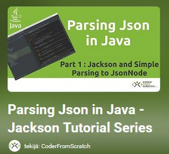
</p>

All learning material from *JSON in Java - Jackson Tutorial Series* from **CoderFromScratch** and from **Geekific**.

> During an integration call involving two systems that both followed the **SCIM 2** standard at 🏦**Nordea**🏦, I was involved in debugging a challenging issue between the services. What initially appeared to be a straightforward Jackson deserialization problem turned out to be more subtle: the JSON structure was not malformed, but was being parsed into the wrong layer of the data model, which caused fields to map incorrectly during deserialization. 🐟
>
>That moment became a turning point. It strengthened my understanding of how easily layered data models can introduce silent structural bugs in distributed systems. I became more deliberate in validating object hierarchies and ensuring strict alignment between JSON structure and domain models in Java-based integrations. The experience reinforced a more careful, architecture-aware approach to debugging beyond just surface-level parsing issues. 🐟 <br><br>
~ *DevelopersCradle*

Contains my own with my own visual notes ✍️ with some video material to enforce learning experience. There is also project, which enhances the learning process!

This repository is made with [](#) with [](#) hotkeys, therefore it will include configuration files which are related to this IDE this approach will be favored for now. ⚙️

[Course playlist](https://www.youtube.com/watch?v=Hv_a3ZBSO_g&list=PLe8LZCtW06l8LGAUQJlvlRZ0DJ-0q8sdn).

If the content sparked 🔥 your interest, please consider buying the course and start learning 📖.

<!-- 
Linkedin puts this shit front, when clicking from private mode x(. Need to put this to make jump working every case
?trk=public_profile_see-credential 
-->

<div align="center">
    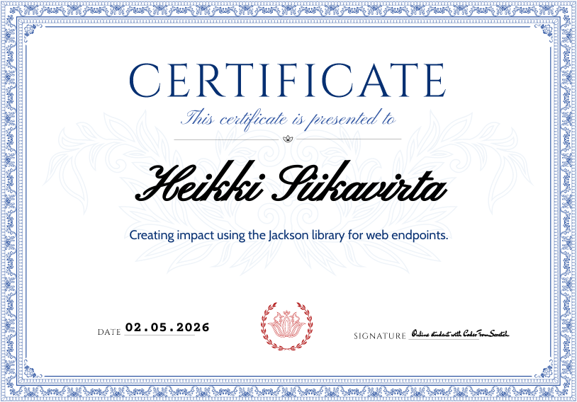
</div>

<br>

**Note: The material provided in this repository is only for helping those who may get stuck at any point of time in the course. It is very advised that no one should just copy the solutions(violation of Honor Code) presented here.**

#### Progress/Curriculum.

- [x] [Part 01](https://github.com/developersCradle/spring-springboot-angular-microservices-mysql-java-persistence-hibernate-aws/tree/main/Parsing%20Json%20in%20Java%20-%20Jackson%20Tutorial%20Series/Section%2001#section-01-parsing-json-in-java-tutorial---part-1-jackson-and-simple-objects) - Parsing Json in Java Tutorial - Part 1: Jackson and Simple Objects. ✅
- [x] [Part 02](https://github.com/developersCradle/spring-springboot-angular-microservices-mysql-java-persistence-hibernate-aws/tree/main/Parsing%20Json%20in%20Java%20-%20Jackson%20Tutorial%20Series/Section%2002#section-02-parsing-json-in-java-tutorial---part-2-objectmapper-and-generate-json-strings) - Parsing Json in Java Tutorial - Part 2: ObjectMapper and Generate Json Strings. ✅
- [x] [Part 03](https://github.com/developersCradle/spring-springboot-angular-microservices-mysql-java-persistence-hibernate-aws/tree/main/Parsing%20Json%20in%20Java%20-%20Jackson%20Tutorial%20Series/Section%2003#section-03-parsing-json-in-java-tutorial---part-3-more-complex-mappings) - Parsing Json in Java Tutorial - Part 3: More complex Mappings. ✅
- [x] [Additional](https://github.com/developersCradle/spring-springboot-angular-microservices-mysql-java-persistence-hibernate-aws/tree/main/Parsing%20Json%20in%20Java%20-%20Jackson%20Tutorial%20Series/Section%2003#section-03-parsing-json-in-java-tutorial---part-3-more-complex-mappings) - Intro to JSON and Jackson's ObjectMapper. ✅

#### Additional stuff.

- [x] [Intro to JSON and Jackson's ObjectMapper](https://www.youtube.com/watch?v=bV85_gIrHTc). ✅

<p align="center">
    
</p> 
<p align="center">
    
</p>

All learning material from *Jackson Quick Start JSON Serialization With Java Made Easy* from **Craig Hawkins**.

> As an API developer, I’ve learned that knowing Jackson is not optional—it’s essential. 🐟
>
> Ah, just another LinkedIn hype story to truly drive in Jackson. 🐟 <br><br> ~ *DevelopersCradle*

Contains my own with my own visual notes ✍️ with some video material to enforce learning experience. There is also project, which enhances the learning process!

This repository is made with [](#) with [](#) hotkeys, therefore it will include configuration files which are related to this IDE this approach will be favored for now. ⚙️

[The course at Udemy](https://www.udemy.com/course/jackson-json-serialization-with-java/).

If the content sparked 🔥 your interest, please consider buying the course and start learning 📖.

<!-- 
Linkedin puts this shit front, when clicking from private mode x(. Need to put this to make jump working every case
?trk=public_profile_see-credential 
-->

<div align="center">
    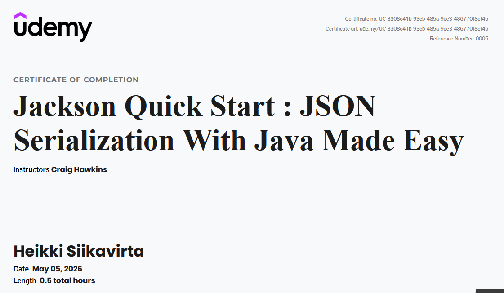
</div>

<br>

**Note: The material provided in this repository is only for helping those who may get stuck at any point of time in the course. It is very advised that no one should just copy the solutions(violation of Honor Code) presented here.**

#### Progress/Curriculum.

- [x] [Section 01](#) - Introduction. ✅
- [x] [Section 02](#) - Jackson Fundamentals. ✅
- [x] [Section 03](#) - Course Conclusion. ✅

#### Additional stuff.

- [ ] [Check this out](https://www.pluralsight.com/courses/java-json-jackson-databinding).

- [ ] [Check this out also](https://www.youtube.com/watch?v=bV85_gIrHTc).


