# Section 1: NEW - Spring Boot 3 Quick Start
All thing which needs get started with Spring Boot

# What I Learned

- Need to install JDK 17 or **higher**, **Spring Boot 3**

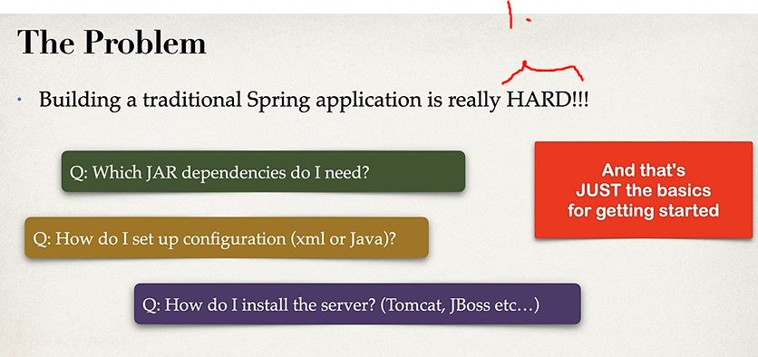

1. Normally setting up **Spring** is difficult, need to think many things first
    - Here, **Spring Boot** comes in to play, it makes thing pre-configured all ready. 


- **Spring boot** solves these things for you for providing these things


- **Spring Boot** uses **Spring** behind scenes
    - **Spring** and **Spring boot** are two different things! 

- Spring boot gives **Spring Initializr** for easy configuration
    - [SpringInitalizr](https://start.spring.io/)


1. Will be using Eclipse


1. Not like with **JSP** application where your **.jar** needs to be run with separate server application, like **tomcat**
2. Server is provided whit in **.jar** file with your code

- This make it easy to just run in command line `java -jar mycoolapp.jar` **MAGIC!**
    - What about deploying app like in normal way? No worries, **Spring boot** can deploy **.war** also
        - Deployed as **.war** file, which can be ran with external server like **Tomcat**


1. One server installed in company
2. This one server runs many applications like in the past


1. **Spring Boot** uses and configures these components **under it**, for easy to use

- You can use **any** IDE for Spring Boot apps!

- When building Java applications, you need JAR files
    - You can do this by hand, but in **recommended** let build tool take care of this. Like maven
    - [Additional info](https://softwareengineering.stackexchange.com/questions/340223/should-you-include-libraries-and-code-unrelated-files-in-your-git-project-and-up)


- Maven takes care of `.jar` files, summary here. External **.JAR** files like Spring, Hibernate which Spring boot uses


<br>


 
1. We want to add decencies to our **Spring Boot** project.
2. **Spring Web** is for full stack web project

- After importing into your favorite **IDE** as Maven project. You can run as **Java application!** Not with server since, it's included in bundles


 
1. As you can see Embedded server is included and running

- Default starting place `http://localhost:8080/`

- We can make basic app, by telling with such annotations


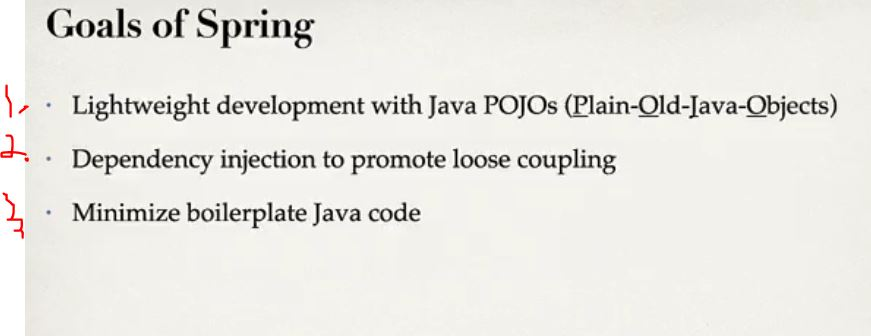

1. Much simple work with POJO:s than [EJB](https://www.javatpoint.com/what-is-ejb). EJB is like **COM** object
     - [POJO](https://en.wikipedia.org/wiki/Plain_old_Java_object)
     - [POJO2](https://www.baeldung.com/java-pojo-class)
2. Loose coupling with dependency injection
3. In old days Java EE needed to write a lot of code

- Core components of Spring Boot


- **SpEL** spring configuration language

 

<br>


1. ORM **Object Relation Mapping**. Popular one and important!

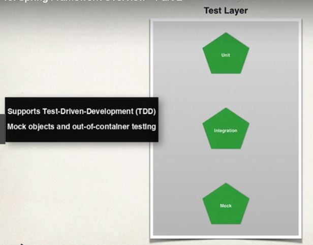

- Integration test supported

- Spring projects
    - are just Spring **modules**

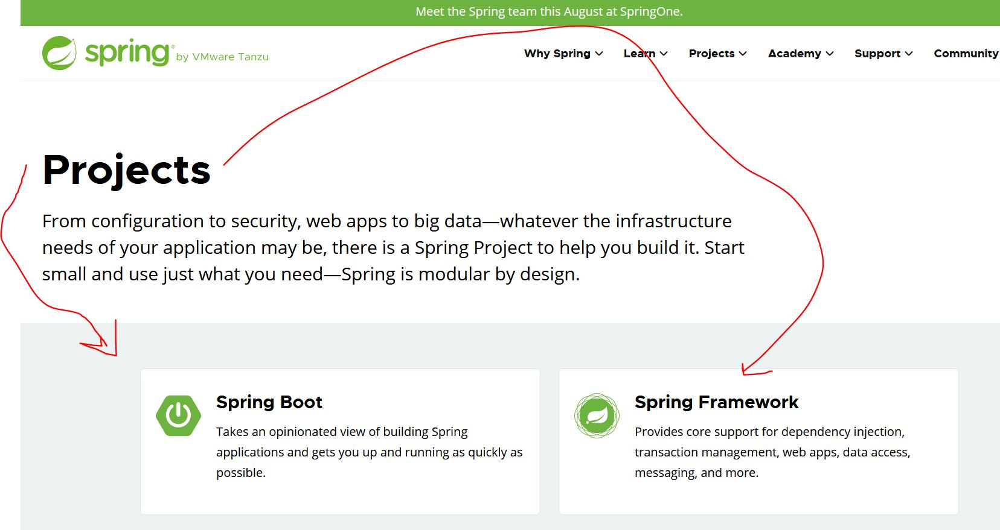

- List of different projects [Spring Projects](https://spring.io/projects)


- This can be also beneficial, if you don't want to push external library to your repository. You can let **Maven** do the work!


- Maven downloads our JAR files from internet
    1. Remote repository is in internet


How Maven works:

1. Maven will read config file 
2. Check local repo
3. If no in local repo, get it from internet remote(remote)
4. Saves it to local repository
5. Build and run application

- When building and running app
    - Maven takes care class and build path for you

- Maven project structure, standard 

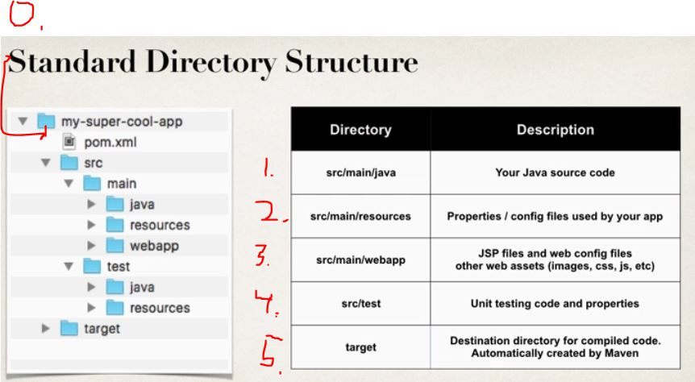

0. POM project configuration file
    1. Java source code
    2. Property files, config file ... etc.
    3. **webapp**, is CSS, web-config files
    4. Test files comes here
    5. Compiled codes come here, artifacts what maven will compile

- Why is important to have directory structure

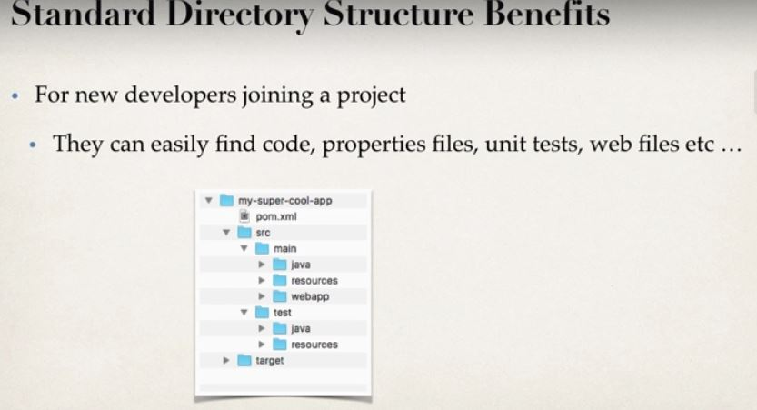

- Maven projects are portable, Eclipse, IntelliJ, NetBeans etc

- As summary why using Maven


- Additionally, when new developer joins team, personnel can get easily into project whit out worrying about project config details


- **Project metadata** Data about your project.
- **Dependencies** Data list of projects which are depending on our project.
- **Plug ins** Addition custom task. Junit, logging

- This structure reflected to **POM.xml**


2. Dependencies get added here, example Junit

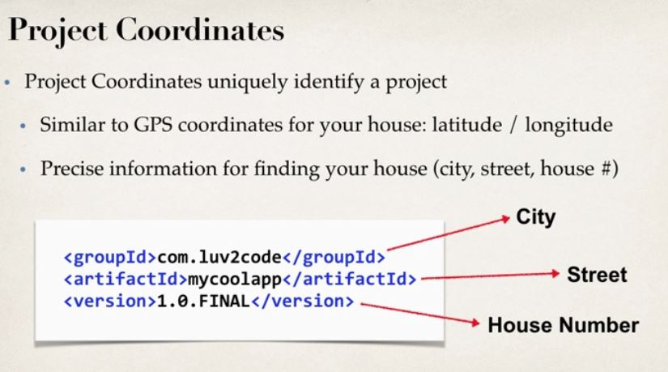

- Project Coordinates -> Like UID


1. Should use reverse domain naming convention
2. Version number, **SNAPSHOT** mean product is still under development

- To add dependency we need add following


- When adding dependency we need, **Group ID**, **Artifact ID**, but version is optional
    - It's good to input such information
    - For **DevOps** this is important, that you can say it have been tested and proven to work with following versions of decencies. Acronym **GAV**


- Finding coordinates to input to POM
    - Option 2, is far the easyest

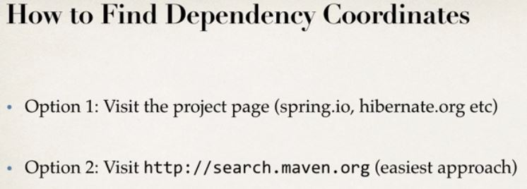

- Maven Wrapper files, helps run and download correct versions of maven.  


- If Maven is all ready installed, no need for wrapper files.

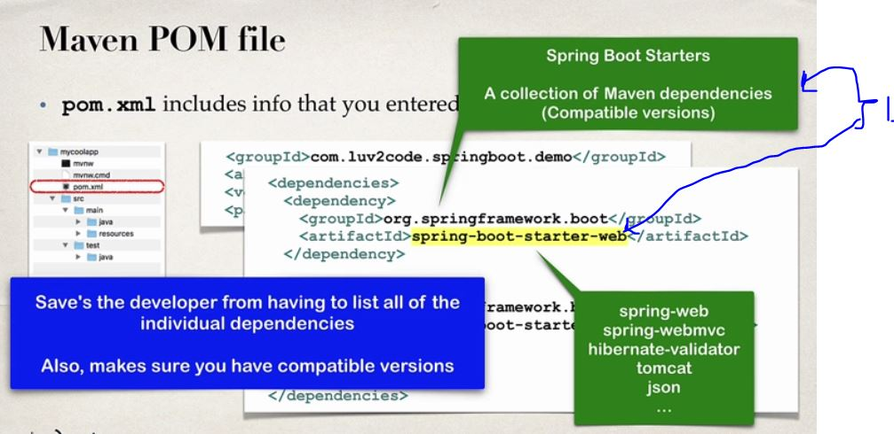
   
1. ``spring-boot-starter-web`` is collection of decencies, for easy import on maven.


1. Plugin used for packaging and for running spring application
    - with `./mvnw package` and `./mvnw spring-boot:run`
2. If Maven is locally installed, you can use following `mvn package` or `mvn spring-boot:run`


- Default Spring Boot will load config data from `application.propertyes`
1. You can add own config data to this file
2. Or make own **custom** properties!

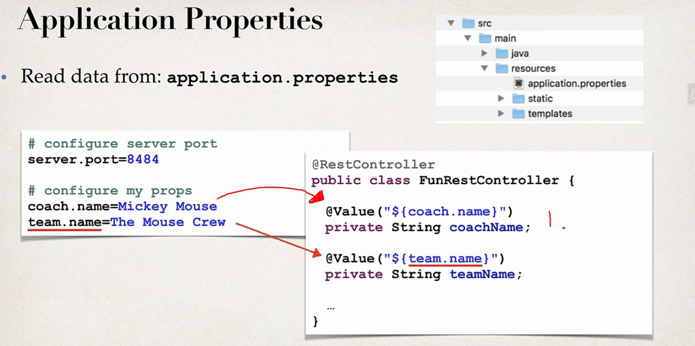

- Using own **custom** properties using injection
    1. `@Value("${coach.name}")` and injecting into variable `coachName;`
- Static content is stored in static folder
    - Such as HTML file, CSS, Images etc.....


- **Thymeleaf** is by far the most popular template engine 


- Setting Spring Boot app is **HARD!**
    1. One dependency what is needed is Spring Boot Starters


- Old days/normally you would need to add many imports to maven
    - Example Spring MVC app, needed imports


- Using **starter web**, contains all needed

```

<dependency>
    <groupId>org.springframerwork.boot</groupId>
    <artifactId>spring-boot-starter-web</artifactId>
</dependency>

```


- As you can see Apache Tomcat is inside package

- Spring Initializr adds needed dependencies to your **POM.xml**

- There is many spring-boot-starter packages [List](https://docs.spring.io/spring-boot/docs/current/reference/htmlsingle/#using.build-systems.starters)

- To look what is inside for example `spring-boot-starter-web`, you can use **Dependency Hierarchy** viewer


1. In Eclipse, you can see there is example **tomcat server** 

- Same inside **IntelliJ**


- Starter parent comes default from spring boot

```
	
    <parent>
		<groupId>org.springframework.boot</groupId>
		<artifactId>spring-boot-starter-parent</artifactId>
		<version>3.1.1</version>
		<relativePath/> <!-- lookup parent from repository -->
	</parent>

```

- Benefits using starter parents  


- To use spring boot starter is easy

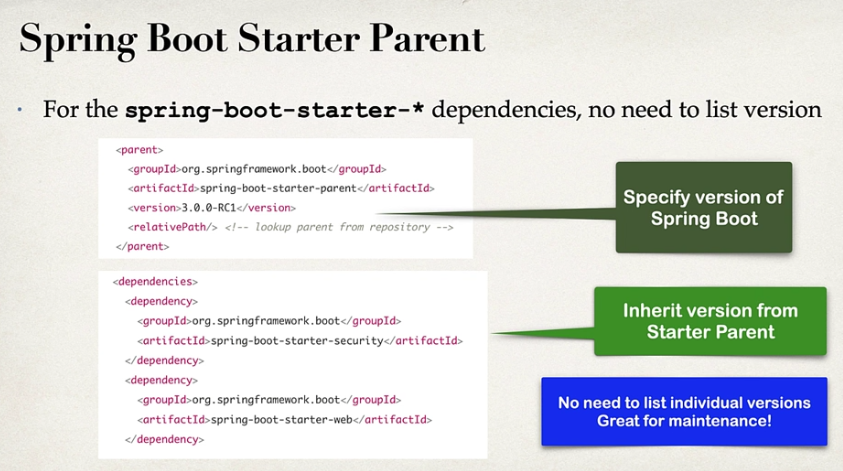

- The main takeaways for using `starter-parent`
    - And great guy below!


- To use Spring Boot Dev Tools, use such

- If intelliJ IDEA needs automatically needs automatic build watch video 19. **TODO**

- **TODO** tee samanalaiset muista Spring Bootin osista

### Spring Boot Actuators

- Actuator exposes metrics and data of application, such as health data

Spring boot Actuators:


- Adding this to **POM**

```

<dependency>
    <groupId>org.springframework.boot</groupId>
    <artifactId>spring-boot-starter-actuator</artifactId>
</dependency>

```


- Health endpoints 


- We can make our own custom health status


- We can modify exposing our endpoint to public

- Info `/info` endpoint in empty by default


1. Example of info

- There are some examples
    - `/auditevents` for **Audit events** for application
     - `/beans` List all the beans registered for Spring Application
     - `/mapping`List all @RequestMapping paths

- There is many Actuator Endpoints [ListOfActuators](www.luv2code.com/actuator-endpoints)


- Exposing all endpoints, keep in mind this is security also **concern**
 
- Get all Bean used in application `http://localhost:8080/actuator/beans`
    - This will expose, example following JSON


 
 - This is also **security** concern!

 ### Actuator in action

 - Configuring in **POM**
 
```
management.endpoints.web.exposure.include=health, info
management.endpoints.env.enabled=true
management.info.env.enabled=true
```
- As you can see two Actuators were exposed to public. **Health** and **Info**


- Exposing some info by following configuration

- Health endpoint in action


```
management.info.env.enabled=true

#Customizing info endpoint
info.app.name=My Supser Cool App
info.app.description=A super duper fun app!
info.app.version=1.0.0.0
info.reppu.tasku=Banaani on repussa!
```

- This info page can be configured what ever you put there `info.reppu.`. Example


- Plugin for Chrome [PrettyPlugInPlugIn](https://chrome.google.com/webstore/detail/json-formatter/bcjindcccaagfpapjjmafapmmgkkhgoa?utm_source=ext_app_menu)

- Exposing all /actuators using wildcard

- Use wildcard "*" to expose all endpoints
- You can expose individuals endpoints with a comma-delimited list

```
2023-09-16T12:40:50.046+03:00  INFO 10044 --- [  restartedMain] o.s.b.a.e.web.EndpointLinksResolver      : Exposing 13 endpoint(s) beneath base path '/actuator'
```

- **Thereaddump** is good for analyzing performance and bottlenecks in application `http://localhost:8080/actuator/threaddump`

- **mapping** `/mapping` for exposing used mapping in app


- Using security Spring Boot
    - Default password can be found in console


- You can override default password

```
spring.security.user.name=SomeName
spring.securty.user.passworld=SomeRandomPassord
```

- Example using generated password! Can be seen in log


- We can **include** and **exclude** endpoints


<br>

- Link to [include and exclude](https://docs.spring.io/spring-boot/docs/2.1.13.RELEASE/reference/html/production-ready-endpoints.html#production-ready-endpoints-enabling-endpoints)

> Disabled endpoints are removed entirely from the application context. If you want to change only the technologies over which an endpoint is exposed, use the **include** and **exclude** properties instead.

- Adding security package asking username before accessing certain endpoints

- We can remove them using following

```
#Exclude individual endpoints with a comma-delimited list
#management.endpoints.web.exposure.exclude=health,info
```

<br>


- Spring Boot apps are self-contained

- There is two man ways to start running Spring Boot application from command line
    - **Option 1** `java -jar`
    - **Option 2** Use Spring Boot Maven plugin `mvnw spring-boot:run`


1. No need IDE or Server installed, all included in **.Jar**


1. Maven comes with package we can run Maven plugin. In **Windows**
2. Maven comes with package we can run Maven plugin. In **Linux / Mac**

- If maven all ready **installed** you just run it normally


<br>

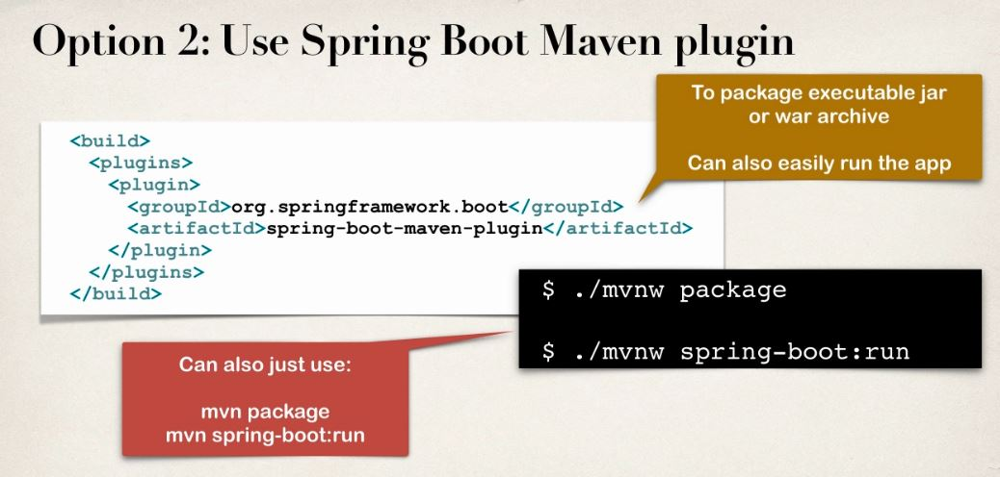

<br>

- We can package our Spring Boot application using `spring-boot-maven-plugin`

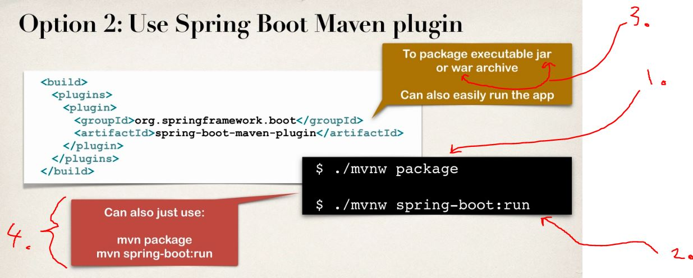

1. Using command to Build Project `mvn package` [Building Project in vanilla Maven](https://maven.apache.org/guides/getting-started/maven-in-five-minutes.html#build-the-project)
2. Running application using Maven Plugin
3. We can pack application to **Jar** or **War**
4. If **Maven** all ready installed we can run it little differently


1. Example using `mvn package` building software


- Running our app from command line with **.jar** `java -jar mycoolapp-0.0.1-SNAPSHOT.jar`

- Running with using maven plugin `./mvnw spring-boot:run`

- We can use of configuration file. It's called property file in Spring Boot
    - You can have no hard coded values here


1. You can define ANY custom properties in this file with `@value`


<br>

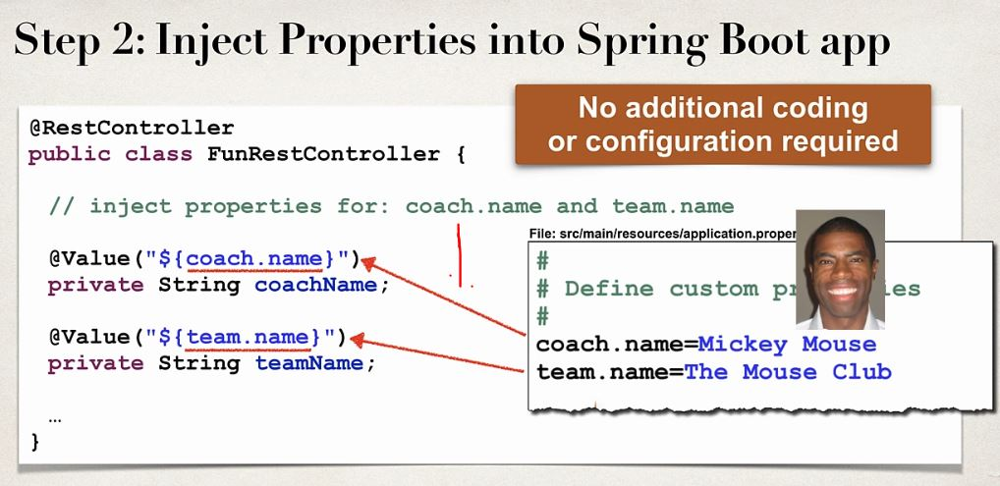

1. We are injecting value **from properties** file into **field** 

- Defining in `application.properties` 

```

coach.name=Mickey Mouse
team.name=The Mouse Club

```

- In Java Rest Controller 

```

	@GetMapping("/teaminfo")
	public String getTeamInfo() {
		return "Coach: " + coachName + ", Team name: " + teamName;
	}

```

- Spring Boot has 1000+ properties!! [List of Properties](luv2code.com/spring-boot-props)

- Eight main ways to categorize properties


1. We can put different log levels for difference **package.level**
2. We can output logs into files


<br>

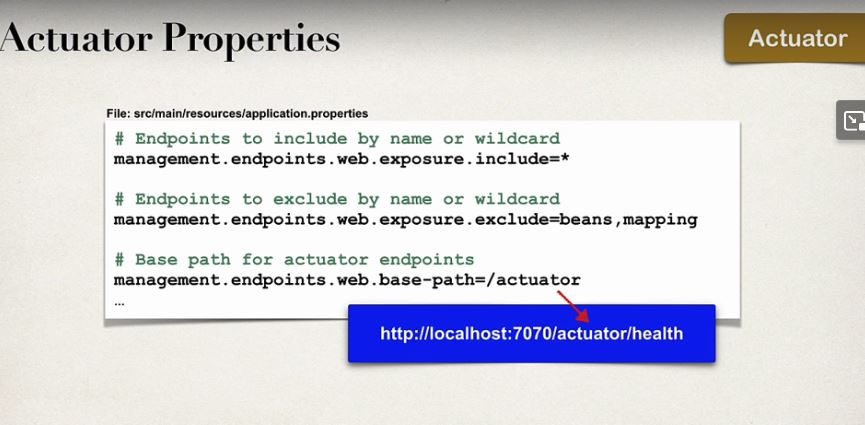


### Security Properties

```
#Default user name
spring.security.user.name=admin

#Password of for default user
spring.security.user.password=topsecret

```


- As you can see embedded servers start at `7070`


