# Section 2: NEW - Spring Boot 3 - Inversion of Control and Dependency Injection

Spring Boot 3 - Inversion of Control and Dependency Injection

# What I Learned

- **IoC** Inversion of Control (IoC)

> The approach of outsourcing the construction and management of objects.

- Why we would need this?


1. We could easily change sport to our implementation with **IoC**

- In ideal solution:


1. Object Factory would return specific object based on configuration **2.**

- Spring Container work like "object factory" 


- There are two main responsibilities for **Spring Container**

- There are **three** main ways to configure Spring Container
1. XML configuration file **(LEGACY)!** ❌
2. Java Annotations **(Modern)** ✔️
3. Java Source Code **(Modern)** ✔️

> **Dependency Injection**
> The dependency inversion principle.
> 
> The Client delegates to another object
> the responsibility of providing its 
> dependencies.


1. Car Object is wanted
2. In background **Car Factory** needs to build and return Car Object
    - Decency injection idea is to give us **full/complete** object. Do what you need to do, use helper classes/services/components


1. We want to **inject** the coach into **DemoController**


### Injection Types

- There is many injection types in **Spring**
- We will use two most recommended ones
1. **Constructor Injection**
2. **Setter Injection**


- While **Constructor Injection** is preferred one

1. If decencies are not provided this is OK to use


<br>

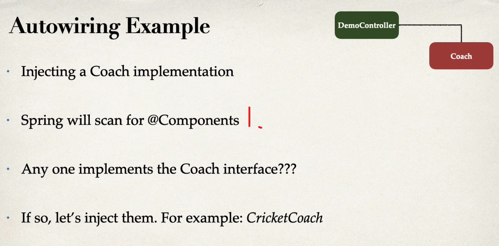

1. Spring scans classes with `@Components`

- To demonstrate this we are going to do this

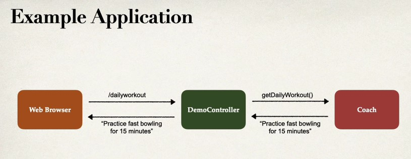

1. When we visit `/dailyworkout` in our browser
2. `DemoController` calls `getDailyWorkout()`

<br>


- `@Compenent` marks class as a Spring Bean

#### Step 1: @Component annotation

>**@Component** marks the class as a Spring Bean
> A Spring Bean is just a regular Java class that is managed by Spring
> @Component also makes the bean available for dependency injection

<br>


<br>


<br>

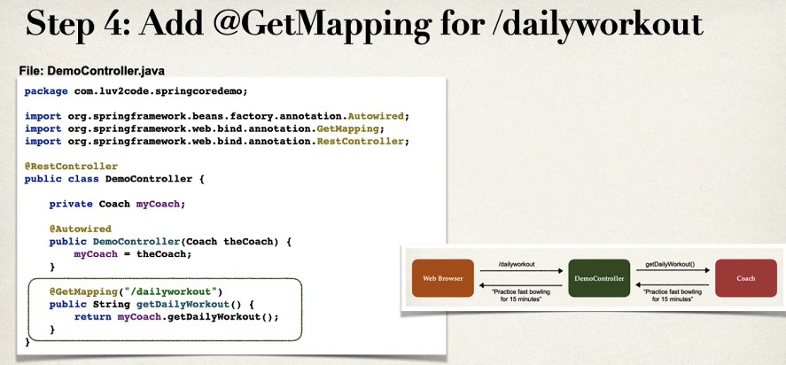

<hr>


- Spring Core example uses following settings

- Example using how `@Component` is registered as Bean in **Spring Boot**


<br>

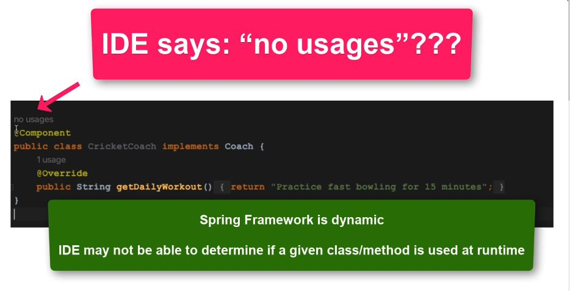

- IDE can be little behind, since dynamic nature of **Spring Framework**

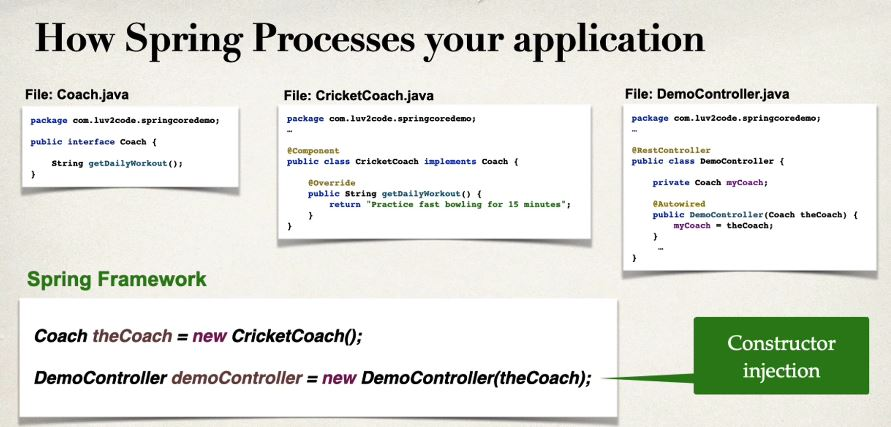

1. Spring Injects behind happens the scenes
    - There is more than this. **HARD** to see when using smaller project 

### Spring Scanning


<br>


- `SpringApplication.run(SpringcoredemoApplication.class, args);` bootstraps your Spring Boot application

- Some most popular annotations are following:


<br>

### Component Scanning

- **By default**, Spring Boot starts component scanning 
    - From same package as your main Spring Boot application

### MEANING

- Scanning start at **SpringBootDemoApplication** level and goes below


<br>

- This is **very important**

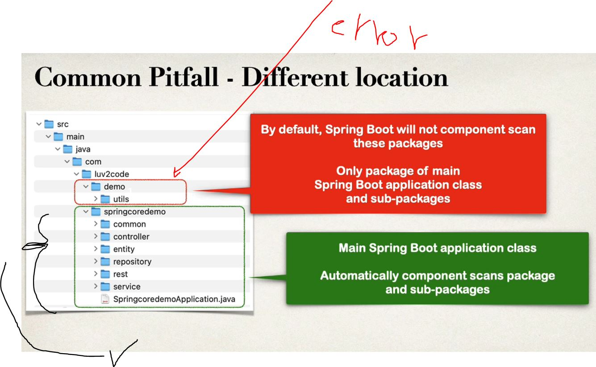

<br>

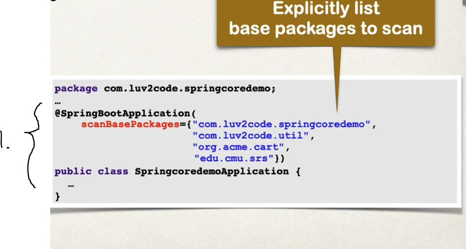

1. Telling explicitly to scan these packages!


<br>

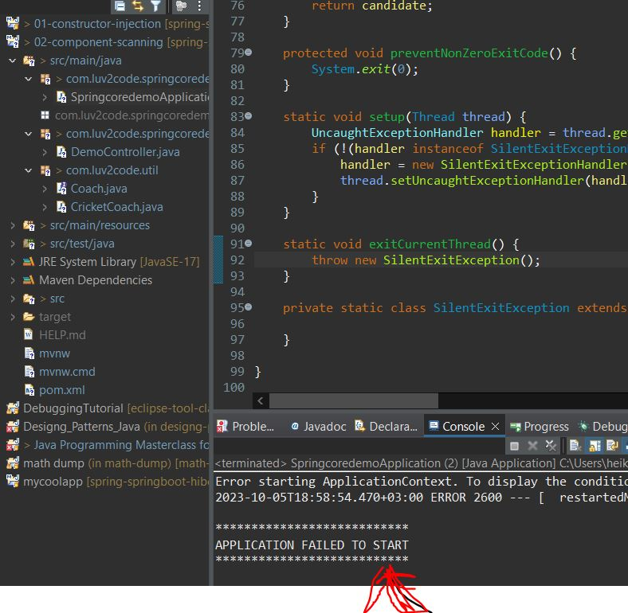

- We need to tell **Spring Boot** how to find these packages

## Setter injection when using setters injecting component


- We will do such autowiring in this example 

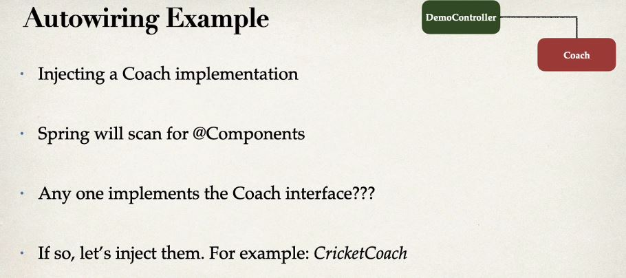

<br>

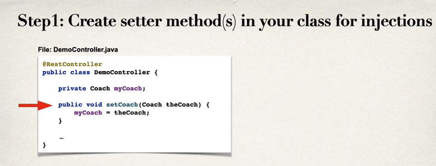

<br>


<br>


1. Behind scenes spring will create instance of **CricketCoach()** and setted with **SETTER INJECTION**


1. We can use `@Autowired` and give any method name to handle dependency injection

## Which Injection Type should use?

- **Constructor Injection**
    - When have required dependencies
    - Recommended by **spring.io**
- **Setter Injection**
    - When have optional dependencies
    - If dependency is not provided

- Making **Setter Injection** example

```
	@Autowired
	public void setCoach(Coach theCoach)
	{
		myCoach = theCoach;
	}
	
	
```

- And same, but with `@autowire` annotation and **its works**

```

	@Autowired
	public void doSomeStuff(Coach theCoach)
	{
		myCoach = theCoach;
	}

```

- ✔️ Spring Injection recommended by **Spring.io**
	- Constructor Injection: Required Dependencies ✔️
	- Setter Injection: Optional Dependencies ✔️
- ❌ **NOT** recommended by Spring Injection by **Spring.io**
	- Field Injection ❌

## Field Injection

- Used in old days with **Spring projects**
	- This made code more hard to **unit test**
	- Some legacy project use **Field Injection**

> Injecting dependencies by setting field values on your class directly (even private fields)
> accomplished by using **Java Reflection**


1. Since we are using **field injection** we don't need to use constructors and setter in **injection**
2. In other hand this will make 

<hr>

### Autowiring


<br>


1. Which one **autowiring** should implement 


- This will be resulting in following error


- Spring don't know which coach it should give back!

# Qualifiers

### To fix this

- One of solution is to be specific which **CricketCoach** you should be using


## For Setter Injection

- You can use Setter injection and use `@Qualifier` annotation


<br>


- As you can see, since its constructor injection whiteout being specific, we are experiencing problem where Spring boot does not know which class it should inject 

<br>

```
	@Autowired
	public DemoController(Coach theCoach) 
	{
		myCoach = theCoach;
	}
	
```

- Remember `@Component` marks Java class as **Bean**

- To fix this we add `@Qualifier`


<br>


<br>


<br>

# Primary


- Just need to use `@Primary` to tell **Spring Boot** to return specified primary coach


- We just use primary `@Primary`
	- Problem with primary that you can have only one of such annotation

- If you mix `@Primary` and `@Qualifier`.
	- Qualifier has higher priority


1. In General should prefer `@Quailifier`

# Lazy Initialization 

- When Spring starts, all beans are initialized and make them available

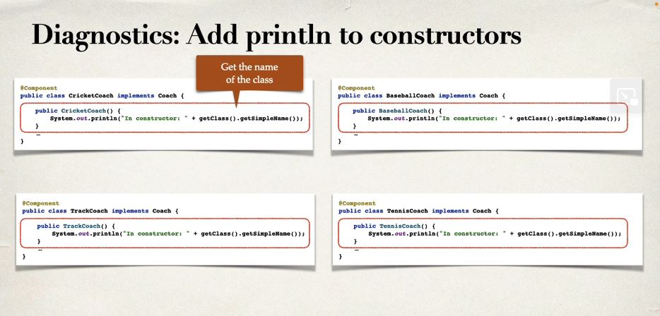

- When made such, we could see such log

```

In contructor: BaseballCoach
In contructor: CricketCoach
In contructor: TennisCoach
In contructor: TrackCoach

```


<br>


1. **Bean** will be initialized only if its needed 
2. We will inject cricket coach
3. We are **not** injecting **TrackCoach** it is not initialized

- If we are lazy to set `@Lazy` to each class, we could use **Global Configuration Property**


1. Such global configuration will be used to make all **Beans** lazy → `spring.main.lazy-initialization=true`
## Advantage of lazy initialization ✔️

1. ✔️ Only creating objects when needed
2. ✔️ May help with faster **start up time** if you have **large number** of **Beans**

## Disadvantages ❌

1. ❌ If you have **web related components** like `@RestController`. Not created until requested
2. ❌ May not discovered configuration issues until too late 
3. ❌ When creating **beans** consumes a lot of memory 

- Lazy initialization is **disabled** by default

- You should profile your application before configuring lazy initialization.


1. As you can see the bean which was initialized because it was marked as `@Lazy` and weren't used 

# Bean Scopes

- Scope is lifecycle of **bean**
	- How long it lives?
	- How many instances is created?
	- How is bean shared?
- **DEFAULT scope** is **SINGLETON**