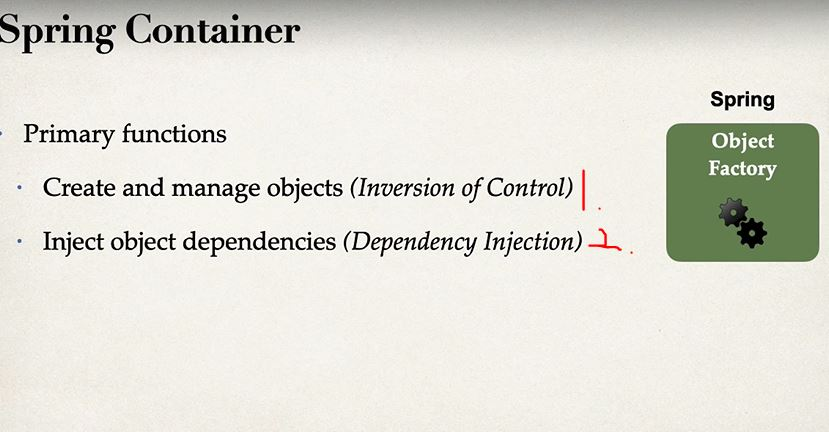

# Section 2: NEW - Spring Boot 3 - Inversion of Control and Dependency Injection

Spring Boot 3 - Inversion of Control and Dependency Injection

# What I Learned

- **IoC** Inversion of Control (IoC)

> The approach of outsourcing the construction and management of objects.

- Why we would need this?

1. We could easily change sport to our implementation with **IoC**

- In ideal solution:

1. Object Factory would return specific object based on configuration **2.**

- Spring Container work like "object factory" 

- There are two main responsibilities for **Spring Container**

- There are **three** main ways to configure Spring Container
    1. XML configuration file **(LEGACY)!** ❌
    2. Java Annotations **(Modern)** ✔️
    3. Java Source Code **(Modern)** ✔️