# Section 3: NEW - Hibernate/JPA CRUD 

NEW - Hibernate/JPA CRUD 

# What I Learned


1. Lot of enterprise companies uses **Hibernate**

- Used retrieving and saving file from/to database

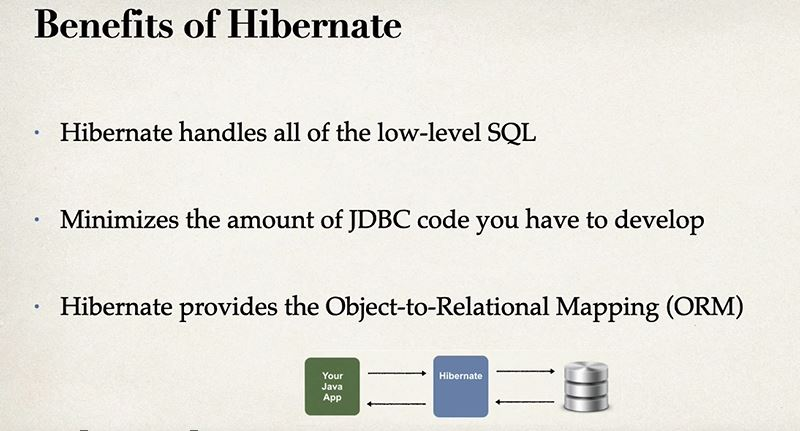

- Less JDBC code with usage of **ORM**

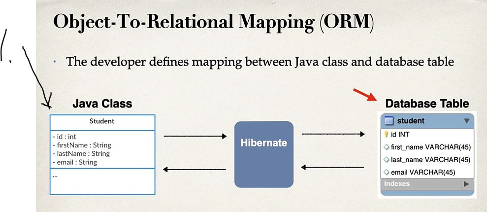

1. Camel case naming


- Remember its only specification

- Many vendors implement - **JPA** specification  

- [JPA Vendor Implementation](luv2code.com/jpa-spec)


- Meaning we could easily "technically" swap JPA Implementation to another
    - If ABC stop supporting the product
        - You could switch to Vendor XYZ


- Example **ExlipseLink** is no more around!
    - We just switch it
- This is the benefit for Coding **STANDARD API** for ORM


<br>


1. Behind the scenes Hibernates implementation of JPA will do all the work for you. **MAKING ALL SQL RELATED THINGS**

- In old days you had to write SQL code for these operations, now hibernate does all the work for you!

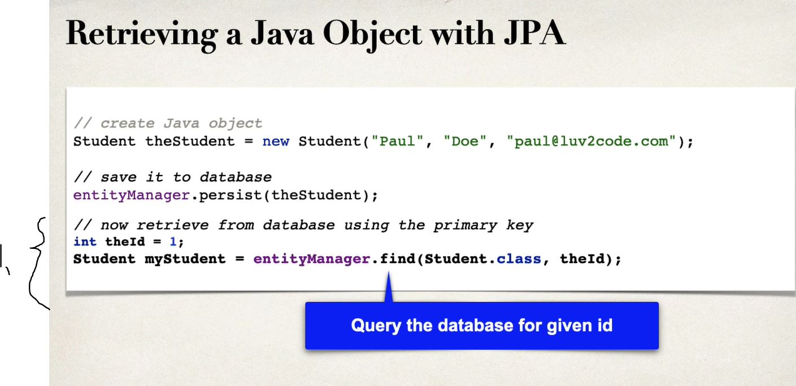

1. Technique for retrieving Student from database. Using **Primary Key** 

```

int theId = 1;
Student myStudent = entityManager.find(Student.calss, theId);
 
```

- This is basically what we need to retrieve **Object** from database.

- TODO too joku JDBC kurssi, koska historian havina.


1. We are using simple **JPA query language** We are not writing any **SQL** code!
    - We can use `like` `where` and such in Java code!


- JDBC is still **used background** of JPA/Hibernate

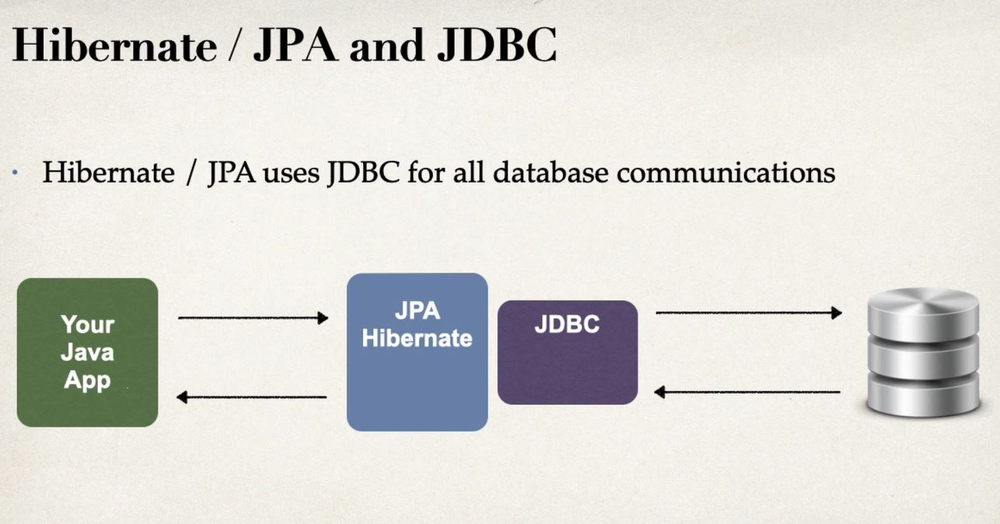
    
- MySQL is being used here.
- [WorkBench](https://dev.mysql.com/downloads/workbench/)
- [MySQL](https://dev.mysql.com/downloads/mysql/)

- Creating user SQL

```
-- Drop user first if they exist
DROP USER if exists 'springstudent'@'%' ;

-- Now create user with prop privileges
CREATE USER 'springstudent'@'%' IDENTIFIED BY 'springstudent';

GRANT ALL PRIVILEGES ON * . * TO 'springstudent'@'%';
```

 - Student tracker SQL

```
CREATE DATABASE  IF NOT EXISTS `student_tracker`;
USE `student_tracker`;

--
-- Table structure for table `student`
--

DROP TABLE IF EXISTS `student`;

CREATE TABLE `student` (
  `id` int NOT NULL AUTO_INCREMENT,
  `first_name`varchar(45) DEFAULT NULL,
  `last_name` varchar(45) DEFAULT NULL,
  `email` varchar(45) DEFAULT NULL,
  PRIMARY KEY (`id`)
) ENGINE=InnoDB AUTO_INCREMENT=1 DEFAULT CHARSET=latin1;
```


<br>


1. We will be using following configurations, **db** which we created previously
2. Data source URL


1. **CommandLineRunner** is **Spring Boot** hook to run after **Spring Boot** have been loaded
2. We can add DAO code later on 

- For now, we can use following to illustrate `CommandLineRunner`

```
	//Executed after Spring Beans have been loaded
	@Bean 
	public CommandLineRunner commandLineRunner(String[] args)
	{
		return runner -> {
			System.out.println("Hello World");
		};
	}
```


1. This connects our local MySql to our JDBC


1. We can see that our JDBC drivers successfully logged in to Database


1. We can see our CondeLineRunner is working, executed after bean have been loaded


# JPA development

1. Annotate Java Class
2. Make Java Code to perform database operation


<br>

- Entity class should have:


## Java annotations

1. Maps class to database table
2. Map fields to database columns


1. We are mapping entity maps to database table


1. We are using `@Column` to map column to database column

- Notice also Java class naming and database naming are different.

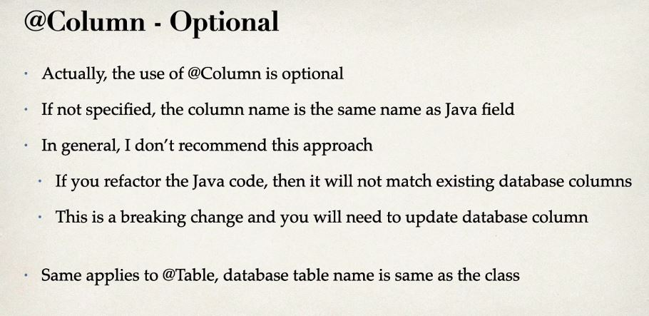

1. `@Column` is optional, but **recommended**. When you will refactor your code your column names could get messed up!

- The same applies to `@Table` annotation

```
CREATE TABLE student (
    id int NOT NULL AUTO_INCREMENT,
    first_name varchar(45) DEFAULT NULL,
    last_name varchar(45) DEFAULT NULL,
    email varchar(45) DEFAULT NULL,
    PRIMARY KEY (id)
)
```

- Same in Java annotations


- In JPA world we need to specify **primary key**

1. We are telling that we let database manage this `Id` field.

## Different ID generation strategies

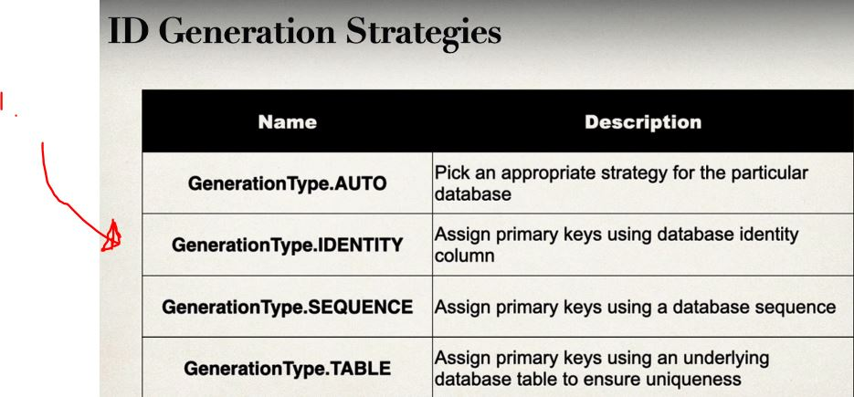

1. `GenrationType.IDENTITY` is most recommended, it should cover most of the cases


- If you didn't find wanted Generating logic for your need. You can **MAKE** your own **CUSTOM** strategy.
    - Make implementation of `org.hibernate.id.IdentifierGenerator`
    - Override the method: `public Serializable genrate(...)`


- Example of Entity where we map Java class to Database Table
```
package com.luv2code.cruddemo.entity;

import jakarta.persistence.Column;
import jakarta.persistence.Entity;
import jakarta.persistence.GeneratedValue;
import jakarta.persistence.GenerationType;
import jakarta.persistence.Id;
import jakarta.persistence.Table;

@Entity
@Table(name="student") // Mapping to table
public class Student {

	@Id
	@GeneratedValue(strategy = GenerationType.IDENTITY) // I let MYSQL handle id generation
	@Column(name="id")
	private int id;
	
	@Column(name="first_name")
	private String firstName;
	
	@Column(name="last_name")
	private String lastName;
	
	@Column(name="email")
	private String email;

	
	public Student() {
	}


	public Student(String firstName, String lastName, String email) {
		this.firstName = firstName;
		this.lastName = lastName;
		this.email = email;
	}


	public int getId() {
		return id;
	}


	public void setId(int id) {
		this.id = id;
	}


	public String getFirstName() {
		return firstName;
	}


	public void setFirstName(String firstName) {
		this.firstName = firstName;
	}


	public String getLastName() {
		return lastName;
	}


	public void setLastName(String lastName) {
		this.lastName = lastName;
	}


	public String getEmail() {
		return email;
	}


	public void setEmail(String email) {
		this.email = email;
	}


	@Override
	public String toString() {
		return "Student [id=" + id + ", firstName=" + firstName + ", lastName=" + lastName + ", email=" + email + "]";
	}

	
	
}
```

- It's common to have **D**ata **A**ccess **O**bject(**DAO**)


1. **DAO** is between App and Database. This is like helper class


- It's good to plan operations for **DAO**. In our example we are going to use such.

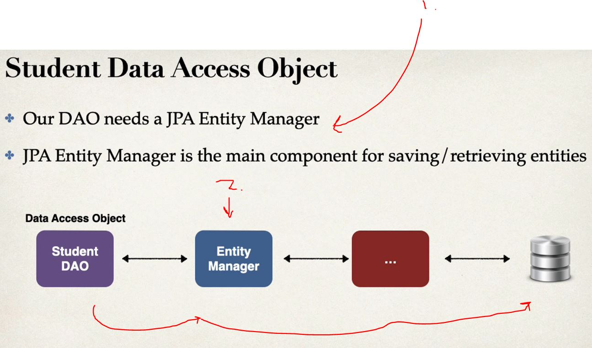

- **DAO** communicates with **Entity Manager**, which in return communicates with **our database**
1. We will have JPA Entity Manager with our **DAO**
2. Main component for **saving/getting** entities


<hr>


1. Student is our JPA Entity class which we did mapping!
2. Saves given Student

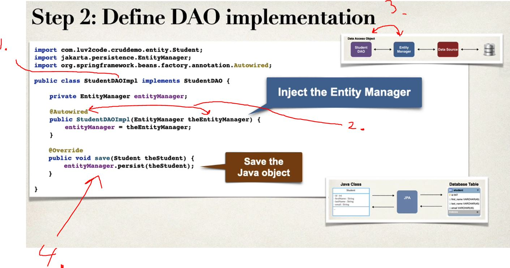

1. **StudentDAO** implementation from interface, which we created in step 1.
2. We are using **EntityManager** to inject into our **DAO** implementation
3. Remember in our architectural approach **EntityManger** is communication between our **DAO** and **database**
4. We are using our **EntityManager** to save our Student **DAO**


<br>

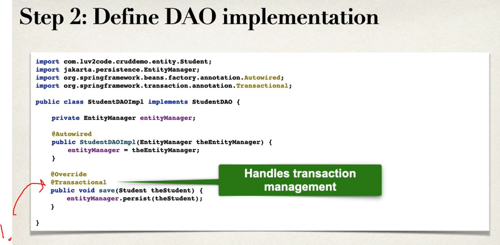

1. We want to tell this action is **Transactional**. This annotation is form Spring Framework

- [Transactional](https://docs.spring.io/spring-framework/docs/current/javadoc-api/org/springframework/transaction/annotation/Transactional.html)

<br>


1. This is subcomponent. It is for **DAO**

- There is reason why we would apply `@Repository` for our **DAO**


<br>

- Using `@Repository` in our implementation


<br>


1. Executed after Beans have been **loaded**

- Following will save Student to db 

```
private Object createStudent(StudentDAO studentDAO) {
		
		System.out.println("Creating new student object ...");
		Student tempStudent = new Student( "Paul", "Doe", "Paul@luv2code.com");
		
		
		System.out.println("Saving the student");
		studentDAO.save(tempStudent);
		
		System.out.println("Saved student. Generated id: " + tempStudent.getId());
		
		
		
		return null;
	}
```

- You can see **Paul** gets saved into database


<br>


- Saving multiple **Students**

```
	private void createMultipleStudent(StudentDAO studentDAO) {
		
		System.out.println("Creating 3 student objects...");
		Student tempStudent1 = new Student( "John", "Doe", "Paul@luv2code.com");
		Student tempStudent2 = new Student( "Mary", "Public", "Paul@luv2code.com");
		Student tempStudent3 = new Student( "Bonita", "Applebum", "Paul@luv2code.com");
		
		System.out.println("Saving the student ...");
		studentDAO.save(tempStudent1);
		studentDAO.save(tempStudent2);
		studentDAO.save(tempStudent3);
	}

```


<br>

- **SQL** command of for changing old table

```
ALTER TABLE student_tracker.student auto_increment=3000
```

<br>

- Alter works! **id** starts from 3000


<br>

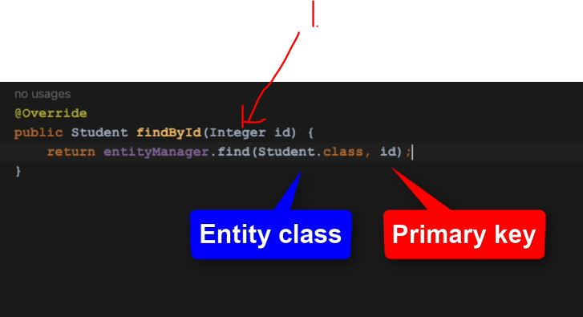

- Looking object based on **Id**

- Setting auto increment to default `truncate student_tracker.student;`

# Retrieving a Java Object With JPA


<br>


- If not find return **null**

<br>

- Since this is retrieving object. This Does not need `@Transactional`, since its query

# Querying Objects

<br>

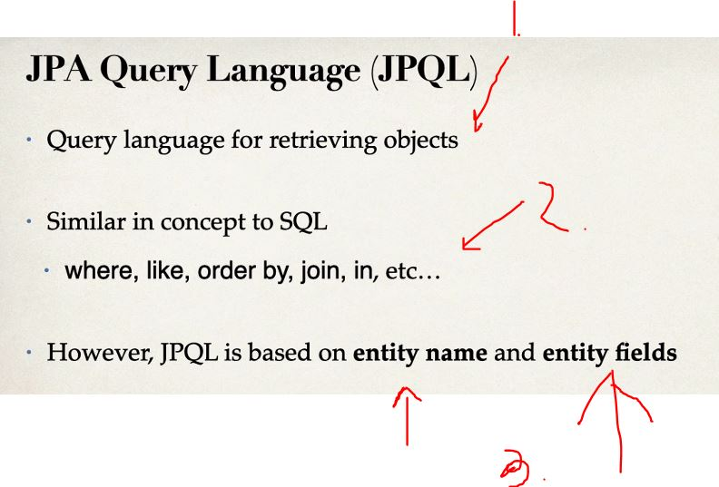

1. Remember **(s)**, since objects are queried thought **entity manager**. Query Language is used to retrieve multiple objects

2. You are using same operations like in SQL

3. **JPQL** is based on **entity names** and **entity fields** rather than **table name** and **table fields** like in **SQL**

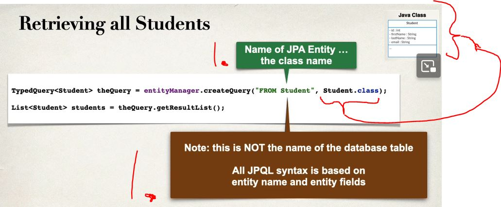

1. This is names in **Entity** not database tables. All **JPQL syntax** is based on **Entity Names** and **Entity Fields**


<br>

- You can use **OR** also.


- Using **LIKE** Ends in `luv2code.com`


<br>


1. **JPQL Named Parameter** are prefixed with a colon `:`

- We can **ORDER BY** in SQL also
```
	@Override
	public List<Student> findAll() {
		//Create query
		
		TypedQuery<Student> theQuery = entityManager.createQuery("FROM Student ORDER BY lastName", Student.class);
		//Return query results
		return theQuery.getResultList();
	}
```