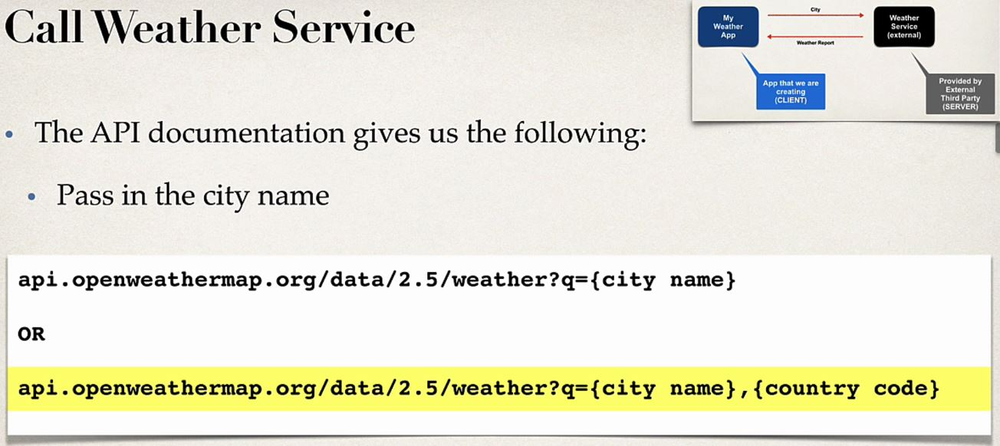
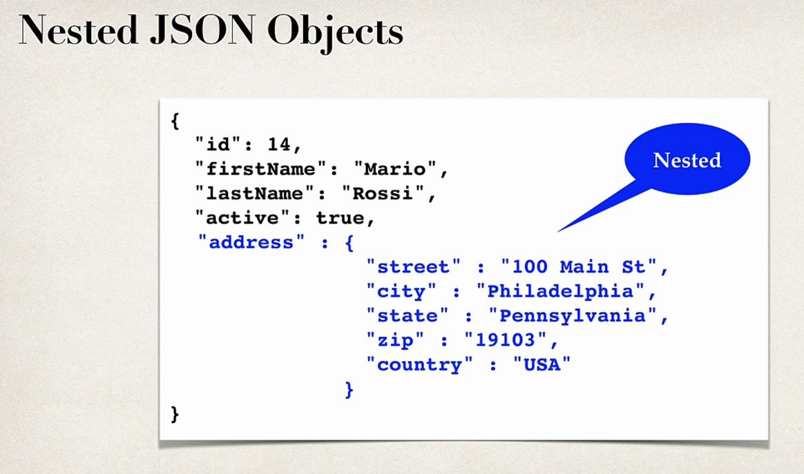
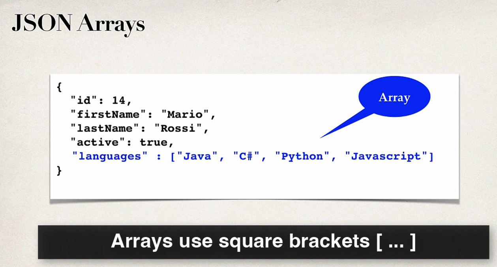
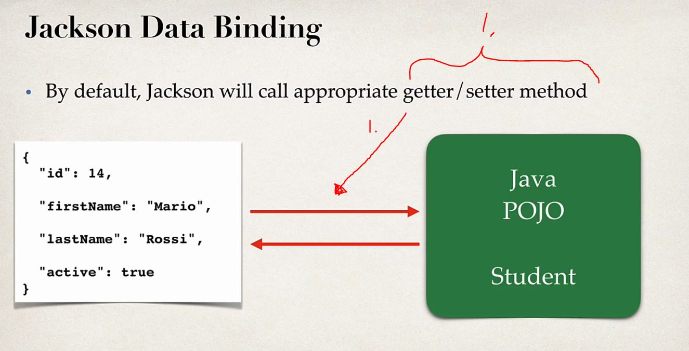
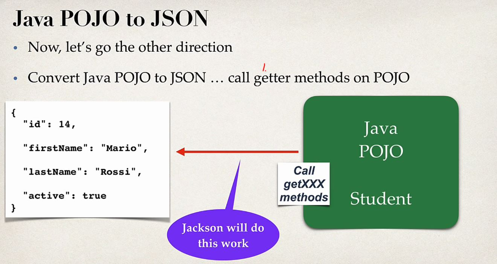
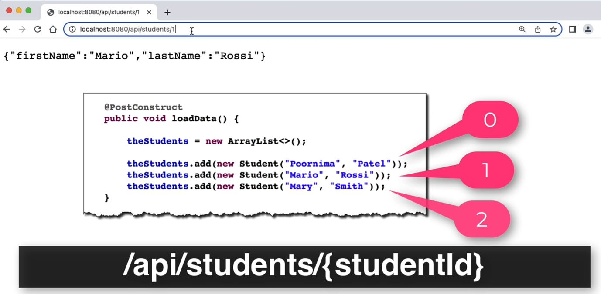
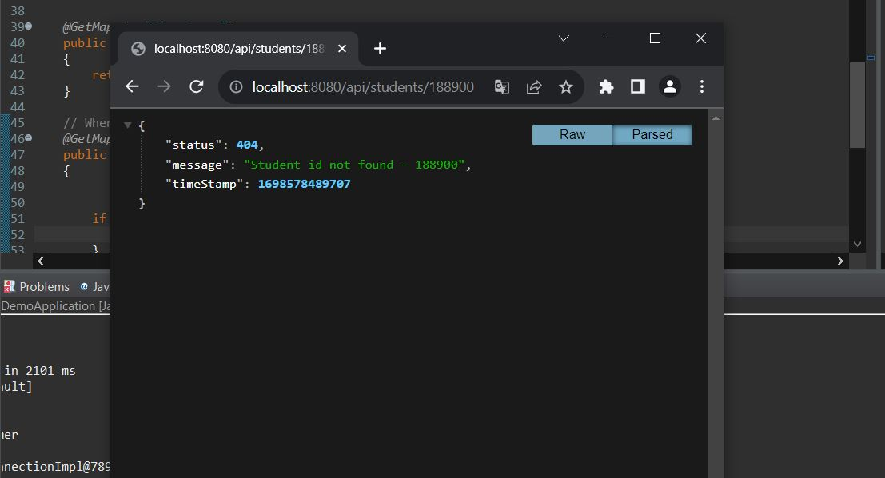
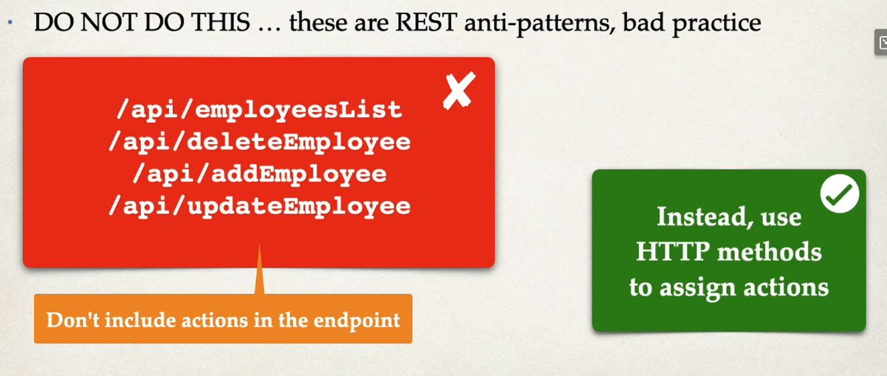
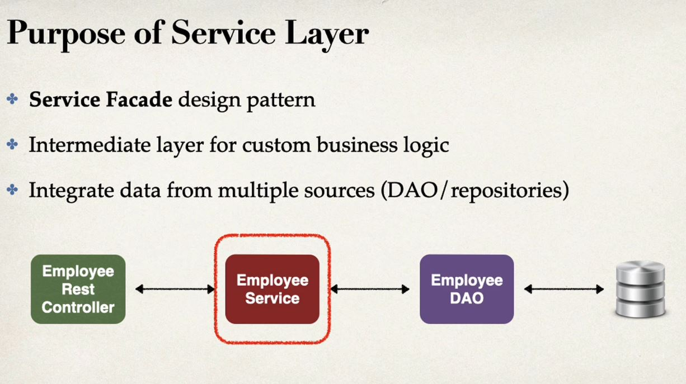

# Section 4: NEW - REST CRUD APIs

NEW - REST CRUD APIs

# What I Learned

- [Reference Manual](luv2code.com/spring-reference-manual)


<br>

- **Connecting** Weather Service, is thought REST API calls over HTTP

- REST is language independent

- We be using [WeatherAPI](openweathermap.org)



<br>


<br>


<br>


<br>

- You can nest as many levels as you can in JSON Object model



<br>



<br>


<br>


- **Message body:**
  Message of content will be inside message body as **JSON**. If adding is happening.


- **MIME** Content Type, media type of the payload.


- For getting dummy JSON files

- [Fake Online REST API for Testing and Prototyping](http://jsonplaceholder.typicode.com/)

- Performing postman **GET** to dummy website

- `http://jsonplaceholder.typicode.com/users`


### Rest client with REST Controller


1. Annotation for class adds support for **REST**

- We can query this **URL** with many ways


- **RestController** in Java

```

package com.luv2code.
demo.rest;

import org.springframework.web.bind.annotation.GetMapping;
import org.springframework.web.bind.annotation.RequestMapping;
import org.springframework.web.bind.annotation.RestController;

@RestController
@RequestMapping("/test")
public class DemoRestController {

	
	@GetMapping("/hello")
	public String sayHello() {
		return "Hello World";
	}
}

```


### Spring Boot REST POJO 


1. Other terms used 

- **Jackson Project** is used behind the scenes

- Jackson takes care data binding between JSON and Java POJO



1. We define getters/setters for **conversion** to **POJO** → **JSON** and other way around. Jackson can help this one out!

- Jackson calls `setXXX` method when setting up **POJO**


1. Name from JSON, is used to call set in **POJO**
2. Jackson calls setter methods



1. Getter methods are called


<br>


- We will pass `<List>Students`


1. List will be automatically converted to **JSON array**


### Spring Boot REST - Path Variables


1. For parametrizing path variable. Will be in **URL**


1. `@PathVariables` **binds** to **method parameter** from incoming URL variable. Needs to be same name!
2. Gets since student and **Jackson** converts this one to JSON!

- We can use `@PostConstruct` for initializing data for bean. Is **processed** after bean have been loaded

```
	@PostConstruct
	public void loadData()
	{
		theStudents = new ArrayList<>();
		
		theStudents.add(new Student("Poornima", "Patel"));
		theStudents.add(new Student("Mario", "Rossi"));
		theStudents.add(new Student("Mary", "Smith"));
		
	}
```



### Spring Boot REST Exception Handling


1. We want to send back exception inside response as JSON


1. We are making JAVA(POJO) for custom error response

2. We are making our own custom exception


4. Step for whose taking care of exception and returning exception back to client


<br>


1. We are making our own POJO class

- To catch exception we write


<br>



- After implementing our exception handling exception mechanism we did not cover all edge cases. The error we countered such error message 

`2023-10-29T13:23:44.486+02:00  WARN 3852 --- [io-8080-exec-10] .w.s.m.s.DefaultHandlerExceptionResolver : Resolved [org.springframework.web.method.annotation.MethodArgumentTypeMismatchException: Failed to convert value of type 'java.lang.String' to required type 'int'; For input string: "sdasdasds"]`

- **Bad Request**. To fix this we can do one of two things:
	- Make **generic exception handler**, catch all exception
	- Or cover all **edge cases**


- Example writing Exception Handler for per **RestController** 

```
	// Catch all exception
	@ExceptionHandler
	public ResponseEntity<StudentErrorResponse> handlerException(Exception exc) {
		
		StudentErrorResponse error = new StudentErrorResponse();
		
		error.setStatus(HttpStatus.BAD_REQUEST.value());
		error.setMessage(exc.getMessage());
		error.setTimeStamp(System.currentTimeMillis());
	
		return new ResponseEntity<>(error, HttpStatus.BAD_REQUEST);

	}
```


###  Spring Boot REST Global Exception Handling

<br>

- We can write **global** exception handlers, and they are kinda recommended.


<br>


- We can `@ControllerAdvice` annotation


1. Here we will handle all global exception in this controller `@ControllerAdvice`
- We don't need to make exception handling REST specific. This can be used from **global controller** advice handler.

- We want following mechanism. **Full CRUD**
	- Get a list of employees (GET)
	- Get a single employee by id (GET)
	- Add a new employee (POST)
	- Update an employee (PUT)
	- Delete an employee (DELETE)


1. Since name "employee" is often present, we will use such naming


### REST ANTI-PATTERNS



- Use HTTP verbs for REST API names 

- SQL Script for database setting for CRUD application

```
CREATE DATABASE  IF NOT EXISTS `employee_directory`;
USE `employee_directory`;

--
-- Table structure for table `employee`
--

DROP TABLE IF EXISTS `employee`;

CREATE TABLE `employee` (
  `id` int NOT NULL AUTO_INCREMENT,
  `first_name` varchar(45) DEFAULT NULL,
  `last_name` varchar(45) DEFAULT NULL,
  `email` varchar(45) DEFAULT NULL,
  PRIMARY KEY (`id`)
) ENGINE=InnoDB AUTO_INCREMENT=1 DEFAULT CHARSET=latin1;

--
-- Data for table `employee`
--

INSERT INTO `employee` VALUES 
	(1,'Leslie','Andrews','leslie@luv2code.com'),
	(2,'Emma','Baumgarten','emma@luv2code.com'),
	(3,'Avani','Gupta','avani@luv2code.com'),
	(4,'Yuri','Petrov','yuri@luv2code.com'),
	(5,'Juan','Vega','juan@luv2code.com');
```

- We are adding `Employee Service`
	-  Between DAO and REST controller


<br>



<br>


1. Pulling data from multiple sources
2. Providing **Rest Controller** single view as Service from multiple data sources

- We want to pull data from many sources


1. Even if you have one DAO its recommended separating **Service** and **DAO** for future **architecture**.


1. Old ones
2. `@Service` is new one

- `@Service` enables component scanning

- Same as using **service** approach

```
package com.luv2code.springboot.cruddemo.service;
import java.util.List;

import org.springframework.beans.factory.annotation.Autowired;
import org.springframework.stereotype.Service;

import com.luv2code.springboot.cruddemo.dao.EmployeeDAO;
import com.luv2code.springboot.cruddemo.entity.Employee;

@Service
public class EmployeeServiceImpl implements EmployeeService {

	
	private EmployeeDAO employeeDAO;
	
	@Autowired
	public EmployeeServiceImpl(EmployeeDAO theEmployeeDAO) {
		employeeDAO = theEmployeeDAO;
	}
	
	
	@Override
	public List<Employee> findAll() {
		return employeeDAO.findAll();
	}
	
}

```

### Best practices using service layer


1. Transactions are refactored to service layer


1. `.merge` operation performs update or modifying depending on ID.
	- If not equal to 0, perform update other perform insert
2. In case of update its important return updated object.

- We want `@Transactional` refactored to **service layer**


