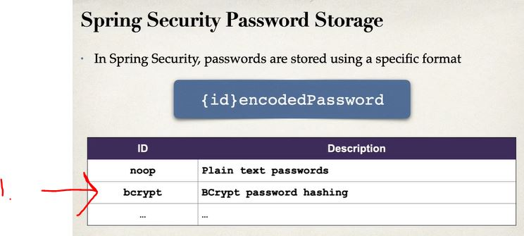

# Section 5: NEW - REST API Security

NEW - REST API Security

This section only covers most common Spring Security tasks.

# What I Learned

- [Spring Security Reference Manual](www.luv2code.com/spring-security-reference-manual)

- In background its using **Servlet Filters**

- Spring Security Model has two main methods to define security.
    - **Declarative**
    - **Programmatic**


1. Most functionality comes from servlet filters

### Overview Spring Security


1. Web Browser wants access `2.` and get results
3. Spring Security catches query and resolves, if request is allow or not
4. Applications Security Configuration is being looked and `users` `passwords` `roles` from db if this user have been authenticated and also is this user authorized to access this resource.

 

- `Authentication` if users and password stored in db
- `Authorization` if user has authorized role

- Declarative Security is configured with `@Configuration`
- Spring can extend basic Spring Security specific enterprise company needs

- Enabling Spring Security

```
<dependency>
    <groupId>org.springframework.boot</groupId>
    <artifactId>spring-boot-starter-security</artifactId>
</dependency>
```

- Defaults: username: `user` and password can be found in the logs

- This can be changed configuring `application.properties`

```
spring.security.user.name=scott
spring.security.user.password=tiger
```

 

1. There are many ways to do authentication and authorization. This course will cover **DB as plain-text and encrypted**

 

<br>

- For Spring Security Password

 

1. We be using this

 

- We are going save Users in memory