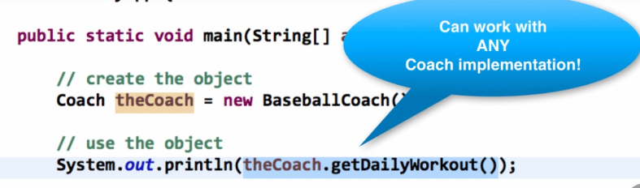
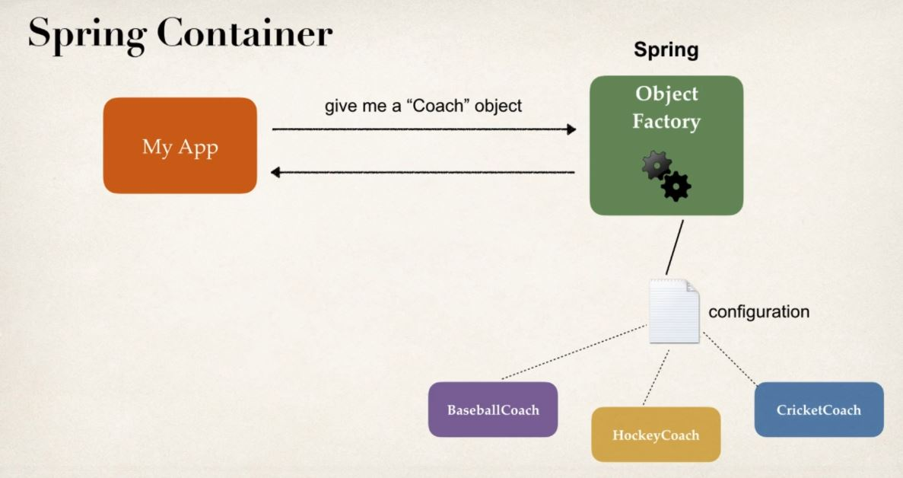
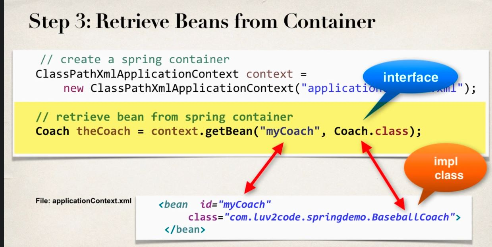

# Section 4: Spring Inversion of Control - XML Configuration

# What I Learned
- IoC (Inversion of Control)
	- Outsource to an object factory
		- Creating and managing object
- 
- We should code thought interface not use straight interface
- 
- This will work with any Coach that we implement
- 
- Spring will give appropriate implementatio based on  config file
- In Spring string container is called ApplicationContext
- 
- A "Spring Bean" is simply a Java object.