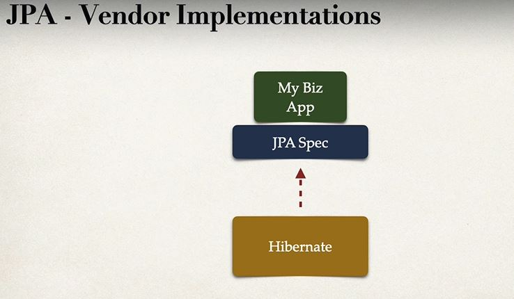
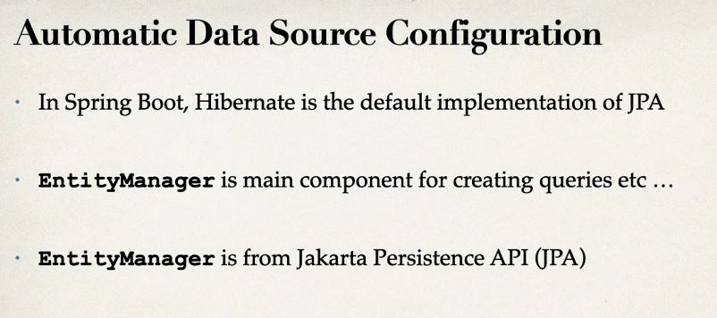

# Section 03: NEW - Hibernate/JPA CRUD.

NEW - Hibernate/JPA CRUD.

# What I Learned.

<div align="center">
	
</div>

1. Lot of enterprise companies uses **Hibernate**

- Used retrieving and saving file from/to database

<div align="center">
	
</div>

- Less JDBC code with usage of **ORM**

<div align="center">
	
</div>

1. Camel case naming

<div align="center">
	
</div>

- Remember its only specification

- Many vendors implement - **JPA** specification  

- [JPA Vendor Implementation](luv2code.com/jpa-spec)

<div align="center">
	
</div>

- Meaning we could easily "technically" swap JPA Implementation to another
    - If ABC stop supporting the product
        - You could switch to Vendor XYZ

<div align="center">
	
</div>

- Example **ExlipseLink** is no more around!
    - We just switch it
- This is the benefit for Coding **STANDARD API** for ORM

<div align="center">
	
</div>

<br>

<div align="center">
	
</div>

1. Behind the scenes Hibernates implementation of JPA will do all the work for you. **MAKING ALL SQL RELATED THINGS**

- In old days you had to write SQL code for these operations, now hibernate does all the work for you!

<div align="center">
	
</div>

1. Technique for retrieving Student from database. Using **Primary Key** 

```

int theId = 1;
Student myStudent = entityManager.find(Student.calss, theId);
 
```

- This is basically what we need to retrieve **Object** from database.

- TODO too joku JDBC kurssi, koska historian havina.

<div align="center">
	
</div>

1. We are using simple **JPA query language** We are not writing any **SQL** code!
    - We can use `like` `where` and such in Java code!


- JDBC is still **used background** of JPA/Hibernate

<div align="center">
	
</div>
    
- MySQL is being used here.
- [WorkBench](https://dev.mysql.com/downloads/workbench/)
- [MySQL](https://dev.mysql.com/downloads/mysql/)

- Creating user SQL

```
-- Drop user first if they exist
DROP USER if exists 'springstudent'@'%' ;

-- Now create user with prop privileges
CREATE USER 'springstudent'@'%' IDENTIFIED BY 'springstudent';

GRANT ALL PRIVILEGES ON * . * TO 'springstudent'@'%';
```

 - Student tracker SQL

```
CREATE DATABASE  IF NOT EXISTS `student_tracker`;
USE `student_tracker`;

--
-- Table structure for table `student`
--

DROP TABLE IF EXISTS `student`;

CREATE TABLE `student` (
  `id` int NOT NULL AUTO_INCREMENT,
  `first_name`varchar(45) DEFAULT NULL,
  `last_name` varchar(45) DEFAULT NULL,
  `email` varchar(45) DEFAULT NULL,
  PRIMARY KEY (`id`)
) ENGINE=InnoDB AUTO_INCREMENT=1 DEFAULT CHARSET=latin1;
```

<div align="center">
	
</div>

<br>

<div align="center">
	
</div>

1. We will be using following configurations, **db** which we created previously
2. Data source URL

<div align="center">
	
</div>

1. **CommandLineRunner** is **Spring Boot** hook to run after **Spring Boot** have been loaded
2. We can add DAO code later on 

- For now, we can use following to illustrate `CommandLineRunner`

```
	//Executed after Spring Beans have been loaded
	@Bean 
	public CommandLineRunner commandLineRunner(String[] args)
	{
		return runner -> {
			System.out.println("Hello World");
		};
	}
```

<div align="center">
	

</div>

1. This connects our local MySql to our JDBC


<div align="center">

</div>

1. We can see that our JDBC drivers successfully logged in to Database

<div align="center">
	
</div>

1. We can see our CondeLineRunner is working, executed after bean have been loaded

# JPA development.

1. Annotate Java Class
2. Make Java Code to perform database operation

<div align="center">
	
</div>

<br>

- Entity class should have:

<div align="center">
	
</div>

## Java annotations

1. Maps class to database table
2. Map fields to database columns

<div align="center">
	
</div>

1. We are mapping entity maps to database table

<div align="center">
	
</div>

1. We are using `@Column` to map column to database column

- Notice also Java class naming and database naming are different.

<div align="center">
	
</div>

1. `@Column` is optional, but **recommended**. When you will refactor your code your column names could get messed up!

- The same applies to `@Table` annotation

```
CREATE TABLE student (
    id int NOT NULL AUTO_INCREMENT,
    first_name varchar(45) DEFAULT NULL,
    last_name varchar(45) DEFAULT NULL,
    email varchar(45) DEFAULT NULL,
    PRIMARY KEY (id)
)
```

- Same in Java annotations

<div align="center">
	
</div>

- In JPA world we need to specify **primary key**

1. We are telling that we let database manage this `Id` field.

## Different ID generation strategies

<div align="center">
	
</div>

1. `GenrationType.IDENTITY` is most recommended, it should cover most of the cases


- If you didn't find wanted Generating logic for your need. You can **MAKE** your own **CUSTOM** strategy.
    - Make implementation of `org.hibernate.id.IdentifierGenerator`
    - Override the method: `public Serializable genrate(...)`

- Example of Entity where we map Java class to Database Table
```
package com.luv2code.cruddemo.entity;

import jakarta.persistence.Column;
import jakarta.persistence.Entity;
import jakarta.persistence.GeneratedValue;
import jakarta.persistence.GenerationType;
import jakarta.persistence.Id;
import jakarta.persistence.Table;

@Entity
@Table(name="student") // Mapping to table
public class Student {

	@Id
	@GeneratedValue(strategy = GenerationType.IDENTITY) // I let MYSQL handle id generation
	@Column(name="id")
	private int id;
	
	@Column(name="first_name")
	private String firstName;
	
	@Column(name="last_name")
	private String lastName;
	
	@Column(name="email")
	private String email;

	
	public Student() {
	}


	public Student(String firstName, String lastName, String email) {
		this.firstName = firstName;
		this.lastName = lastName;
		this.email = email;
	}


	public int getId() {
		return id;
	}


	public void setId(int id) {
		this.id = id;
	}


	public String getFirstName() {
		return firstName;
	}


	public void setFirstName(String firstName) {
		this.firstName = firstName;
	}


	public String getLastName() {
		return lastName;
	}


	public void setLastName(String lastName) {
		this.lastName = lastName;
	}


	public String getEmail() {
		return email;
	}


	public void setEmail(String email) {
		this.email = email;
	}


	@Override
	public String toString() {
		return "Student [id=" + id + ", firstName=" + firstName + ", lastName=" + lastName + ", email=" + email + "]";
	}

	
	
}
```

- It's common to have **D**ata **A**ccess **O**bject(**DAO**)

<div align="center">
	
</div>

1. **DAO** is between App and Database. This is like helper class

<div align="center">
	
</div>


- It's good to plan operations for **DAO**. In our example we are going to use such.

<div align="center">
	
</div>

- **DAO** communicates with **Entity Manager**, which in return communicates with **our database**
1. We will have JPA Entity Manager with our **DAO**
2. Main component for **saving/getting** entities

<div align="center">
	
</div>

<hr>

<div align="center">
	
</div>

1. Student is our JPA Entity class which we did mapping!
2. Saves given Student

<div align="center">
	
</div>

1. **StudentDAO** implementation from interface, which we created in step 1.
2. We are using **EntityManager** to inject into our **DAO** implementation
3. Remember in our architectural approach **EntityManger** is communication between our **DAO** and **database**
4. We are using our **EntityManager** to save our Student **DAO**

<div align="center">
	
</div>

<br>

<div align="center">
	
</div>

1. We want to tell this action is **Transactional**. This annotation is form Spring Framework

- [Transactional](https://docs.spring.io/spring-framework/docs/current/javadoc-api/org/springframework/transaction/annotation/Transactional.html).

<br>


<div align="center">
	
</div>

1. This is subcomponent. It is for **DAO**

- There is reason why we would apply `@Repository` for our **DAO**

<div align="center">
	
</div>

<br>

- Using `@Repository` in our implementation

<div align="center">
	
</div>

<br>

<div align="center">
	
</div>

1. Executed after Beans have been **loaded**

- Following will save `Student` **Entity** to database.

```
private Object createStudent(StudentDAO studentDAO) {
		
		System.out.println("Creating new student object ...");
		Student tempStudent = new Student( "Paul", "Doe", "Paul@luv2code.com");
		
		
		System.out.println("Saving the student");
		studentDAO.save(tempStudent);
		
		System.out.println("Saved student. Generated id: " + tempStudent.getId());
		
		
		
		return null;
	}
```

- You can see **Paul** gets saved into database.

<div align="center">
	
</div>

<br>

<div align="center">
	
</div>

- Saving multiple **Students**.

```
	private void createMultipleStudent(StudentDAO studentDAO) {
		
		System.out.println("Creating 3 student objects...");
		Student tempStudent1 = new Student( "John", "Doe", "Paul@luv2code.com");
		Student tempStudent2 = new Student( "Mary", "Public", "Paul@luv2code.com");
		Student tempStudent3 = new Student( "Bonita", "Applebum", "Paul@luv2code.com");
		
		System.out.println("Saving the student ...");
		studentDAO.save(tempStudent1);
		studentDAO.save(tempStudent2);
		studentDAO.save(tempStudent3);
	}

```

<div align="center">
	
</div>

<br>

- **SQL** command of for changing old table.

```
ALTER TABLE student_tracker.student auto_increment=3000
```

<br>

- Alter works! **id** starts from 3000


<div align="center">
	
</div>

<br>

<div align="center">
	
</div>

d
- Looking object based on **Id**.

- Setting auto increment to default `truncate student_tracker.student;`.

# Retrieving a Java Object With JPA.

<div align="center">
	
</div>

<br>

<div align="center">
	

</div>

- If not find return **null**

<br>

- Since this is retrieving object. This Does not need `@Transactional`, since its query

# Querying Objects.

<br>

<div align="center">
	
</div>

1. Remember **(s)**, since objects are queried thought **entity manager**. Query Language is used to retrieve multiple objects.

2. You are using same operations like in SQL.

3. **JPQL** is based on **entity names** and **entity fields** rather than **table name** and **table fields** like in **SQL**.

<div align="center">
	
</div>

1. This is names in **Entity** not database tables. All **JPQL syntax** is based on **Entity Names** and **Entity Fields**.

<div align="center">
	
</div>

<br>

- You can use **OR** also..

<div align="center">
	
</div>

- Using **LIKE** Ends in `luv2code.com`.

<div align="center">
	
</div>


<br>

<div align="center">
	
</div>

1. **JPQL Named Parameter** are prefixed with a colon `:`.

- We can **ORDER BY** in SQL also.

```
	@Override
	public List<Student> findAll() {
		//Create query
		
		TypedQuery<Student> theQuery = entityManager.createQuery("FROM Student ORDER BY lastName", Student.class);
		//Return query results
		return theQuery.getResultList();
	}
```

<div align="center">
	
</div>

- After semicolons come place filler

- We can use **typed query** with **parameters**

```

TypedQuery<Student> theQuery = entityManager.createQuery("FROM Student WHERE lastName =: theData", Student.class);
		
theQuery.setParameter("theData", theLastName);
return theQuery.getResultList();

```

<div align="center">
	
</div>

# Updating an Object.

## Updating a Student.

```
Student theStudent = entityManager.find(Student.class, 1); //Wiht primary key of 1

//chage first name to "dave"
theStudent.setFirstName("dave");

entityManager.merge(theStudent); // Updating the entity, with MERGE!
```
- **entityManager.merge** making use of merge 

## Updating Multiple Objects


<div align="center">
	
</div>

1. Field of the entity


<div align="center">
	
</div>

1. We can use `@Transactional` since we rare performing updating old pation

# Delete student and student(s) 

<div align="center">
	
</div>

<br>

<div align="center">
	
</div>

1. Updating is generic term. **Here** we are modifying the database.
	- This is not match operations to **JPSQL**.
	- This can be used to perform **Update**, **Delete** or **what ever**.

2. Returned how many rows been in affected.

- Deleting All Students.

### Interface.

```
int deleteAll(Integer studentId);
//Its better to use Interger to able get null and errors in same message
```

```
int numRowsDelted = entityManager.createQuery("DELETE FROM Student")
.executeUpdate();
```

<div align="center">
	
</div>


1. We can create **SQL** with Java and hibernate.

- We can add such into file: `applicaaion.properties`
`spring.jpa.hibernate.ddl-auto=create`.

- When starting your application JPA/Hibernate will **Drop** and **Create** tables, based on JPA/Hibernate annotations in Java Code.

<div align="center">
	
</div>

2. Such will be created based on annotation provided by **1.**

- Different values for configurations.

<div align="center">
	
</div>

1. When all database tables are dropped all data will be lost. This is convenient when **Unit testing**

### Create configuration

<div align="center">
	
</div>

<br>

<div align="center">
	
</div>

- Careful using this for basic projects.

<div align="center">
	
</div>

### What you should do.

<div align="center">
	
</div>

2. We don't recommend this
1. We recommend these scripts. Furthermore, we recommend like **Flyway**.

