# Section 05: NEW - REST API Security.

NEW - REST API Security.

This section only covers most common Spring Security tasks.

# What I Learned.

- [Spring Security Reference Manual](www.luv2code.com/spring-security-reference-manual)

- In background its using **Servlet Filters**

- Spring Security Model has two main methods to define security.
    - **Declarative**
    - **Programmatic**

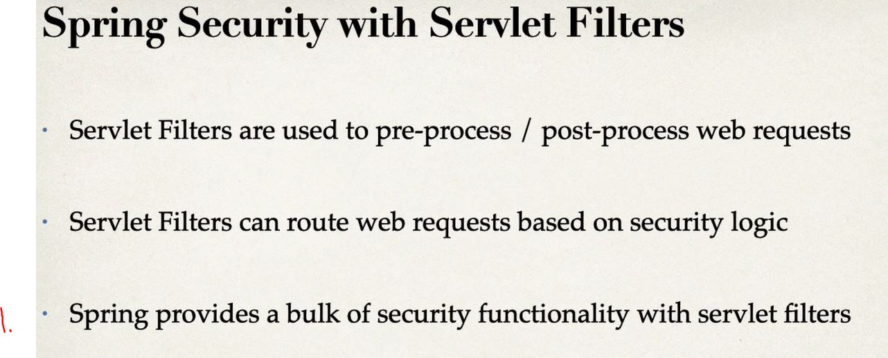

1. Most functionality comes from servlet filters

### Overview Spring Security

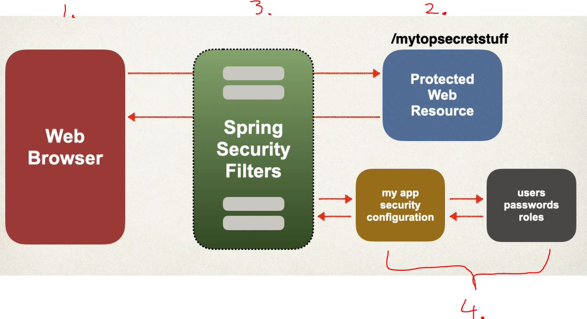

1. Web Browser wants access `2.` and get results
3. Spring Security catches query and resolves, if request is allow or not
4. Applications Security Configuration is being looked and `users` `passwords` `roles` from db if this user have been authenticated and also is this user authorized to access this resource.

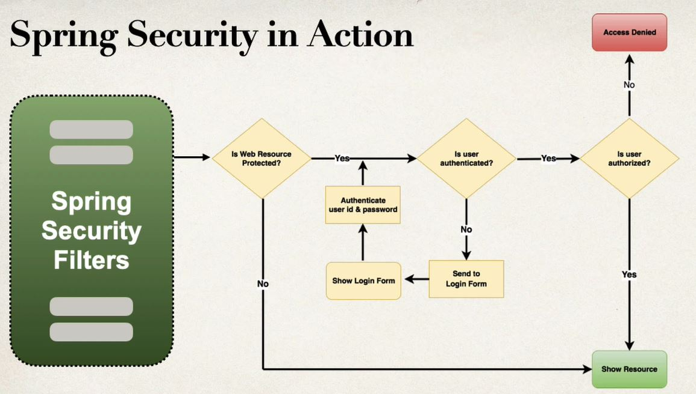 

- `Authentication` if users and password stored in db
- `Authorization` if user has authorized role

- Declarative Security is configured with `@Configuration`
- Spring can extend basic Spring Security specific enterprise company needs

- Enabling Spring Security

```
<dependency>
    <groupId>org.springframework.boot</groupId>
    <artifactId>spring-boot-starter-security</artifactId>
</dependency>
```

- Defaults: username: `user` and password can be found in the logs

- This can be changed configuring `application.properties`

```
spring.security.user.name=scott
spring.security.user.password=tiger
```

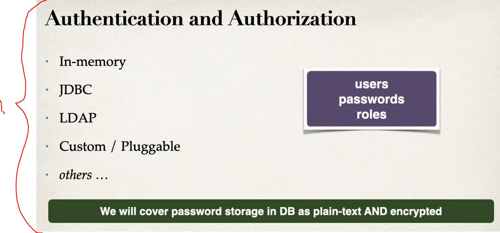 

1. There are many ways to do authentication and authorization. This course will cover **DB as plain-text and encrypted**

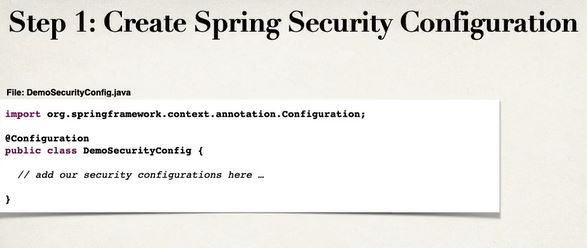 

<br>

- For Spring Security Password

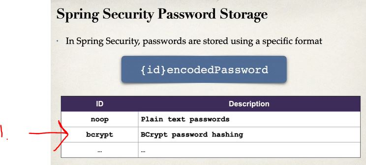 

1. We be using this

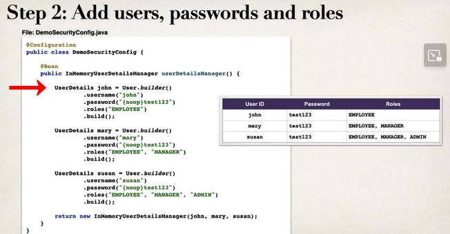 

- We are going save Users in memory

- Example using **InMemoryUserManager**

```
@Configuration
public class DemoSecurityConfig {

		@Bean
		public InMemoryUserDetailsManager userDetailsManager() { //In memory authentication
			
			UserDetails john = User.builder()
					.username("john")
					.password("{noop}test123") //Noop means plain text
					.roles("EMPLOYEE")
					.build();
			
			UserDetails mary = User.builder()
					.username("mary")
					.password("{noop}test123") //Noop means plain text
					.roles("EMPLOYEE", "MANAGER")
					.build();
			
			UserDetails susan = User.builder()
					.username("susan")
					.password("{noop}test123") //Noop means plain text
					.roles("EMPLOYEE", "MANAGER", "ADMIN")
					.build();
			
			return new InMemoryUserDetailsManager(john, mary, susan); 
		}
}
```

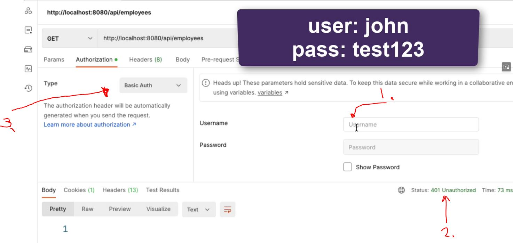 

1. In postman user and password is inputted into such.
2. Whiteout credentials we are having `401 Unauthorized`
3. By default Spring uses `Basic Auth`

- We can restrict endpoints based on ROLES, we will do such

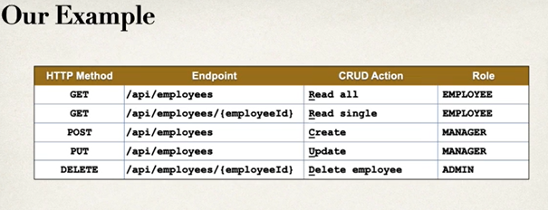 

- We can specify restrict access by `requestMatchers(add path here).hasRole(add role here)`
	- We can specify also for other HTTP verbs

- Example using "EMPLOYEE" role

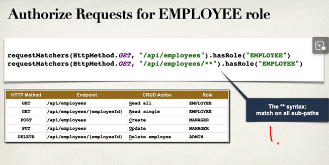 

1. `**` is **wild card** and we can use it to refer all rest paths

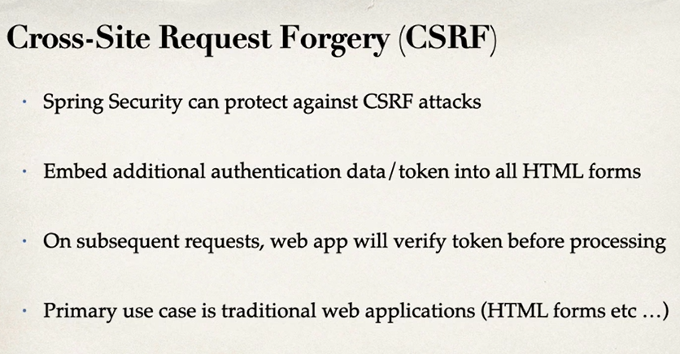 

- When to use CSRF Protection

 

1. Recommended generally
2. Non-browsers usually disabled


- Makingrules in code

```

@Configuration
public class DemoSecurityConfig {

		@Bean
		public InMemoryUserDetailsManager userDetailsManager() { //In memory authentication
			
			UserDetails john = User.builder()
					.username("john")
					.password("{noop}test123") //Noop means plain text
					.roles("EMPLOYEE")
					.build();
			
			UserDetails mary = User.builder()
					.username("mary")
					.password("{noop}test123") //Noop means plain text
					.roles("EMPLOYEE", "MANAGER")
					.build();
			
			UserDetails susan = User.builder()
					.username("susan")
					.password("{noop}test123") //Noop means plain text
					.roles("EMPLOYEE", "MANAGER", "ADMIN")
					.build();
			
			return new InMemoryUserDetailsManager(john, mary, susan); 
		}
		
		@Bean
		public SecurityFilterChain filterChain(HttpSecurity http) throws Exception  {
			
			
			//Setting up rules
			http.authorizeHttpRequests( configurer ->
			configurer
				.requestMatchers(HttpMethod.GET, "api/employees").hasRole("EMPLOYEE")
				.requestMatchers(HttpMethod.GET, "api/employees/**").hasRole("EMPLOYEE")
				.requestMatchers(HttpMethod.POST, "api/employees").hasRole("MANAGER")
				.requestMatchers(HttpMethod.PUT, "api/employees").hasRole("MANAGER")
				.requestMatchers(HttpMethod.DELETE, "api/employees/**").hasRole("ADMIN")
				
			);
			
			// use HTTP Basic authentication
			http.httpBasic(Customizer.withDefaults());
			
			//Disable SRRF for REST in general
			http.csrf(csrf -> csrf.disable());
			
			
			
			
			return http.build();

		}
}

```

- You have option to customize the table schemas
	- This is **Useful** if you have custom tables
		- This means you have to write own JDBC, JPA/Hibernate code **by** yourself
- **BUT**, you decide to use Spring Securit **predefined** table schema. No need to write any extra JDBC, JPA/Hibernate code 

 

1. Default tables and columns need to be present.
2. Authorities think as "roles".

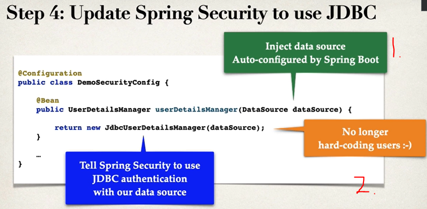 

1. Datasource is coming automatically from **Spring Boot**
2. No need to hard code users into the Manager 

- noop` ment that passwords are saved in plaintext

- We will use such SQL for initialization

```

USE `employee_directory`;

DROP TABLE IF EXISTS `authorities`;
DROP TABLE IF EXISTS `users`;

--
-- Table structure for table `users`
--

CREATE TABLE `users` (
  `username` varchar(50) NOT NULL,
  `password` varchar(50) NOT NULL,
  `enabled` tinyint NOT NULL,
  PRIMARY KEY (`username`)
) ENGINE=InnoDB DEFAULT CHARSET=latin1;

--
-- Inserting data for table `users`
--

INSERT INTO `users` 
VALUES 
('john','{noop}test123',1),
('mary','{noop}test123',1),
('susan','{noop}test123',1);


--
-- Table structure for table `authorities`
--

CREATE TABLE `authorities` (
  `username` varchar(50) NOT NULL,
  `authority` varchar(50) NOT NULL,
  UNIQUE KEY `authorities_idx_1` (`username`,`authority`),
  CONSTRAINT `authorities_ibfk_1` FOREIGN KEY (`username`) REFERENCES `users` (`username`)
) ENGINE=InnoDB DEFAULT CHARSET=latin1;

--
-- Inserting data for table `authorities`
--

INSERT INTO `authorities` 
VALUES 
('john','ROLE_EMPLOYEE'),
('mary','ROLE_EMPLOYEE'),
('mary','ROLE_MANAGER'),
('susan','ROLE_EMPLOYEE'),
('susan','ROLE_MANAGER'),
('susan','ROLE_ADMIN');

```

- Design tables are a good way to visually inspect what is going on in Database

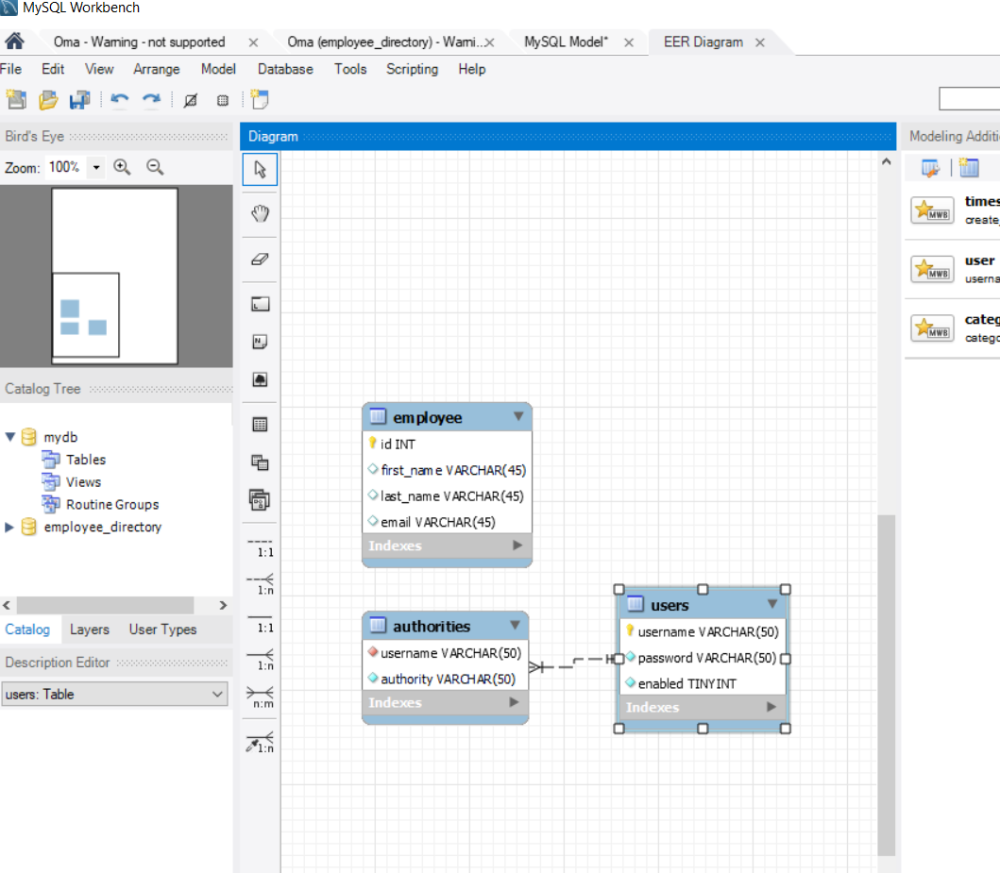 

- This can be done **MySQL Workbench** 
	- **Database**
		- **Reverse engineer...**

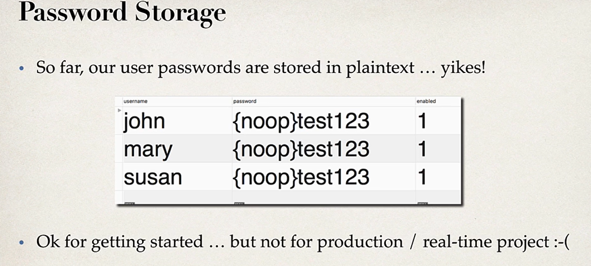

- Plaintext password are OK for prototypes, **not** for production / or real-time applications

- Spring Security recommends using the popular **bcrypt** algorithm

- **Bcrypt** 
	- One-way encrypted hashing
	- Adds random salt to the passwords
	- Includes support to brute force attacks
	- [Why](www.luv2code.com/why-bcrypt)
	- [Bcrypt analysis](www.luv2code.com/bcrypt-wiki-page)
	- **This is one should be read by all** [Bcrypt analysis](www.luv2code.com/password-hashing-best-practices)

- There are two ways to get **Bcrypt** password 
1. Use website to encrypt
2. write some Java code to perform the encryption

- [Website for generating](www.luv2code.com/generate-bcrypt-password)

- For same password you will get different password hash 

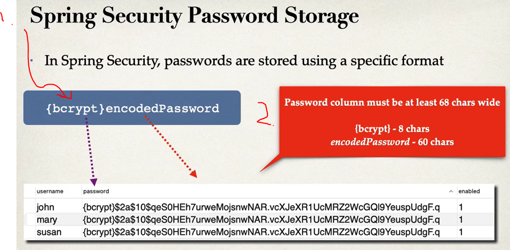

1. Using **Bcrypt** when configuring **UserDetailManager**
2. Columns must be at least **68 chars** wide

- When changing encryption database table needs to be also considered 

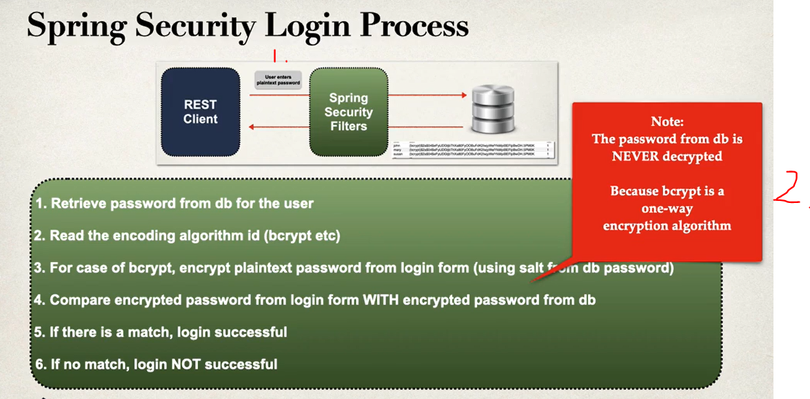

1. User enters password in plaintext
2. **NOTE** When server return password, it is not **DECRYPTED**

- Creating table for encrypted password

```
	USE `employee_directory`;

DROP TABLE IF EXISTS `authorities`;
DROP TABLE IF EXISTS `users`;

--
-- Table structure for table `users`
--

CREATE TABLE `users` (
  `username` varchar(50) NOT NULL,
  `password` char(68) NOT NULL,
  `enabled` tinyint NOT NULL,
  PRIMARY KEY (`username`)
) ENGINE=InnoDB DEFAULT CHARSET=latin1;

--
-- Inserting data for table `users`
--
-- NOTE: The passwords are encrypted using BCrypt
--
-- A generation tool is avail at: https://www.luv2code.com/generate-bcrypt-password
--
-- Default passwords here are: fun123
--

INSERT INTO `users` 
VALUES 
('john','{bcrypt}$2a$10$qeS0HEh7urweMojsnwNAR.vcXJeXR1UcMRZ2WcGQl9YeuspUdgF.q',1),
('mary','{bcrypt}$2a$10$qeS0HEh7urweMojsnwNAR.vcXJeXR1UcMRZ2WcGQl9YeuspUdgF.q',1),
('susan','{bcrypt}$2a$10$qeS0HEh7urweMojsnwNAR.vcXJeXR1UcMRZ2WcGQl9YeuspUdgF.q',1);


--
-- Table structure for table `authorities`
--

CREATE TABLE `authorities` (
  `username` varchar(50) NOT NULL,
  `authority` varchar(50) NOT NULL,
  UNIQUE KEY `authorities4_idx_1` (`username`,`authority`),
  CONSTRAINT `authorities4_ibfk_1` FOREIGN KEY (`username`) REFERENCES `users` (`username`)
) ENGINE=InnoDB DEFAULT CHARSET=latin1;

--
-- Inserting data for table `authorities`
--

INSERT INTO `authorities` 
VALUES 
('john','ROLE_EMPLOYEE'),
('mary','ROLE_EMPLOYEE'),
('mary','ROLE_MANAGER'),
('susan','ROLE_EMPLOYEE'),
('susan','ROLE_MANAGER'),
('susan','ROLE_ADMIN');
	
```

- `` `password` char(68) NOT NULL, `` as you can see, we are using 68 for **bcrypt**

- If we have custom tables for security, example like this in below.

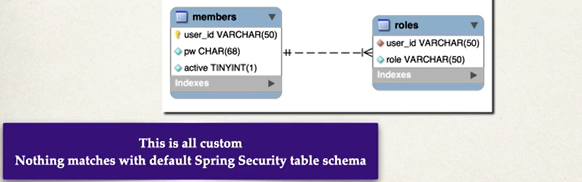 

- We need to write our JDBC connection

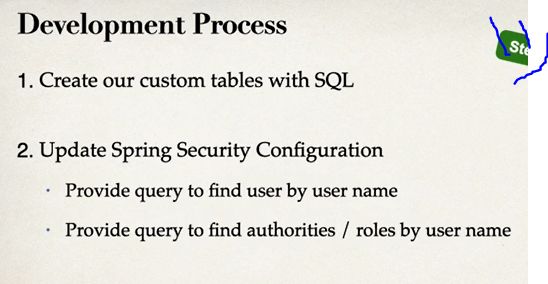

- Telling custom tables, with **SQL**. We could use any table, we just tell how to access it

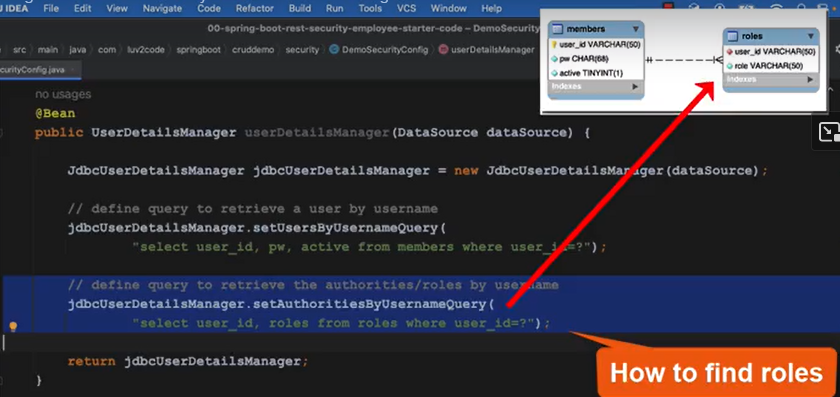

- If there is some problem with logging or in general, when no error is occurring
	- It's recommended to enable logging, in this case `logging.level.org.springframework.security=DEBUG` 

