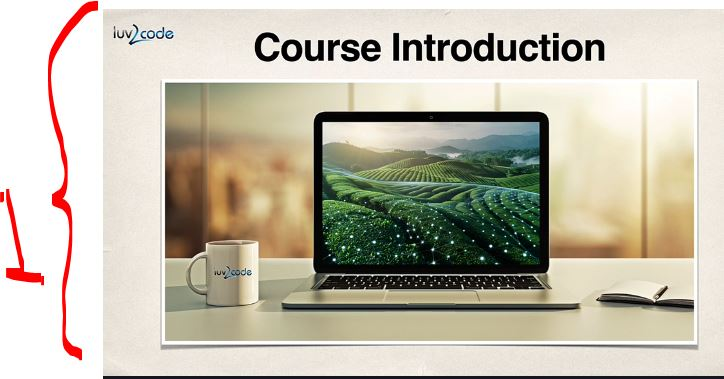
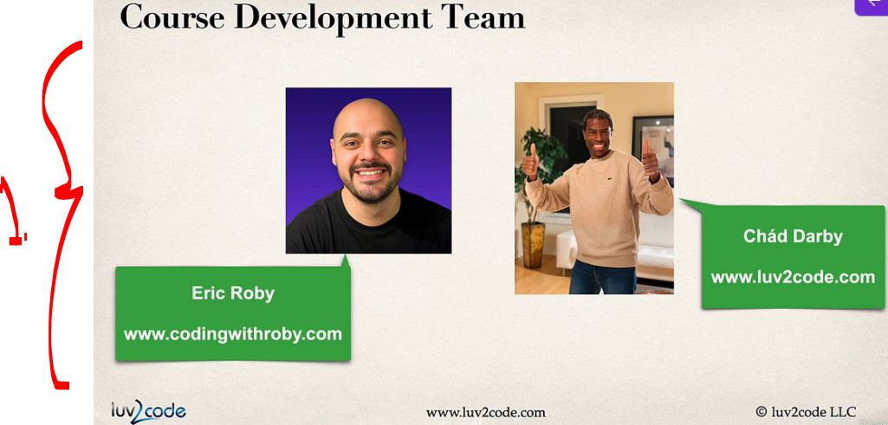
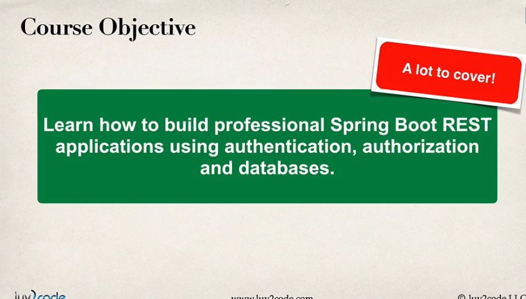
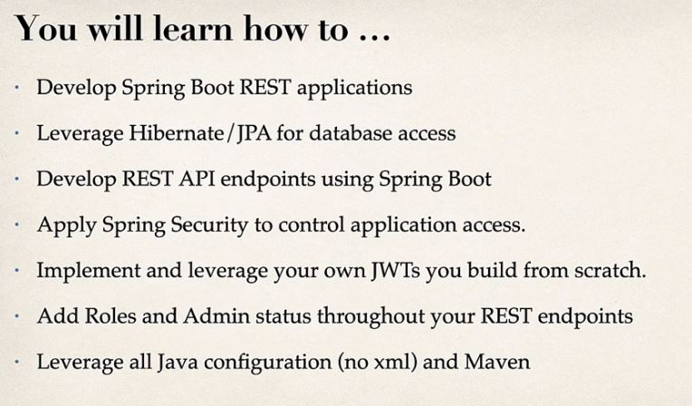
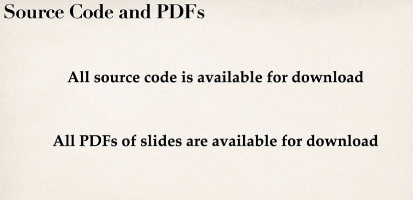
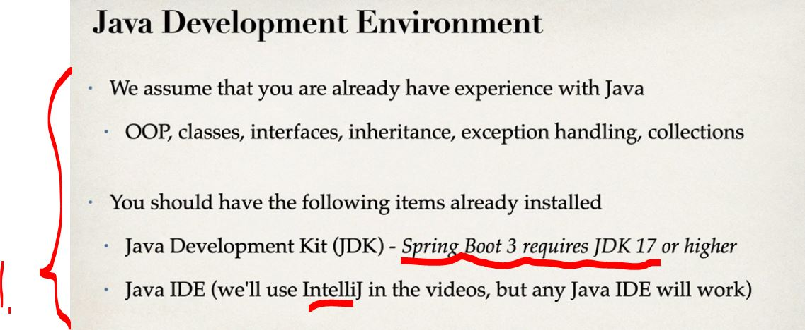

# Section 01: Introduction.

Introduction.

# What I Learned.

# Introduction.

<div align="center">
    
</div>

1. We will be building REST API, with Spring Boot!

<div align="center">
    
</div>

1. Best team!

<div align="center">
    
</div>

1. We will be making:
    - Professional Spring Boot REST API.
    - There is authentication.
    - There is authorization.
    - There is database.
    
<div align="center">
    
</div>

- About the material:

<div align="center">
    
</div>

# How To Take This Course and How To Get Help.

````
How To Take This Course and How To Get Help
How To Take This Course

As you go through the course, I highly recommend that you type code along with me in the videos. This is the best way to learn the material.

Some students will watch the video first and then replay it while typing in the code. Others like to type along on the first watch. Choose whatever approach works for you.

But the important thing is that you type in the code. This is the most effective way to really learn the material.


----

How To Get Help

If you have any coding questions or have a syntax error, here's how you can get help:

1. Download the source code.

If you have any problems, the solution code is: https://github.com/darbyluv2code/spring-boot-rest-apis

Download the solution code and compare your code against the solution code.


2. Search previous questions

Most likely, another student has encountered a similar error in the past. Use the search box to enter keywords regarding your error message and see if you can find any similar questions/answers.


3. Post a NEW Question

If you are not able to resolve the problem, post a NEW question to the discussion forum. Don't use this current question ... instead post a NEW question for your question.

By posting a new question you will get higher visibility and this allows us to track your question efficiently.

Be sure to paste your Java source code along with any relevant config files.

The luv2code team will respond to your question in 24 hours.


---

Java Versions

This course requires Java 22 or higher. A new version of Java is released every six months. As a result, your Java version may be slightly different than what is used in the videos. However, the code should work as desired unless there are breaking changes.

Enjoy the class :-)
````

- Recommend that you **type code** along with me in the videos!
    - I am making notes!

# Downloading the Source Code and PDFs.

- todo this one.

# Java Development Environment Checkpoint.

<div align="center">
    
</div>

1. We will be building REST API, with Spring Boot!
    - Minimum **Spring Boot 3** with **JDK 17**!
    - **IntelliJ**!

- Todo this to end!

# What are REST Services - Part 1.

# What are REST Services - Part 2.

# JSON Basics.

# Spring Boot REST HTTP Basics.