# Section 05: Spring Boot REST - Project 03 (Part 2).

Spring Boot REST - Project 03 (Part 2).

# What I Learned.

# Spring Boot REST: Spring Data JPA Overview.

# Spring Boot REST: Switch to Repository. 

# Spring Boot REST: Using JPA Repository.

# Spring Boot REST: Spring Security Overview.

# Spring Boot REST: Setup Spring Security.

# Spring Boot REST: Setup Configuration Overview.

# Spring Boot REST: Setup Configuration.

# Spring Boot REST: Spring Security Request Mappers.

<p align="center">
        
</p>

1. We will go how to restrict access based on the **ROLES**!

<p align="center">
        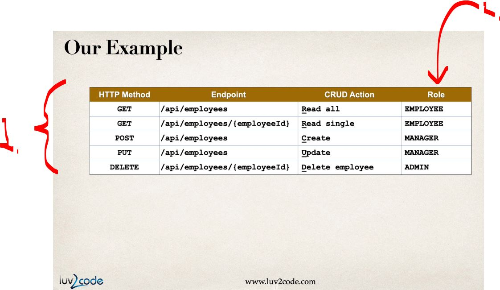
</p>

1. Endpoint that will be there.
2. The roles, which have the access! 

<p align="center">
        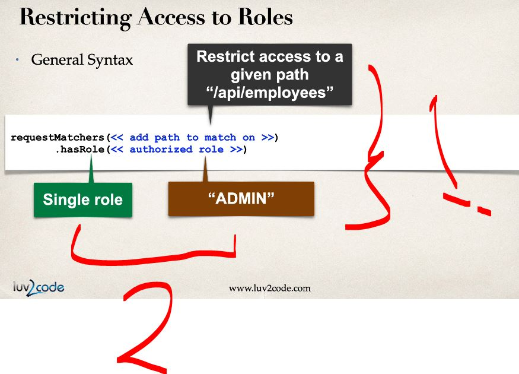
</p>

1. Here will be format of the configuration!
2. One example with the **single role** and **admin**!

<p align="center">
        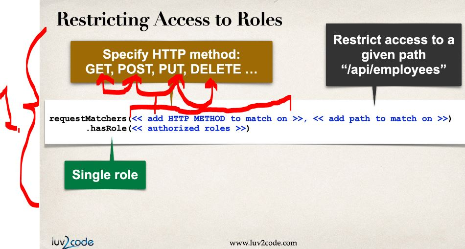
</p>

1. Here we have example, when there is same **URL**, but **different** **methods**!

<p align="center">
        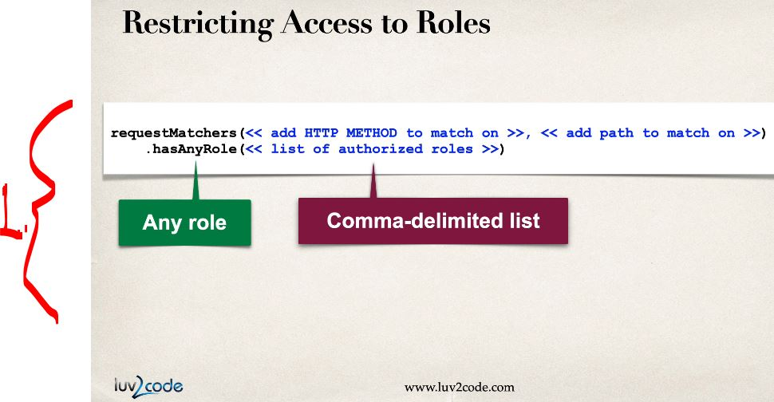
</p>

1. Example with the **multiple roles**!

<p align="center">
        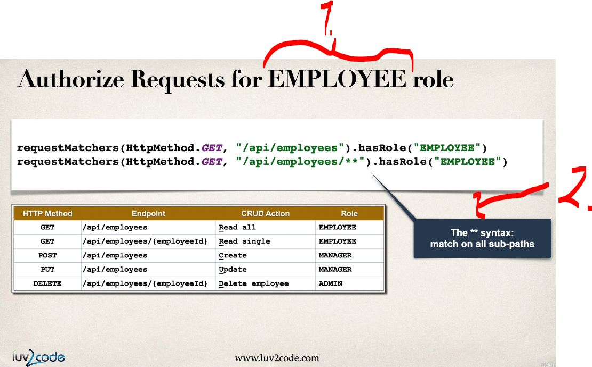
</p>

1. Example of the usage of **authorization** for the **EMPLOYEE** role!
2. This example will be, for the `/api/employees/**` and all the rest after that.
   - If there is **ID** and later there will be **name**! This **wildcard** will be supporting this.

<p align="center">
        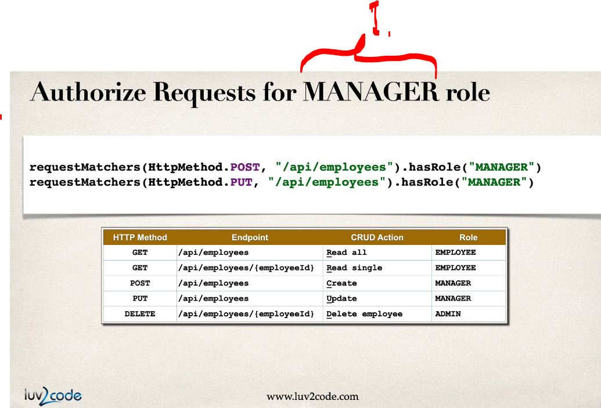
</p>

1. Example of the usage of **authorization** for the **MANAGER** role!

<p align="center">
        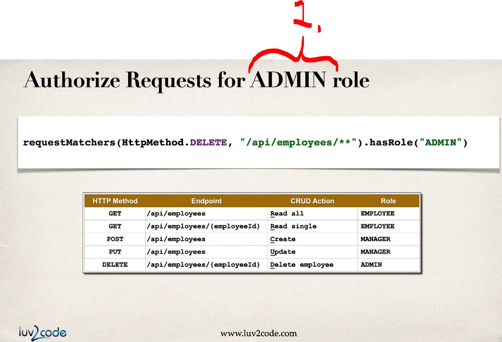
</p>

1. Example of the usage of **authorization** for the **ADMIN** role!

> [!NOTE]  
> **Spring Basic Authentication** is essentially **HTTP Basic Authentication**!

<p align="center">
        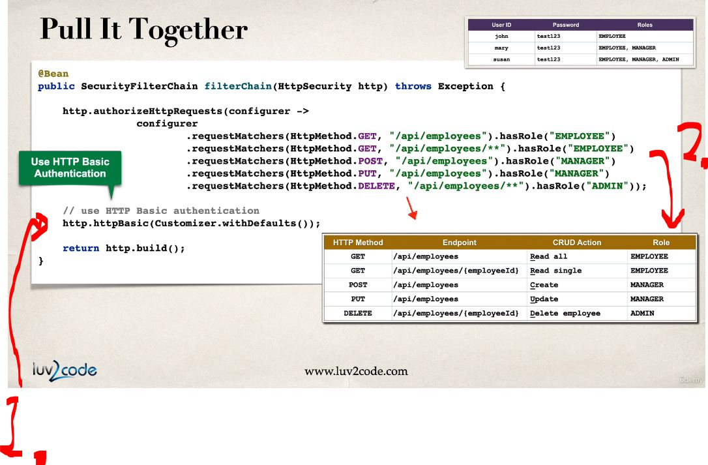
</p>

1. We will be using **HTTP** Basic Authentication.
2. These will be implemented from the **table**!

<p align="center">
        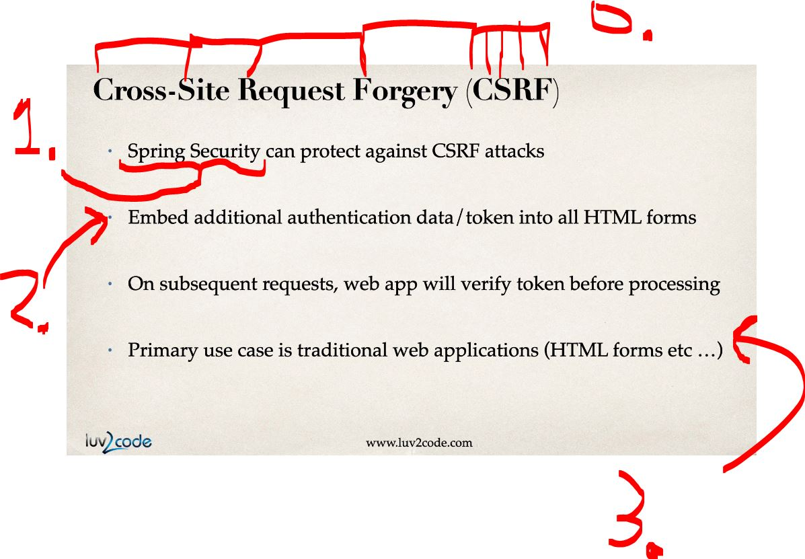
</p>

0. **CSRF** (**C**ross-**S**ite **R**equest **F**orgery).
1. This comes from **Spring Security**!
2. **CSRF** protection is adding a **token** to **legitimate requests**.
    - When a request comes in, it checks:
    - *“Does this request have the correct token?”*
      - Outcome:
        - ✅ **Real request** (from your app) → has token → allowed.
        - ❌ **Fake request** (from attacker site) → no token → blocked.
3. One popular use case is the **HTML** webpages ... etc!

<p align="center">
        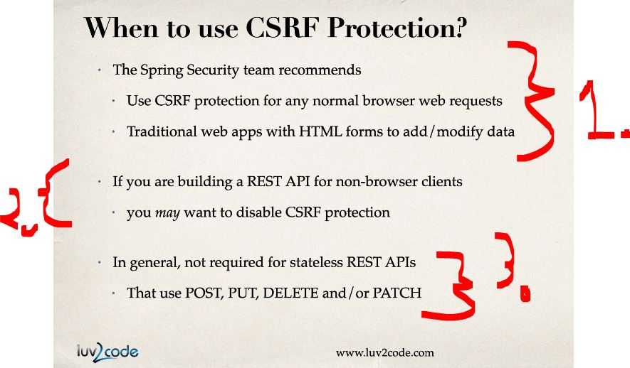
</p>

1. With **HTML forms**, this is **recommended** to be used!
2. For **non-browser** clients, this is **often disabled**!
3. This should be **not** used in the **REST API**'s, since the **stateless**!

<p align="center">
        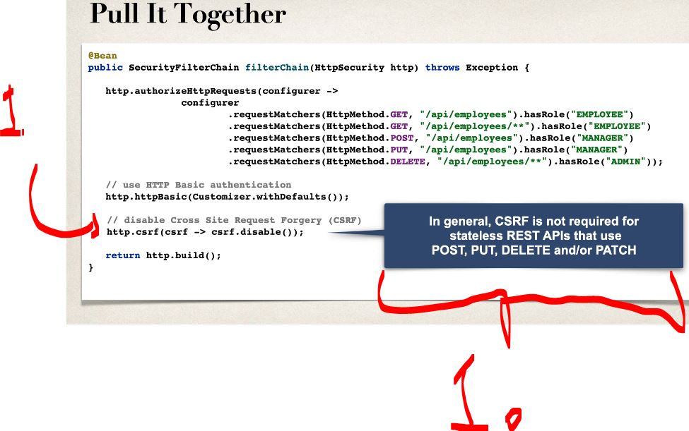
</p>

1. Since, we are using this mostly for **REST**, we will be disabling this **CSRF**.
    - `http.csrf(csrf -> csrf.disable());`.

<details>

<summary id="securityFilterChain_example" open="true"> <b>SecurityFilterChain example, whitout roles!</b> </summary>

````Java
@Bean
public SecurityFilterChain securityFilterChain(HttpSecurity http) throws Exception {
    http
        .csrf(csrf -> csrf
            // 1. Specify the paths that DO NOT need CSRF (e.g., your REST API)
            .ignoringRequestMatchers("/api/**", "/webhooks/**")
        )
        .authorizeHttpRequests(auth -> auth
            // 2. Define your regular security rules
            .requestMatchers("/api/**").hasRole("API_USER")
            .requestMatchers("/web/**").authenticated()
            .anyRequest().permitAll()
        );

    return http.build();
}
````

</details>


