# Section 06: Spring Boot REST - Project 04.

Spring Boot REST - Project 04.

# What I Learned.

# Spring Boot REST Project 04 Overview.

# Spring Boot REST: Create Project 04 Overview.

# Spring Boot REST: Create Project 04.

# Spring Boot REST P4: Create Entities Overview.

# Spring Boot REST P4: Create Todo Entity.

# Spring Boot REST P4: Create User Entity.

# Spring Boot REST P4: Create Authority Entity.

# Spring Boot REST P4: Collection Table for Authorities.

# Spring Boot REST P4: Configure Remaining Database Information.

# Spring Boot REST P4: Setup MySQL Database Overview.

# Spring Boot REST P4: Run Docker & Setup Resources.

# Spring Boot REST P4: Setup Database GUI.

# Spring Boot REST P4: Implement Swagger Overview.

# Spring Boot REST P4: Add Swagger.

# Spring Boot REST P4: JWT Overview (Current).

<div align="center">
    
</div>

1. What are **JWT**?

<div align="center">
    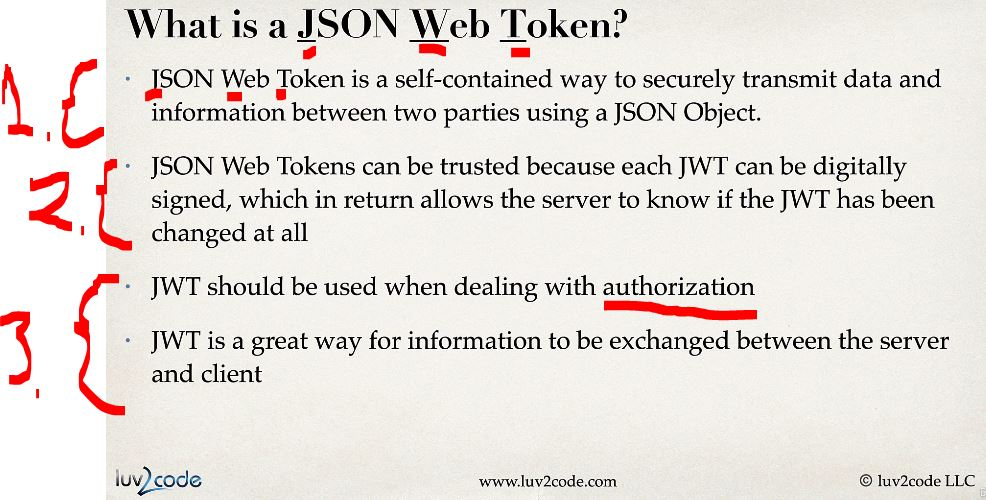
</div>

1. **JWT**, the **J**SON **W**eb **T**oken!
    - This will be used to **secure** data between **two parties** using **JSON Object**!
2. **JTW** can be trusted, since the **JTW** can be **digitally signed**!
    - This can be checked if the **JWT* was changed! 
3. **JWT** should be used for the **authorization**!
    - This is **a great** way to exchange between **server** and the **client**!

<div align="center">
    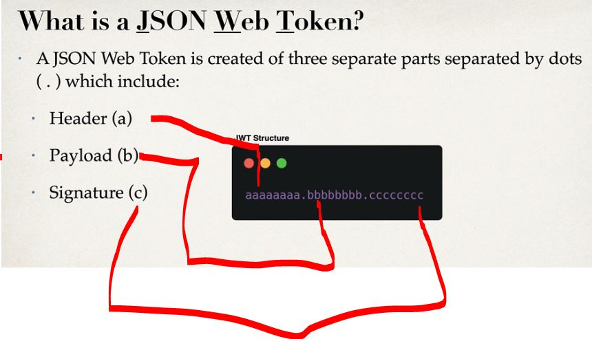
</div>

1. There are **three** parts:
    - `a` **Header**.
    - `b` **Payload**.
    - `c` **Signature**.

- Example below of the **JTW**, there are **three** parts:

````JSON
eyJhbGciOiJIUzI1NiIsInR5cCI6IkpXVCJ9
.
eyJzdWIiOiJqYW5lLmRvZSIsInJvbGVzIjpbIlVTRVIiXSwiZXhwIjoxNzE2MjM5MDIyfQ
.
SflKxwRJSMeKKF2QT4fwpMeJf36POk6yJV_adQssw5c
````

<div align="center">
    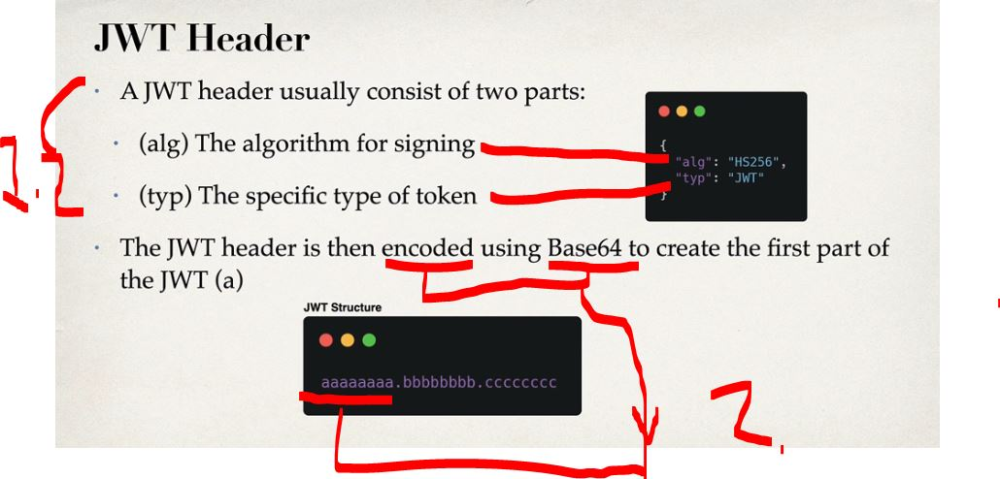
</div>

1. **JWT** header:
    - `alg` → **Signing algorithm**.
    - `typ` → **Type of the token**.
    ````JSON
    {
    "alg": "HS256",
    "typ": "JWT"
    }
    ````
2. **JWT** Header is **encoded** with the `Base64` for the **first** part of the **JWT**! 

> [!NOTE]
> A `claim` = data about the user or request inside the JWT payload.

<div align="center">
    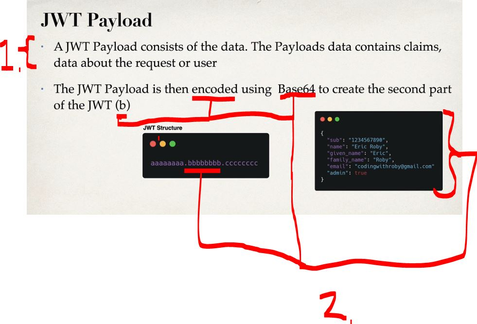
</div>

1. **JWT** Payload contains the **claim** about the **user**
2. Will contain information about the **user**!
    ````JSON
    {
    "sub": "john.doe",
    "roles": ["USER"],
    "exp": 1716239022
    }
    ````

> [!NOTE]
> The `secret` is stored on the **server side** only—never in the client, **never in the JWT itself**.

<div align="center">
    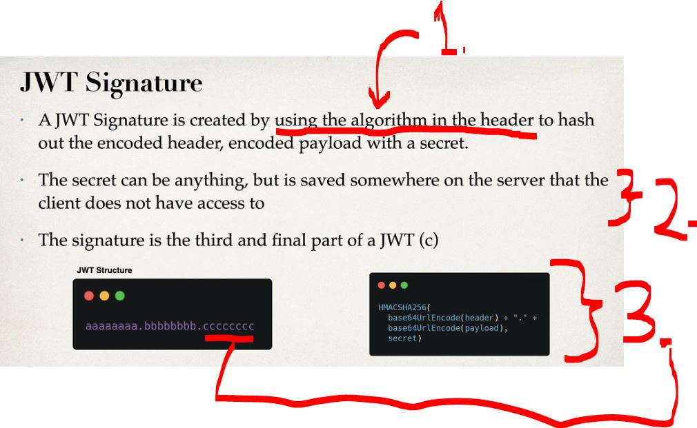
</div>

1. **JWT** Signature is created using the algorithm specified in the *header*!
2. *The **JWT secret** is stored securely **on the server**, typically in environment variables or a secret manager, and is used to sign and validate tokens. It is never exposed to the client.*
3. The third part `ccccc`, will be populated with following operations:
    ````Bash
    HMACSHA256(
    base64UrlEncode(header) + "." + base64UrlEncode(payload),
    secret
    )
    ````
    - `1.` Take the encoded `header`.
    - `2.` Take the encoded `payload`.
    - `3.` Join them with a **dot** `.`.
    - `4.` Run `HMAC-SHA256` using a **secret key**.
    - `5.` Base64URL-encode the result and them into **JWT** Signature!
    - Now, when **there is change** will break the **hash in the end**.
        - We will know when the **JWT** is invalid!

<div align="center">
    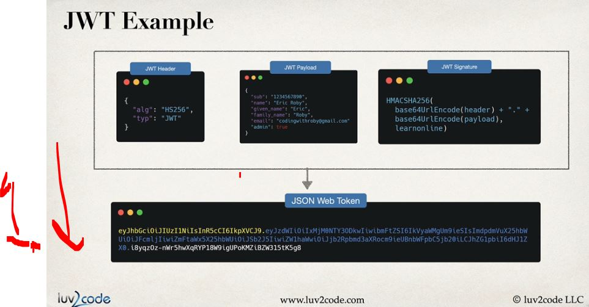
</div>

1. We will be combining the **three** of these. These will be making **JSON Web Token**!

# Spring Boot REST P4: Setup JWTs Overview.

<div align="center">
    
</div>

1. How we will be setting **JWT**!

- The **Development Process**, will go.

<div align="center">
    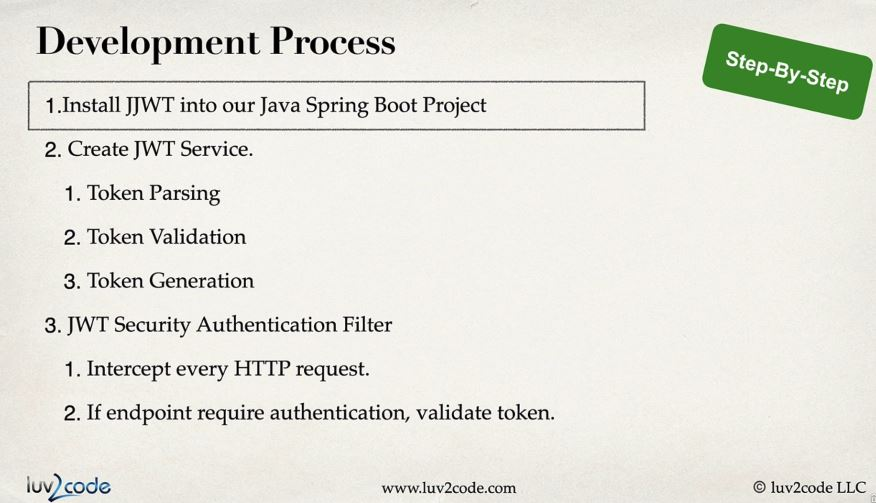
</div>

- The **JJWT** packages for Spring!

<div align="center">
    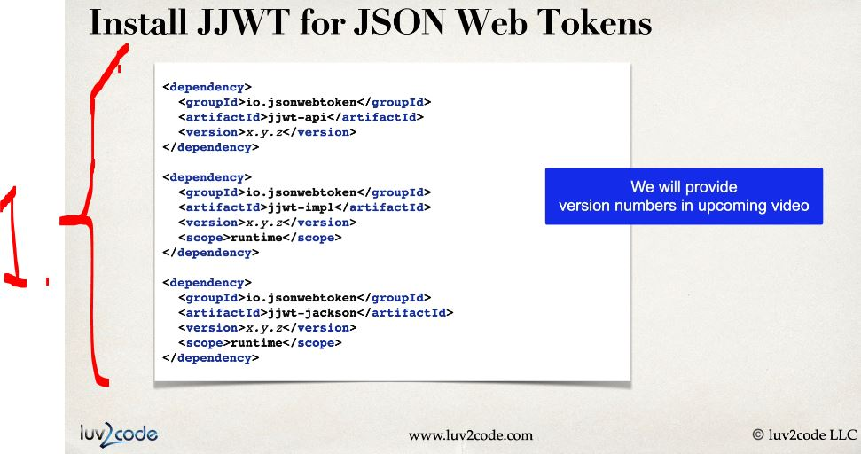
</div>

- The **JJWT** configuration:

<div align="center">
    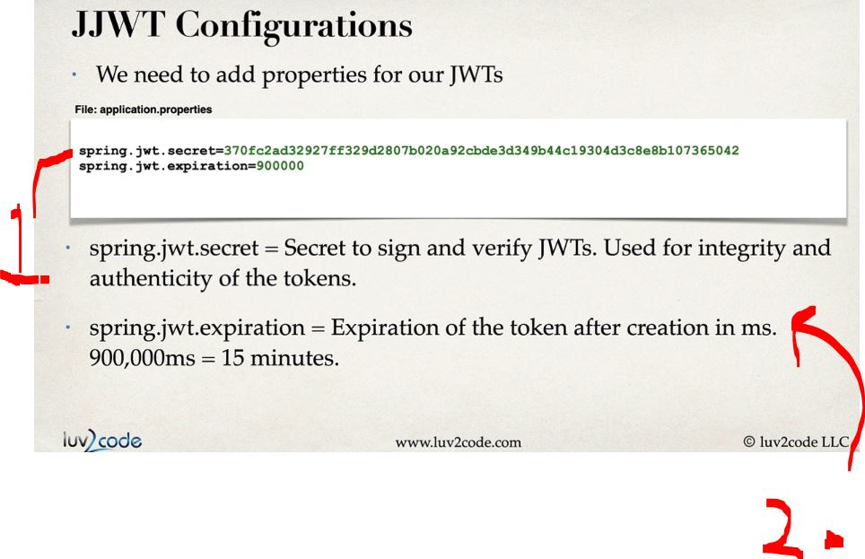
</div>

1. This `secret` will be used for:
    - **Verifying**, when its **created**!
    - **Signing** its **received**!
2. After **15 minutes**, the **JWT** becomes invalid and must be refreshed or reissued.

<div align="center">
    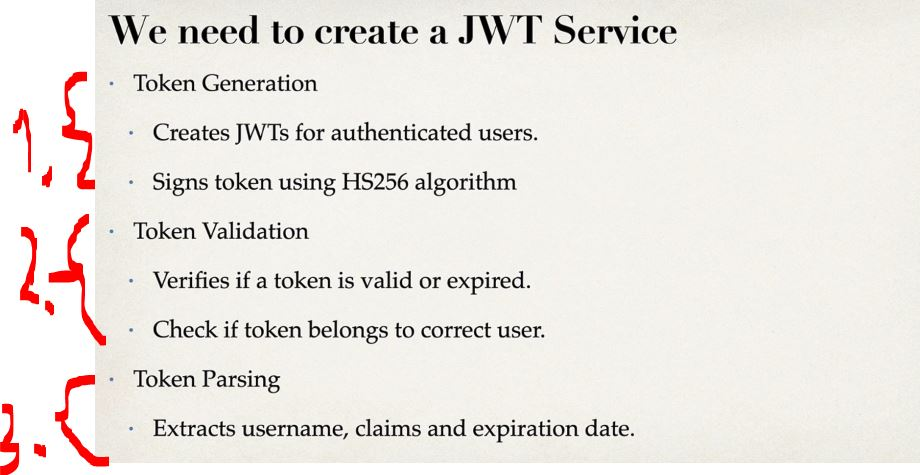
</div>

1. Token Generation:
    - We create the **JWT** for authenticated user and sign it with **HS256** algorithm!
2. Token Validation:
    - Verifies if the **token** is `valid` or `expired`!
    - Checks if **token** belongs to right user!
3. We need to extract the `claims`.
    - `claim` = **one field** of data **inside** the **JWT**!

<div align="center">
    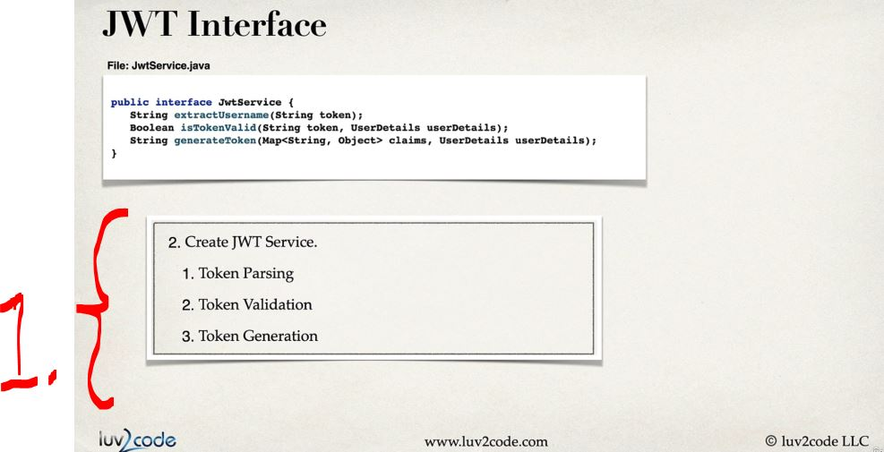
</div>

1. In our **service** we will have:
    - Token Parsing.
    - Token Validation.
    - Token Generations.

<div align="center">
    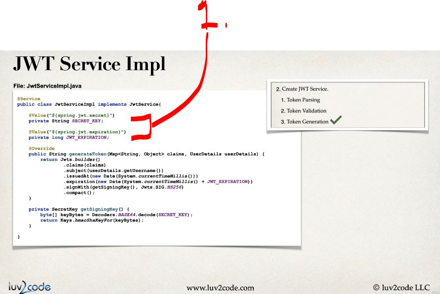
</div>

1. `SECRET_KEY` and `JWT_EXPIRATION`, will be getting from the **secret** and the **expiration** timeout!

- Todo do this!

# Spring Boot REST P4: Install JWTs & Application Properties.

# Spring Boot REST P4: Create JWT Interface & Service.

# Spring Boot REST P4: Generate Token Method.

# Spring Boot REST P4: Extract Claims from JWT.

# Spring Boot REST P4: JWT Validation.

# Spring Boot REST P4: JWT Auth Filter Overview.

# Spring Boot REST P4: JWT Authentication Filter Implementation.

# Spring Boot REST P4: Security Config Overview.

# Spring Boot REST P4: User Repository Implementation.