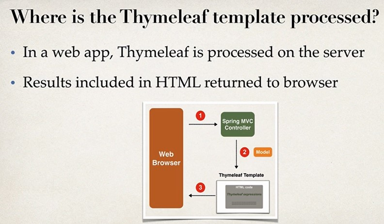
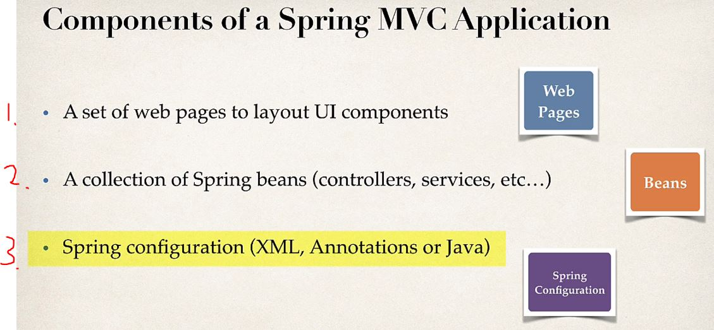
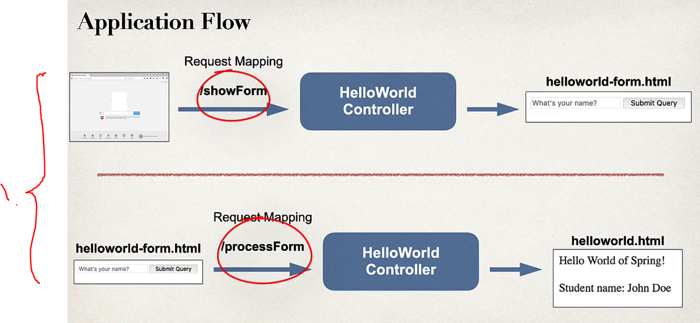
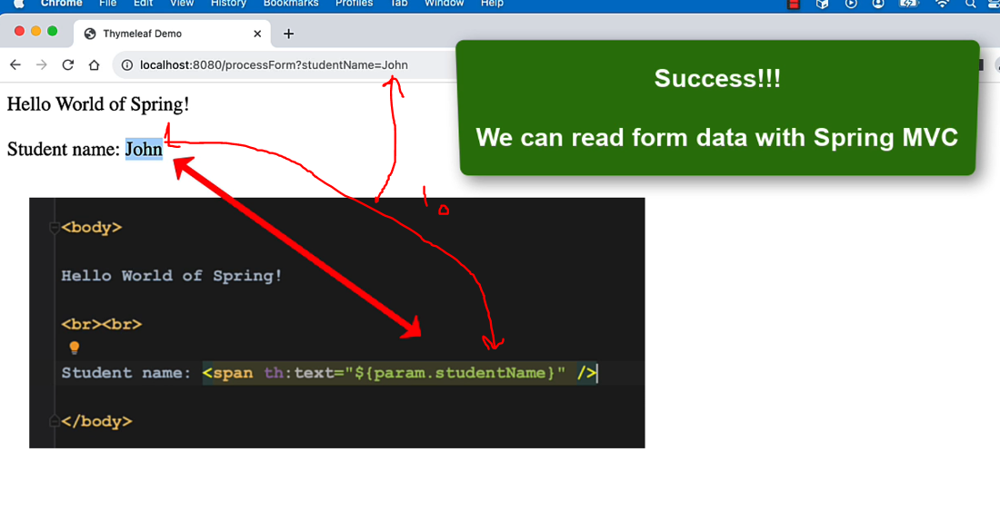
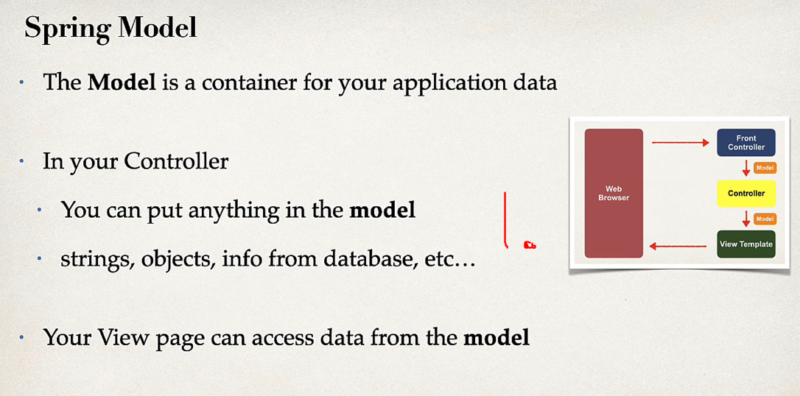
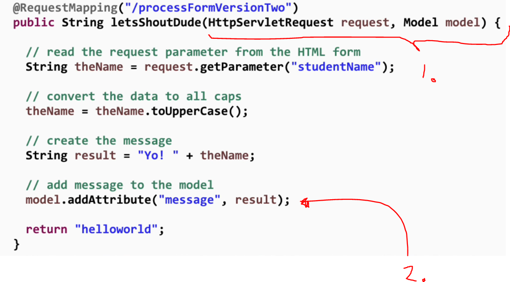

# Section 6: NEW - Spring MVC

NEW - Spring MVC.

# What I Learned

# 160. Spring Boot - Spring MVC with Thymeleaf - Overview


- Templating engine, more information [Thymeleaf](www.thymeleaf.org).

- **Thymeleaf** separated project, but shares a lot of synergy with Spring.

# What is Thymeleaf template?

- Can be HTML page with **Thymeleaf** expressions.
    - These can access HTML code, java code, Beans.
    


1. Web Browser makes request, it goes to **Spring MVC Controller**.
2. Controller adds data to model.
3. Template sends back HTML.


- Adding Thymeleaf to POM. 


1. When **Thymeleaf** is configured, Spring will automatically look for template with corresponding name.

- In Spring Boot **Thymeleaf** templates go into `src/main/resources/templates`.
    - For web apps, **Thymeleaf** uses `.html` extension.


- HTML page will be having **Thymeleaf** namespace.
    - Elements referring to he **Thymeleaf** will be having same namespace `th:element here`.
- Spring will access `theDate` from Spring model and use it.

- Thymeleaf support other features:
  - Lopping and conditionals.
  - CSS and JavaScript integration.
  - Template layouts and fragments.
    - More here [Thymeleaf](www.thymeleaf.org).


# 161. Spring Boot - Spring MVC with Thymeleaf - Coding - Part 1

- We are importing **Thymeleaf** for POM file.

```
<dependency>
  <groupId>org.thymeleaf</groupId>
  <artifactId>thymeleaf</artifactId>
  <version>3.1.2.RELEASE</version>
</dependency>
```

# 162. Spring Boot - Spring MVC with Thymeleaf - Coding - Part 2


- Example making use of **Thymeleaf**.


## helloworld.html

- **Thymeleaf** uses `${theDate}` to be pick attribute form the model.

```

<!DOCTYPE html>

<html xmlns:th="http://www.thymeleaf.org">

  <head>
    <title>Thymes Demo</title>
  </head>

  <body>
  
   		<p th:text="'Time on the server is ' + ${theDate}"> /p>
  
  </body>

</html>

```

### DemoController.java

```

@Controller
public class DemoController {
	
	@GetMapping("/hello")
	public String sayHello(Model model) {

		model.addAttribute("theDate", new java.util.Date()); //Adding to model, for later to be processed 
		
		return "helloworld";//Spring will automatically look for "helloworld.html" template
		
	}
}

```

- We can see rendered in realtime.


# 163. Spring Boot - Spring MVC with Thymeleaf and CSS - Overview

- Using CSS with **Thymeleaf**.


1. There is two ways to apply css for this resource.


1. Naming of folders does not matter if your under static. 


1. We are referring in css.

- **@** symbol referencing context path of your application. This references **app root**.

- There is other paths for finding resource.
  - Default is from **top-down** in following order.


1. Most common place to store resources. 

<br>

- We can reference in following way using **Bootstrap**.


- Or we can reference **Bootstrap** which is in internet.


# 164. Spring Boot - Spring MVC with Thymeleaf and CSS - Coding
 
- Attaching css for **Thymeleaf**.

```
<!DOCTYPE html>

<html xmlns:th="http://www.thymeleaf.org">

  <head>
    <title>Thymeleaf Demo</title>
  
    <link rel="stylesheet"
          th:href="@{/css/demo.css}" />
          
  
  </head>

  <body>
  
   		<p th:text="'Time on the server is ' + ${theDate}" class="funny" />
  
  </body>

</html>
```


# 165. Spring Boot - Spring MVC Behind the Scenes



1. It collection of UI components.
2. Collection of Spring beans.
3. You can configure **Spring** in three ways:
  - XML.
  - Annotations.
  - Java.

- In big look, Spring mvc works like such.


<br>


1. **You** develop these ones!
2. Front Controller has **DispatcherServlet** implemented. This is inside Spring `.jar` file.
  - This one delegates requests to other object in the system.

- **Business logic** is usually inside Controller.


- Model contains the data.


1. Most common **View template** is **Thymeleaf**.


- There is more **View Templates**. [Other view templates](www.luv2code.com/spring-mvc-views)

# 166. Spring Boot - Hello World Form and Model Overview



1. Two mappings. Other for showing Form and other for processing form.


- Mapping to html page from controller.

# 167. Spring Boot - Hello World Form and Model - Coding - Part 1

# helloworld-form.html

```
<!DOCTYPE html>
<html xmlns:th="http://www.thymeleaf.org">

  <head>
    <meta charset="UTF-8">
    <title>Hello World - Input Form</title>
  </head>

  <body>
  	<form action="@{/processForm}" method="GET">
		  
		  <input type="text" name="studentName"
		  placeholder="What's your name?" />
		  
		  <input type="submit" />
		  
	  </form>
  </body>

</html>
```

# 168. Spring Boot - Hello World Form and Model - Coding - Part 2

- Reading from **HTML form field**.


- Example processing page

```
<!DOCTYPE HTML>
<html xmlns:th="http://www.thymeleaf.org">

<head>
	<title>Thymeleaf Demo</title>
</head>

<body>

	Hello World of Spring!

	<br><br>

	Student name: <span th:text="${param.studentName}" />

	<br><br>

	The message: <span th:text="${message}" />

</body>

</html>
```



1. Reading form data with **Spring MVC**!


# 169. Spring Boot - Adding Data to Spring MVC Model - Overview



1. You can but any into **model**. 



1. Spring is flexible with parameters, you can add **parameters** to **Spring controller methods** when needed.
2. Saving fields to **model**.


1. We can access model in a template by type the **name of attribute** which was palaced there before.


# 170. Spring Boot - Adding Data to Spring MVC Model - Coding - Part 1

- Example reading from form data and saving to data.

```
    @RequestMapping("/processFormVersionTwo")
    public String letsShoutDude(HttpServletRequest request, Model model) {

        // read the request parameter from the HTML form
        String theName = request.getParameter("studentName");

        // convert the data to all caps
        theName = theName.toUpperCase();

        // create the message
        String result = "Yo! " + theName;

        // add message to the model
        model.addAttribute("message", result);

        return "helloworld";
    }
```

# 171. Spring Boot - Adding Data to Spring MVC Model - Coding - Part 2

- Reading form the model `	The message: <span th:text="${message}" />`.

# 172. Spring Boot - Spring MVC Binding Request Params - Overview